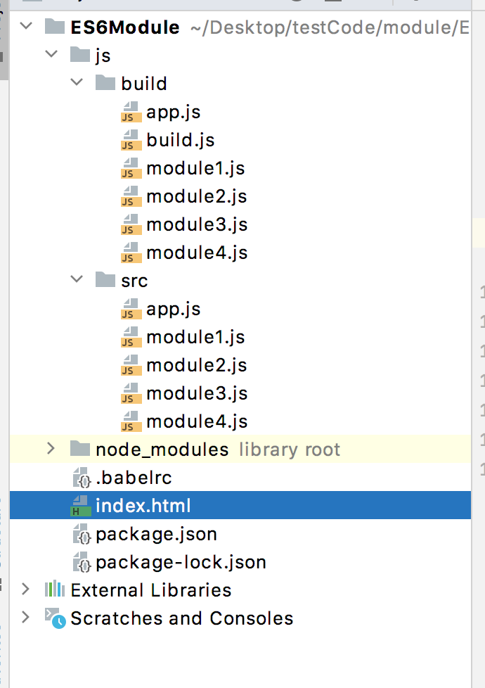
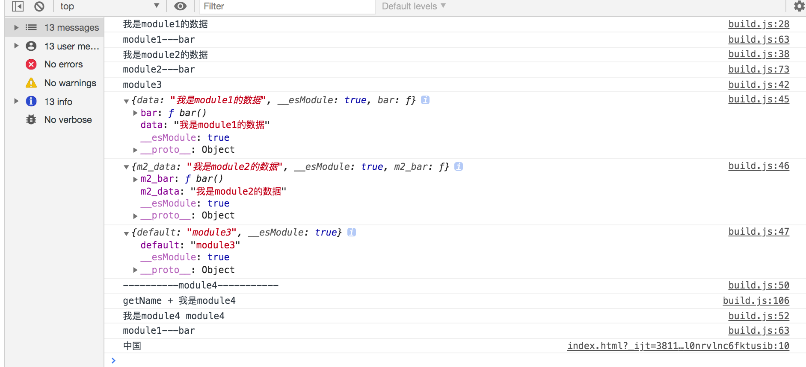
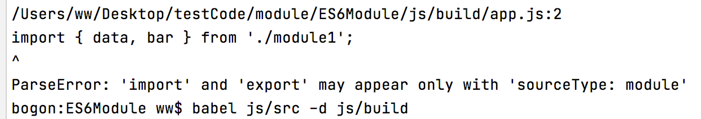

# ES6模块化

> ES6模块化是ES6中引入的模块化管理语法。
>
>  ES6模块化的项目结构：
>
> 
>
> 
>
>  `JS模块化管理中，一个模块就是一个js文件`

## ES6模块化实现

> `模块化的暴露与引入操作`：
>
> 1. 暴露，将当前文件中哪些内容暴露给外部使用，就像类的权限控制一样，暴露的方式：
>    1. 分别暴露，在每个想要暴露的`定义语句前添加export`修饰符，将模块中的内容暴露。
>    2. 统一暴露，在代码最后，使用`export {变量名1, 变量名2, ...}`，将模块中的内容暴露。
>    3. 默认暴露，`export default 变量名/对象/函数/字面量`，文件中只能有一个默认暴露。
> 2. 引入，在其它文件中要使用某个文件中暴露的内容时，需要将文件引入，引入方式：
>    1. 分别暴露和统一暴露的引入方式，`import { 变量名1, 变量名2} from '路径或者模块名'`，要求import使用的变量名必须和export中定义的一样。
>    2. 默认暴露的引入方式，`import 名称 from '路径或者模块名'`。
>    3. 暴露的统一引入方式，`import * as 名称 from '路径或者模块名'`。
>    4. 混合暴露的引入方式，`import 名称, { 变量名1, 变量名2} from '路径或者模块名'`，如果模块中有默认暴露时，默认暴露必须放在最前面。
>
> `注意点`：
>
> 1. 暴露方式可以混着用，一个模块中可以使用多种暴露方式，但是默认暴露一个文件只能有一个。
> 2. 引入时填写的路径或者库名称，加不加文件后缀名都行，推荐是不加后缀名，因为其它模块化工具都没有加，好记。
> 3. 引入时，自己或者同事写的模块使用路径，npm下载的模块使用模块名，一定要注意否则会从node_modules文件夹中寻找你开发的模块。
>
>  
>
> `ES6实现模块化方式`：
>
> 1. 首先借助babel库，将ES6翻译成ES5，并且将ES6模块化代码翻译成CommonJS模块化代码。
> 2. 然后借助browserify工具，将CommonJS模块化代码翻译成浏览器能运行的JS代码。
>
> ​		ES6模块化现在浏览器都是不支持的，例如import和export，浏览器都是不认识的，因此需要借助翻译工具。它借助两个工具(babel和browserify)来实现模块化，是不是觉得ES6模块化实现非常鸡贼。

### 前期环境搭建

> 
>
> ES6模块化环境搭建：
>
> 1. 需要安装node.js，为了使用npm工具。
> 2. 然后执行`npm install babel-cli browserify -g `命令，将`babel-cli`和`browserify`库安装在全局，babel-cli为babel操作的命令行工具。
> 3. 再执行`npm install babel-preset-es2015`命令，局部安装preset-2015的babel插件，用来翻译ES6。
> 4. 在项目的根目录下创建`.babelrc`文件，用来给babel指定具体任务，或者说让babel启动哪个插件翻译代码。
> 5. 配置.babelrc文件添加一句代码，`{"presets" : ["es2015"]}`
>
> 注意：
>
> 1.  `.babelrc`文件的存放位置，可以放在src文件夹下，也可以放在项目的根目录下，注意存放位置，否则babel不会工作，如果不配置该文件时，babel直接对文件进行拷贝粘贴，原样读取原样写入，根本不进行翻译。
>
> 项目结构在最上面展示了。

### 代码实现

> 代码结构：
>
> 1. 创建三个自定义模块，module1，module2、module3和module4，在这4个模块中展示ES6模块化工具规定暴露写法。
> 2. 创建app.js汇总文件，用来引入4个自定义模块和1个第三方库。
> 3. html文件引入翻译后的文件build.js。
>
>  翻译代码：
>
> 1. ` babel js/src -d js/build`：将src下的所有js文件中ES6模块化代码翻译成CommonJS模块化代码。
> 2. `browserify js/build/app.js -o ./js/build/build.js`，将CommonJS模块化代码翻译成浏览器可运行饿代码。
>
>  编写完代码后，将翻译后的汇总文件引入到html中。
>
> 
>
> 注意：
>
> 1. 大部分第三方库都使用默认暴露方式，直接使用export接收一个对象，将需要暴露的数据放在该对象中。
>2. export { a, b} 和import {a, b} from '路径'，这些写法时ES6暴露的固定写法，不是对象简写和对象的解构赋值。
> 3. export 暴露的变量名，必须与import引入的变量名一致，否则语法错误。
> 4. 一个模块有多种暴露方式时，如果有默认暴露，默认暴露必须写在最前面，`import 默认暴露变量名, { 变量名1, 变量名2} from '路径或者模块名'`
> 5. 三种暴露写法，可以使用一种引入方式，`import * as 变量名 from '路径'`。其实是创建一个对象，将export返回的内容作为该对象属性。执行结果中可以看到module3模块使用默认暴露方式暴露一个字符串，使用该方式引入会被包裹在对象中，对象结构{default: 暴露数据}
> 6. 使用统一暴露时，ES6提供了暴露时给变量名起别名的语法，`export { aa as newName1, bb as newName2}`。

module1.js

```javascript
// 分别暴露，该文件中定义的对象，哪个想要暴露，就在前面加上export
export let data = '我是module1的数据';
export function bar(){
    console.log('module1---bar');
}
```

module2.js

```javascript
// 统一暴露，将需要暴露的对象使用大括号包括
let data = '我是module2的数据';
function bar(){
    console.log('module2---bar');
}
// 简写版
// export {data, bar};

// 进阶版 --- 给暴露的变量起别名，放在命名冲突
export {data as m2_data, bar as m2_bar};
```

module3.js

```javascript
// 默认暴露，一个文件中只能有一个默认暴露，并且和另外两个暴露一样，支持任何类型数据，返回的是一个当前这个数值，不会在外层包裹一层对象。
export default 'module3';
```

module4.js

```javascript
// 在模块中引入其它模块
import {bar} from "../build/module1";

//混合暴露，一个模块中可以使用多种暴露方式
export default 'module4'
export let data = '我是module4';
export function foo(){
    bar();
}

function getName(){
    console.log(`getName + ${data}`)
}
export {getName as m4_getName};


```

app.js

```javascript
// 分别暴露和统一暴露的引入方式
import {data, bar} from './module1';
import {m2_data, m2_bar} from "./module2";
// 默认暴露的引入方式
import m3 from "./module3";

// 混合暴露的引入方式
import m4,{data as m4_data, foo, m4_getName} from "./module4";

// 引入方式的统一写法，适合所有暴露
import * as module1 from './module1';
import * as module2 from './module2';
import * as module3 from './module3';

// 引入第三方库
import uniq from 'uniq';

// module1
console.log(data);
bar();

// module2
console.log(m2_data);
m2_bar();

// module3
console.log(m3);

// 使用 'import * as 名称 from 路径' 的引入方式
console.log(module1);
console.log(module2);
console.log(module3);

// module4
console.log('----------module4-----------');
m4_getName();
console.log(m4_data,m4);
foo();

// 调用uniq
var list = uniq([1,2,3,4,5,5,5,6,7,7,6,9]);
console.log(list);
```

index.html

```html
<!DOCTYPE html>
<html>
<head>
    <!--  告诉浏览器当前页面的编码方式，防止中文乱码  -->
    <meta http-equiv="Content-Type" content="text/html;charset=utf-8">
</head>
<body>
<!-- 将翻译后的汇总文件引入到html中 -->
<script src="./js/build/build.js">
</script>
<script>
    console.log('中国');
</script>
</body>
</html>

```





## 错误

>  常见错误1，如下图所示：
>
> 
>
>  
>
> 该错误的原因时，使用browserify翻译的模块，不符合CommonJS模块化语法，ES6模块化需要进行两步翻译，但是直接将使用ES6模块化的代码让browserify翻译，跳过了第一步翻译导致的错误。


## 学习时产生的问题

> 1. import {a, b} from '路径'，既然不是解构赋值，可不可以变量名可以随便起？
>    1. 不能，使用分别暴露和统一暴露时，暴露的变量名和引入的变量名必须一致，否则babel翻译报错。
> 2. 是否可以重复引入某个模块，不会重复下载吗？
>    1. 可以重复引入，翻译完成后，会将汇总文件引入的其它模块代码添加到汇总模块中，形成一个文件。
> 3. 命名冲突问题？
>    1. 使用import {a, b} from ‘’方式引入时，需要小心与当前模块的命名冲突问题。建议使用`import * as module from ‘路径’`，或者使用第三种暴露方式，命名冲突出现几率小。
> 4. 引入自定义模块时，路径最后可以不可以添加后缀名？
>    1. 可以添加，默认还是不添加吧，某些模块化加后缀名会出现问题(例如AMD模块化无论模块名后是否有后缀都会添加)。
> 5. 如何使用依赖，例如module1和app文件都依赖module3时，都使用import * as module3 from './module3'，两个文件都使用同一个变量名接收module3，命名冲突吗？
>    1. 不会冲突，上面代码中app.js和module4模块都引入了module1模块，它们最后会被融合到同一个文件中(build.js)，因此引入代码写了两遍`var _module = require('../build/module1');`，将同一个值给同一个变量赋值多变，没有任何影响。
> 6. 