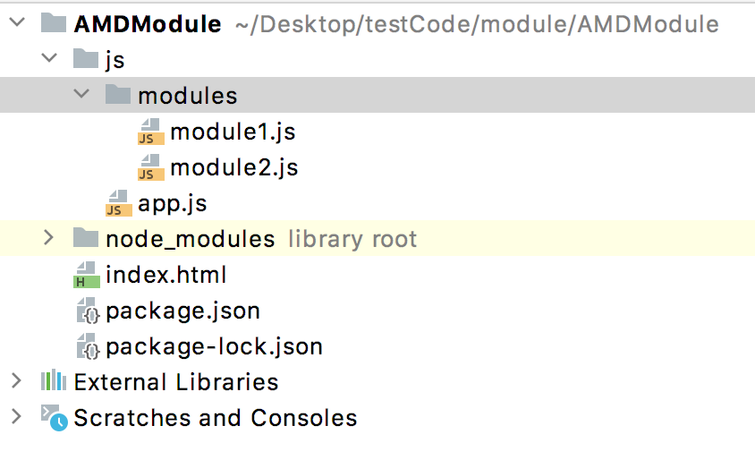

# AMD模块化

>  
>
> 项目结构：
>
> 
>
> `JS模块化管理中，一个模块就是一个js文件`

## 模块化实现

> `模块化的暴露与引入操作`：
>
> 1. 暴露，将当前文件中哪些内容暴露给外部使用，就像类的权限控制一样，暴露的方式：
>
>    1. 方式
>
>       ```javascript
>       /*
>       * 函数接收三个参数，其中前两个参数为可选参数：
>       * 第1个参数：指定该模块名称，其它模块想引入该模块时，必须使用'my_module1'这个名称。
>       * 第2个参数：指定该模块依赖哪些模块，使用一个数组接收，数组中保存模块名称。
>       * 第3个参数：回调函数，其中编写该模块的逻辑代码，返回一个对象，该对象数据就是该模块想要暴露的数据。
>       */
>       define('my_module1', ['vue', 'jquery'], function(v, $){  
>       	  return{a, b}
>       });
>       ```
>
> 2. 引入配置，指定该项目所使用的所有模块的路径位置。
>
>    1. 方式
>
>       ```javascript
>       /* 
>       * requirejs.config函数接收一个对象，该对象用来配置AMD。
>       * baseUrl：指定搜索文件的基础路径，基本上找文件都是baseUrl + path
>       * paths：是一个对象，记录该项目中每个模块的路径，想要使用基础路径就不要加斜杠，不想就加。
>       */
>       requirejs.config({
>
>           baseUrl: "./js/",
>           paths:{
>               // 如果使用要使用基础路径，开头不能有斜杠。
>               module1: "modules/module1",
>               module2: "modules/module2",
>               // 不使用基础路径，前面加斜杠，'./' 或者'../'
>               jquery: "../node_modules/jquery/dist/jquery"
>           }
>       });
>       ```
>
> 
>
> 3. 引入，在其它文件中要使用某个文件中暴露的内容时，需要将文件引入，引入方式：
>
>    1. 方式
>
>       ```javascript
>       /*
>       * 参数1: 当前模块引入的所有模块
>       * 参数2: 当前模块的逻辑代码
>       */
> requirejs(['module1', 'module2', 'jquery'], function(m1, m2, $){
>       
>       }
>       ```
>
> 
>
> `注意点`：

### 前期环境搭建

> AMD模块化时基于require.js文件实现的模块化，加载并解析汇总文件。AMD模块化非常简单，无需对源代码进行翻译，直接可运行在浏览器中，有浏览器翻译。

### 代码实现

>  代码说明：
>
>  1. module1文件是不依赖任何模块。
>  2. module2文件依赖module1模块。
>  3. app.js中配置模块路径。
>  4. 在html中使用js时，script标签src为requireJS文件的路径，使用data-main属性指向汇总文件。
>
>  代码注意：
>
>  1. 在进行模块配置时，设置baseUrl属性时，它是一个相对路径，它是基于index.html所在的路径为当前路径。也就是说index.html在哪个文件夹下，baseUrl就基于那个文件夹。
>  2. baseUrl属性的最后一个字符`必须是以斜杠结尾`，规定，否则运行时模块路径就会出错，导致js文件的404问题。
>  3. paths中记录着模块的路径，模块最终的路径为baseUrl+paths中的相应模块路径的组合，因此两点注意：
>
>     1. 如果想要使用baseUrl，则paths中该模块记录的路径不能以斜杠开头，否则拼接就会出问题，坑爹。
>
>     2. 如果不想用baseUrl，则path中该模块记录的路径以`./`或`../`等开头就行，例如：例如代码中的jquery。
>  4. 所有的文件名后都不能加后缀名，requireJS会自动为模块文件添加`.js`后缀名。如果加上就会报404错误。
>  5. 有些模块暴露时设置了模块名称，就是给define函数传递第一个参数，在配置路径(paths中的key)和依赖(define和requirejs函数中的数组值)时，使用的模块名必须是该模块使用define函数第一参数设置的值，例如jquery就是这样，即`暴露时设置的名称必须与引入时的一致`一定要注意。
>  6. 有些库不支持AMD，即没有AMD模块化代码，如果想用则需要自己添加。
>
>  jquery的AMD模块化代码：
>
>  ```javascript
>  if ( typeof define === "function" && define.amd ) {
>    define( "jquery", [], function() {
>       return jQuery;
>    } );
>  }
>  ```

module1.js

```javascript
// 不引入任何模块
define(function(){
    let msg = "module1文件中的msg数据";
    function showMsg(){
        console.log(msg);
    }
    // 将部分数据暴露出去，使用对象简写方式
    return {msg, showMsg};
});
```


module2.js

```javascript
// 暴露写法，并且引入第一个模块
define(['module1'], function(m){
    let data = '我是module2的数据';
    let m1_m2_data = data + m.msg;

    function bar(){
        return m1_m2_data;
    }
    // 将部分数据暴露出去，使用对象简写方式
    return {data, bar};
})
```

module3.js

```javascript
// 为了展示define函数第一个参数的用法，在path、requirejs函数和define函数中，必须使用zps这个名字。
define('zps', [], function(m){
    let data = '我是module2的数据';
    let m1_m2_data = data + m.msg;

    function bar(){
        return m1_m2_data;
    }
    // 将部分数据暴露出去，使用对象简写方式
    return {data, bar};
})
```


app.js

```javascript
// 模块配置，设置当前项目所所使用的模块，指明这些模块的路径。
requirejs.config({
    // 设置加载模块的基础路径，后面必须跟一个斜杠。
    baseUrl: "./js/",
    paths:{
        // 如果使用要使用基础路径，开头不能有斜杠。
        module1: "modules/module1",
        module2: "modules/module2",
      	zps: "modules/modules3",
        // 不使用基础路径，前面加斜杠，'./' 或者'../'
        jquery: "../node_modules/jquery/dist/jquery"
    }
});

// 模块引入写法，引入三个模块，第二个参数为回调函数，用来写该模块代码，将三个模块暴露的内容使用参数接收
requirejs(['module1', 'module2', 'zps', 'jquery'], function(m1, m2, m3, $){
    // 调用模块1的数据
    console.log(m1.msg);
    m1.showMsg();

    // 调用模块2的数据
    console.log(m2.data);
    console.log(m2.bar());

    // 调用第三方库，修改颜色
    $('body').css('background', 'pink');
});

```

index.html

```html
<!DOCTYPE html>
<html lang="en">
<head>
    <meta charset="UTF-8">
    <title>Title</title>
</head>
<body>
<!-- 使用src设置模块化翻译工具路径， 使用data-main设置项目的汇总文件路径-->
<script src="./node_modules/requirejs/require.js" data-main="./js/app.js"></script>
</body>
</html>
```

## 学习中的问题

> baseUrl的当前路径是基于index.html文件所在路径还是项目根目录？
>
> 1. 基于index.html，已经过测试。
>
> 引入模块时后面可以跟后缀名吗？
>
> 1. 不可以，requireJS会自动添加后缀名，因此不能添加。
>
> 引入jquery，为何不能写`jQuery`？
>
> 1. 因为jquery源代码中使用了AMD模块化，定义了模块名称为`jquery`，因此不能用其它名称，即使大写也不行。