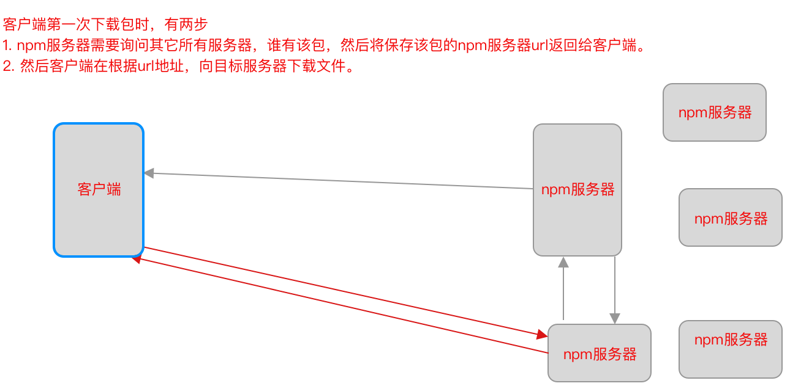

# npm

> npm:
>
> ​		 npm时node.js自带的包管理工具，用来管理项目中第三方模块。npm服务器中保存着成千上万个优秀开发者开发的各种功能框架，可以通过npm命令行给自己开发的项目下载远程服务器框架。
>
>  
>
> npm就像手机中的应用商店软件，用来管理手机上的应用，例如搜索商店应用，下载商店应用，删除手机应用，上传应用到远程商店。

## npm包结构

> npm将开发者开发的项目称之为包，其实就是常说的框架，或者叫库。
>
> npm包结构：
>
> 1. package.json：包的描述文件，描述这个包的包名、版本号、包的描述、包的依赖等信息，`npm包必须要有该文件`。
> 2. bin文件夹：存放可执行文件，为二进制的文件。
> 3. lib文件夹：存放经过编译后的js文件，例如翻译后的js文件。
> 4. test文件夹：存放一些测试报告
> 5. doc文件夹：存放项目的开发文档、bug文档、版本变更文档。
> 6. package-lock.json：项目安装第三方包时，npm自动生成的文件，用来记录当前项目依赖了哪些包，文件中记录了这些包的url地址。
> 7. node_modules文件夹：包含下载的第三方包。
>
> 
>
> ​		想要使用npm管理这个包，`必须要有package.json文件`，否则不能称之为包，也不能使用npm工具进行包管理，因为npm就是依据package.json文件进行管理的，其它其它文件夹可以没有，以前npm服务器管理很严格包中必须有前五个文件和文件夹，否则向npm服务器提交自己开发的包，提不上去，但是基本上很多知名的包，都或多或少的缺失一些文件夹。 
>
>   
>
> package-lock.json文件说明：
>
> ​		使用package-json文件在下载包时，无需在经过第一步寻址操作。
>
>  
>
> 
>
> 

## npm包命令

> npm命令：
>
> 1. `npm init`：初始化文件夹，将其转成一个包，其实就是在该文件夹中创建package.json文件，可以手动自己建该文件并填写信息。
> 2. `npm search xxxx`：查询npm服务器中是否有xxxx包。不好用，直接在网站上搜索https://www.npmjs.com/
> 3. `npm install xxxx `：也可以写成`npm install xxxx -S`或者`npm install xxxx --save`，关于命令说明：
>    1. 这个命令为局部安装，会在项目的根目录创建node_modules文件夹，将下载的包保存在该文件夹中。
>    2. 安装完毕会自动产生一个package-lock.json(`npm版本在5以后才有`)，里面缓存的是每个下载过的包的地址，目的是下次安装时速度快一些。
>    3. 当安装完一个包，该包的名字会自动写入到package.json中的`dependencies(生产依赖)`里。npm5及之前版本要加上--save后缀才可以。
> 4. `npm install xxxx -D`：或者使用 npm install xxxxx --save-dev ， 下载包并将该包写入到【devDependencies(开发依赖中)】
> 5. `npm i xxxx -g `：全局安装xxxx包（一般来说，带有指令集的包要进行全局安装，例如：browserify、babel等）
> 6. `npm root -g`：查看全局包安装路径。
> 7. `npm i xxx@yyy` :安装xxx包的yyy版本
> 8. `npm i` ：安装package.json中依赖声明的所有包。
> 9.  `npm remove xxxxx`  在node_module中删除xxxx包，同时会删除该包在package.json中的声明
> 10. `npm view xxxxx versions` :查看远程npm仓库中xxxx包的所有版本信息
> 11. `npm view xxxxx version` :查看npm仓库中xxxx包的最新版本，没啥用。
> 12. `npm ls xxxx` :查看我们所安装的xxxx包的版本
>
> 注意：
>
> 1. 调用`npm init`填写包描述文件时，包名规则：
>    1. 不能有中文
>    2. 不能有大写字母
>    3. 尽量不要以数字开头
>    4. 不能与npm仓库上其他包同名
> 2. 版本号说明，package.json中`dependencies属性`中显示的包版本时`不准确的`，需要使用`npm ls xxxx`命令查看。
>    1.  `^3.x.x` ：锁定大版本，以后安装包的时候，保证包是3.x.x版本，x默认取最新的。
>    2. `~3.1.x`：锁定小版本，以后安装包的时候，保证包是3.1.x版本，x默认取最新的。
>    3. `3.1.1` ：锁定完整版本，以后安装包的时候，保证包必须是3.1.1版本。
> 3. 全局安装的包说明，并不是所有包都适合全局安装，有些包带有命令行，因此例如babel、browserify包，需要在任何路径下都能使用，因此将其进行全局安装。

### 下载指定版本

```js
npm i webpack@^4.0.0 -D // 下载webpack时锁定大版本，例如webpack4最新版本为4.46.0，则下载4.46.0。
npm i webpack@~4.1.0 -D // 下载webpack时锁定小版本，例如webpack4.1.x版本最新的小版本为16，则下载4.1.16。
npm i webpack@4.1.1 -D // 下砸指定版本。
npm i webpack // 下载最新的版本
```


### 依赖

> npm分为生产依赖和开发依赖，在开发中有些包是用来辅助开发，不应该任何产品文档中的功能，例如代码提示包、语法检查包、css扩展前缀包、压缩代码包，这些包不能出现在生产环境上。
>
>  
>
> 使用`npm install xxxx`命令表示该包安装在生产和开发环境中，使用`npm install -D`命令表示该包只安装在开发环境中，原理就是依据package.json文件的两个属性`devDependencies`和`dependencies`，前者记录哪些包时开发环境依赖，哪些是所有环境依赖，项目上线时，将node_modules删除，删除package.json文件的`devDependencies`属性，然后重新拉取项目所有依赖的库，这样开发环境依赖的包就不会存在在生产环境中了。

### package.json

> ```json
> {
>   "name": "amd_module",  // 包名称
>   "version": "1.0.0",  // 包版本
>   "description": "AMDModule练习", // 包的描述
>   "main": "index.js", // 包的主文件
>   "license": "MIT",  // 遵循的开源协议规则，无需改变
>   "dependencies": {   // 包所依赖的第三方包
>     "jquery": "^3.5.1",  //  jquery为锁定大版本，即下载3版本的最新包
>     "requirejs": "～2.3.6" // requeirjs为锁定小版本，即下载2.3版本的最新包
>   }
> }
> ```

### package-lock.json

> ```json
> {
>   "name": "amd_module", // 包名称
>   "version": "1.0.0",   // 包版本
>   "lockfileVersion": 1,
>   "requires": true,   
>   "dependencies": {  // 项目所有依赖的包
>     "jquery": {
>       "version": "3.5.1",
>       "resolved": "https://registry.npm.taobao.org/jquery/download/jquery-3.5.1.tgz",
>       "integrity": "sha1-17TQjhv9uGrS8aPQOeoXMEcXq7U="
>     },
>     "requirejs": {
>       "version": "2.3.6",
>       "resolved": "https://registry.npm.taobao.org/requirejs/download/requirejs-2.3.6.tgz",
>       "integrity": "sha1-5Qk9lgHCgpJRJYwLlEXU0Z+p58k="
>     }
>   }
> }
> ```
>
>  version：当前包的版本
>
> resolved：当前包保存在远程服务器的url地址
>
> integrity：当前包的在本地npm缓存中的hash码，方便从npm缓存中获取该包。

### 配置npm

> 1. `npm config list`：查看npm配置信息
> 2. `npm config get registry`：查看npm包下载的服务器地址
> 3. ``npm config set registry url`：设置npm包下载的服务器地址
> 4. `npm config get cache`：查看包的缓存路径。
> 5. `npm config set cache 本地路径`：设置包的缓存路径。
> 6. `npm config get prefix`：查看全局安装的第三方包的保存路径
> 7. `npm config set prefix `：设置全局安装的第三方包的全局路径
> 8. `i `：清空npm缓存
> 9. `npm cache verify`：验证缓存数据的有效性和完整性，清理垃圾数据
> 10. `npm uninstall -g xxxx`：删除全局安装的包。
>
> 说明：
>
> 1. npm cache，npm每次下载包时会将包缓存起来并生成一个hash码，并在package-lock.json文件记录该hash码，之后删除node_modules文件夹后，使用`npm i`命令下载该包依赖的所有包时，会根据package-lock.json文件记录的所有包的hash码去缓存着，如果找到直接将包copy到项目的node_modules目录下，找不到再走网络。

# cnpm

> cnpm：有阿里服务器提供的npm工具，用来管理项目中的第三方包。
>
>  
>
> 由于npm服务器放在外国，每次下载这些第三方包非常的麻烦，网速非常慢有时可能被墙，因此阿里做了一件事，建立一个国内的npm服务器，定时同步外国的npm服务器，开发者直接从阿里服务器下载这些第三方包就行，无需再去外国网站下载了。
>
>  
>
> 淘宝的npm镜像地址：：https://registry.npm.taobao.org
>
>  安装完npm或者yarn后直接修改register，改成国内的阿里npm镜像。


