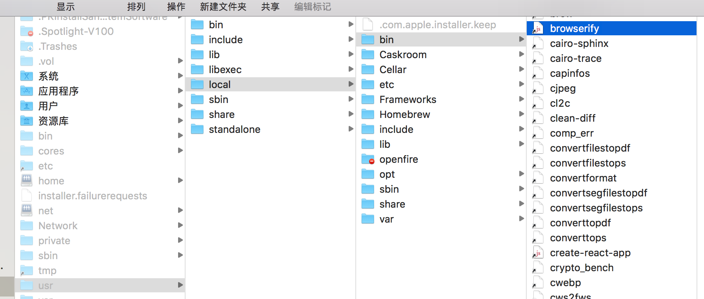
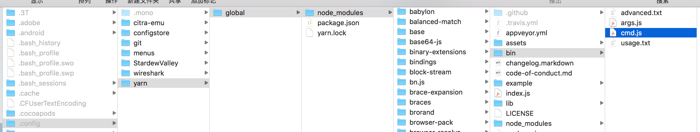

# yarn 

> Yarn也是包管理工具，比npm工具优秀太多了，现在的主流npm管理工具。
>
> 
>
> 安装yarn包管理工具：`npm -i yarn -g`，全局安装，因为它是带有命令。
>
> 
>
> `yarn global dir`：输出全局安装的包文件路径
>
> `yarn global bin`：系统可执行文件中的可执行的yarn管理的包文件。
>
> 两者的关系：
>
> ​		两者的关系可以从下图中看出，`yarn global bin`指向的目录为系统可执行目录，即目录中文件名为终端的命令名，可以执行，npm中支持命令的包，会通过快捷方式保存到该目录中，`yarn global dir`保存的就是真身。
>
> 
>
> 

## yarn命令与npm命令的对应关系如下：

### 初始化项目: 
	yarn init -y
	npm init -y

### 下载项目的所有声明的依赖: 
	yarn
	npm install

### 下载指定的运行时依赖包: 
	yarn add xxxx@3.2.1
	
	npm install xxxxx@3.2.1 -S

### 下载指定的开发时依赖: 
	yarn add xxxxx@3.2.1 -D
	
	npm install xxxxx@3.2.1 -D

### 全局下载指定包: 
	yarn global add xxxxxx
	
	npm install xxxxxxx -g

### 删除依赖包: 
	yarn remove xxxxx
	yarn global remove xxxxxx
	
	npm remove xxxxxxx -g

### 查看某个包的信息: 

> 例如查看该包的版本迭代记录

	yarn info xxx 
	npm info xxx

### 设置淘宝镜像: 
	yarn config set registry https://registry.npm.taobao.org
	npm config set registry https://registry.npm.taobao.org

yarn包管理工具，在npm中给新建的包起名字不能起存在的包名。例如jquery、vue这些存在库的名称，否则npm无法给你下载库文件，但是yarn没事，自己建的包名随便起，就算叫jquery时，它也能知道下载网上的知名库jquery。

并且yarn有包缓存功能，即有时断网的情况下，可以下载已下载的包，因为它缓存过。