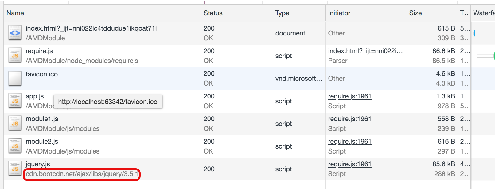

# 模块化与CDN配合 

> 虽然AMD实现了JS项目的模块化，但是上线后，所有的第三方库文件都需要从自己的服务器中下载，这样都两个劣势：
>
> 1. 每一个用户都需要下载该第三方库，无形中给服务器造成了许多的带宽压力。
> 2. 由于中国很广，如果服务器没有遍布各省的话，一些距离远的的地区下载这些文件非常好时，例如只有在上海有服务器，其它地方例如黑龙江、广州访问该服务器就非常慢。
>
> 因此对于项目中使用到的第三方文件，可以使用国内其它组织提供的CDN服务器，例如下面的例子，项目中依赖jquery，此时设置jquery库的路径就不再是本地路径，而是网上的cdn提供的路径。这样就少一个文件走本地服务器，即减轻压力，有加快第三方库下载速度。

app.js

```javascript
// 模块配置，设置当前项目所所使用的模块，指明这些模块的路径。
requirejs.config({
    // 设置加载模块的基础路径，后面必须跟一个斜杠。
    baseUrl: "./js/",
    paths:{
        // 如果使用要使用基础路径，开头不能有斜杠。
        module1: "modules/module1",
        module2: "modules/module2",
        // 不使用基础路径，前面加斜杠，'./' 或者'../'
        jquery: "https://cdn.bootcdn.net/ajax/libs/jquery/3.5.1/jquery"
    }
});

// 模块引入写法，引入三个模块，第二个参数为回调函数，用来写该模块代码，将三个模块暴露的内容使用参数接收
requirejs(['module1', 'module2', 'jquery'], function(m1, m2, $){
    // 调用模块1的数据
    console.log(m1.msg);
    m1.showMsg();

    // 调用模块2的数据
    console.log(m2.data);
    console.log(m2.bar());

    // 调用第三方库，修改颜色
    $('body').css('background', 'pink');
});

```


module1.js

```javascript
// 不引入任何模块
define(function(){
    let msg = "module1文件中的msg数据";
    function showMsg(){
        console.log(msg);
    }
    // 将部分数据暴露出去，使用对象简写方式
    return {msg, showMsg};
});
```

module2.js

```javascript
// 暴露写法，并且引入第一个模块
define(['module1'], function(m){
    let data = '我是module2的数据';
    let m1_m2_data = data + m.msg;

    function bar(){
        return m1_m2_data;
    }
    // 将部分数据暴露出去，使用对象简写方式
    return {data, bar};
})
```

index.html

```html
<!DOCTYPE html>
<html lang="en">
<head>
    <meta charset="UTF-8">
    <title>Title</title>
</head>
<body>
<!-- 使用src设置模块化翻译工具路径， 使用data-main设置项目的汇总文件路径-->
<script src="./node_modules/requirejs/require.js" data-main="./js/app.js"></script>
</body>
</html>
```

