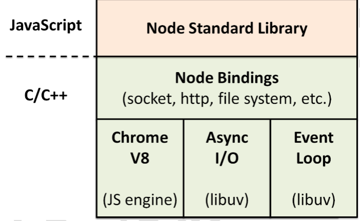

# node.js

> node.js：它是基于chrome的V8引擎开发的JS运行平台，实现使用js代码来开发服务器。
>
> 

## node.js优缺点

> node优点：
>
> 1. 单线程
>2. 异步非阻塞的I/O
> 3. 特别适用于I/O密集型应用
> 4. 事件驱动
> 
> 缺点：
>
> 1. 单线程，系统稳定性差。
>2. 非常不适合处理CPU密集型应用

### java与node服务器对比

> 例子中的角色说明：
>
> 1. 顾客：代表的发送http请求
> 2. 桌子：本次请求所占用的内存资源
> 3. 房子：服务器内存总量
> 4. 服务员：处理请求的线程
> 5. 后厨：耗时的I/O操作
>
> 举例：
>
> ​		一家餐厅开业，顾客纷纷去他家品尝美食，顾客到餐厅后，服务员给他找一个桌子坐下，然后顾客向服务员点餐，然后服务员将顾客点的内容给后厨，后厨将顾客点的美食做完告诉服务员，服务员将菜端上来，顾客吃完饭离开餐厅。
>
> 1. java服务器的处理方式：顾客来了后，会有一个服务员为专门服务，点餐、等待后厨的菜，然后将菜端给顾客，最后等待顾客离开，之后该服务员才能服务下一位顾客，因此即使在服务当前顾客时，有另一个顾客上门，服务员也不管。这样效率太低，变成餐厅需要排队吃饭。老板想要挣更多的钱，就会请大量服务员，给每一个顾客陪一个服务员，这样效率提高了，但是成本也蹭蹭往上涨。
> 2. node服务器处理方式：顾客来了后，店内只有一个服务员，这个服务员是所有顾客共享的，服务员将顾客点的菜写在纸条上，然后贴到后厨窗口，然后就去服务下一位顾客了，服务后面的顾客也是一样记录所点的菜，然后写在纸条上贴到后厨窗口，每当后厨做完一位顾客的菜时，通知服务员，服务员将菜端给对应顾客。这样充分的提高了服务员工作效率。
>
> java服务器与node服务器的比较：
>
> 1. java服务器会为每个请求创建一个线程，专门用来处理该请求，当遇到耗时I/O操作时，等待I/O操作完成；相反node服务器只用单线程(主线程)处理请求，基于事件驱动，为I/O操作创建I/O线程，当线程执行完后将其添加到事件队列中，主线程会每过一段时间查看一下事件队列，当队列中有事件时，取出并执行。
>
> 为何适用于I/O密集型应用？
>
> 1. 因为所有I/O操作都放在子线程执行，主线程继续处理其它任务(接收请求)，因此I/O操作不会阻塞主线程，所有非常适合I/O密集型应用。
>
> 为何不适合CPU密集型应用？
>
> 1. node只有一个线程用来处理接收请求，就像上面的例子一个，如果每位顾客都磨磨唧唧，直接影响服务员接待下一个顾客的时间，因此如果请求需要大量的CPU运算，这样大大降低node处理请求的效率。

### 事件驱动

> 事件驱动：
>
> ​		分离耗时操作，这种事件驱动设计方式常常用在客户端，例如移动端app，用户的交互放在子线程完成，主线程只负责UI的渲染工作，每当子线程完成内容后，将回调函数放到事件队列中，等待主线程处理。
>
>  
>
> 事件驱动特点：
>
> 1. 有一个单独的事件处理队列。
> 2. 将耗时操作放在子线程完成。

## js如何运行在node.js

### 模块的引入

> ​		node.js如何实现模块的引入，或者说如何搜索模块路径？
>
> 1. 对于自定义的模块，在引入时指定的是模块相对于使用它的模块的相对路径，因此直接以当前模块为起点找寻自定义模块。
> 2. 对于第三方模块，在引入时指定的是模块名而不是路径，因此node.js会根据当前模块文件所在的文件夹查找`node_modules`文件夹，如果找不到在向外层文件夹寻找，直到查找到项目根目录的下的`node_modules`文件夹，如果还是没有则报错。查找到则进入`node_modules`文件夹查找对应名称的第三方模块。

### node给开发者提供接口

> node.js上编写js文件时，如何调用node.js自带的包(CommonJS)？
>
> 1. node.js在运行开发者的js代码时，是以文件为单位，将文件的所有内容封装到一个外层函数中，这样实现的CommonJS提供的函数。
>
> ```javascript
> // module1.js文件
> let jq = require('jquery');
> function bar(){
>   console.log('bar');
> } 
> 
> // node运行module1.js文件时，使用一个函数将文件内容这个包裹起来
> function(exports, require, module, __filename, __dirname){
>   	// module1.js文件。
> 	  let jq = require('jquery');
>     // 获取当前代码所属的函数。
>   	console.log(arguments.callee.toString());
> 		function bar(){
> 		  console.log('bar');
> 		} 
> }
> ```
>
> 上面代码可以看出，直接将js代码原封不动的封装到一个匿名函数中。
>
>  
>
> 为何设计外层函数？
>
> 1. 隐藏服务器实现，由于代码被外层函数包裹，外层无法知道内层作用域中的实现，利用作用域。
> 2. 让js文件支持CommonJS模块化。
>


### global对象

> node中的global对象，相当于浏览器中的window对象，是一个全局对象。node中，在全局作用域中使用this是获取不到global对象，而是一个空对象`{}`。


### 让node执行自己的代码方式：

> 1. 命令行：node 项目的主JS文件。
> 2. IDE点击run

