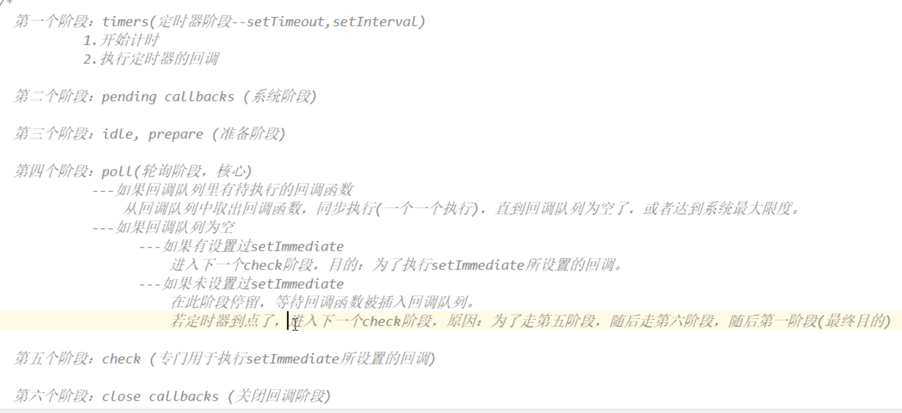
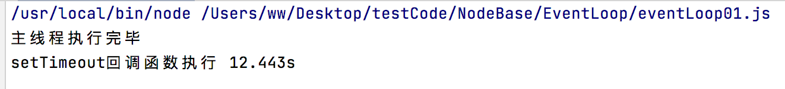
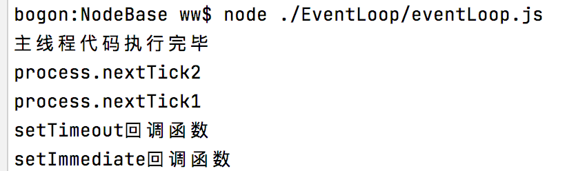

# node事件循环

> node的是基于事件驱动，因此必有一个事件循环和一个事件回调队列。
>
> node事件循环有6个阶段：
>
> 
>
>  
>
> node事件说明：
>
> 1. `第1阶段处理定时器回调任务`，也就是说即使在第4阶段定时器到时间了，也不会执行，要等到下一次循环的第1阶段才能执行。
> 2. 第四阶段查看回调队列中是否有待执行的回调函数，这里的回调函数指的是第4阶段需要处理的回调函数，换句话说在该阶段查看是否还有我需要执行的任务，`阶段4一般处理例如网络请求、I/O操作等回调任务`。
> 3. 如果当前`没有setImmediate事件`、`没有到时间的定时器回调函数`，并且`第4阶段任务已经清理完待执行的回调任务`，此时事件循环会停在第4阶段，等待任务唤醒。
> 4. 第5阶段`专门执行setImmediate注册的回调函数`。
>
> 
>
>  总结：
>
> 1. 定时器回调任务，在第1阶段执行。
> 2. setImmediate注册的回调函数，在第5阶段执行。
> 3. 网络请求、I/O操作等回调函数，在第4阶段执行。
> 4. process.nextTick()注册的回调函数，在1、4、5阶段优先执行。


## 立即执行函数和定时器函数

>定时器函数：
>
>1. setTimeout(func, 5ms)，创建一个一次性定时器。
>2. setInterval(func, 5ms)：创建一个循环定时器，每个5ms执行一次
>3. clearTimeout(timer)：清除一次性定时器，用在定时器还没有到时间时，清除定时器任务。
>4. clearInterval(timer)：清除循环定时器。
>
>立即执行函数：
>
>1. setImmediate(func)：将func函数立即放到回调队列，等待事件循环的第5阶段执行。
>2. clearImmediate(func)：在func函数未执行时，从回调队列中清除该func回调函数。
>3. process.nextTick(func)：将func函数立即放到回调队列，等待事件循环执行。`process对象时global对象的属性`。
>
>
>
>说明：
>
>1.  setTimeout()函数创建的定时器无需清理，当定时器回调函数执行完成就会自动清理。
>2. setTimeout(func, 0)与setTime(func)区别，不设置延时时间，浏览器会自动设置延时时间一般在10ms～100ms之间。
>3. setImmdiate()函数不是定时器。

### process.nextTick()与setImmediate()函数的区别

> 两个函数都是将参数中的回调函数添加到回调队列中，但是调用时机不同：
>
> 1. setImmediate()函数参数中的回调函数只能在第5阶段执行，因此需要等到事件循环到阶段5才能执行。
> 2. process.nextTick()函数添加的回调函数的`优先级更高`，因此在1、4、5阶段优先执行process.nextTick()注册的回调函数。


## 主线程与事件循环

> ​		回调队列中的函数都需要在主线程中执行，但是只有当主线程空闲时，才能执行回调队列中的函数。即只有当主线程中的代码执行完毕，才能执行回调队列中的函数。
>
>  
>
> 下面代码说明了两点：
>
> 1. 定时器并不是精确的，原因就在于事件循环只有在主线程执行完毕才能执行，因此就是到时间了，`主线程没有执行完毕`，`定时器回调函数前还有其它任务`或者`还没有循环到阶段1`。
> 2. 回调队列中的函数，需要在主线程中执行，只有当主线程代码执行完毕，才会执行回调队列中的函数。

```javascript
// 记录定时器是否在立即执行。
let oldDate = Date.now();
setTimeout(function (){
    let temp = (Date.now() - oldDate)/1000;
    console.log('setTimeout回调函数执行', `${temp}s`);
},0);

for (let i = 0; i < 9999999999; i++) {
}
console.log('主线程执行完毕');
```




### 回调函数的执行顺序

>1. process.nextTick()注册的回调函数，在主线程代码执行完毕，优先执行。多个process.nextTick()注册的回调函数，执行顺序看代码编写顺序。
>2. setTimeout(func, 0)和setImmediate(func)这两个函数执行顺序不确定，情况如下：
>   1. 如果主线程没有其它代码，循环速度>计时速度，阶段1刚开始计时时，循环查看回调队列中没有定时器回调，直接跳到下一个阶段，此时到点了但是阶段1过了，只能等下一次事件循环，此时setImmediate(func)优先执行。
>   2. 主线程中有代码，定时器计时时，主线程代码还没有执行完毕，之后主线程开始执行回调队列时，循环进入阶段1，查看回调队列中有定时器回调函数，则setTimeout(func, 0)先执行。
>
>

```javascript

let timer1 = setTimeout(function () {
    console.log('setTimeout回调函数');
}, 0);

let immediate = setImmediate(function () {
   console.log('setImmediate回调函数');
});

// 从执行结果上看，多个process.nextTick定义的回调函数的执行顺序，取决于process.nextTick在主线程的执行顺序。
process.nextTick(function () {
    console.log('process.nextTick2');
});

process.nextTick(function () {
   console.log('process.nextTick1');
});

console.log('主线程代码执行完毕');


```

