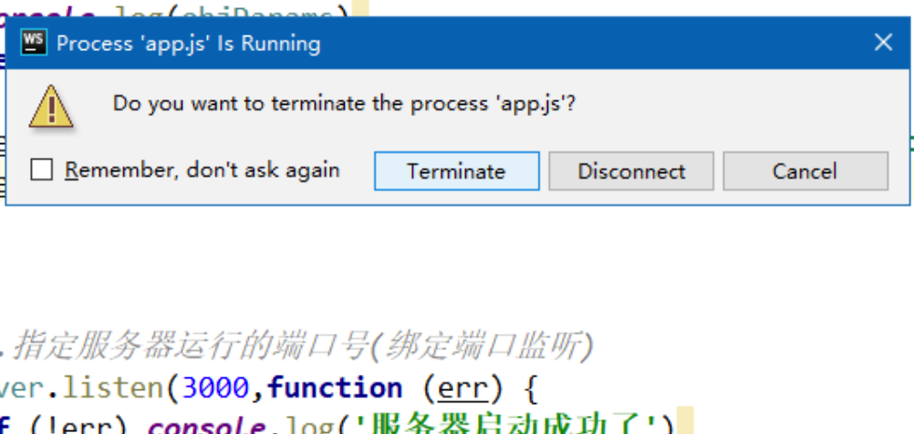

# 原生服务器

> node.js提供的`http`系统包，实现网络请求模块

```javascript
// 引入http包
let http = require('http');
// 创建一个server对象，用来接收浏览器发送过来的请求
let server = http.createServer(function(req, res){
  // 
});
// 绑定监听端口。
server.listener(8080, function(err){
  if(err){
    console.log(err);
  }else{
   	console.log('服务器启动完成') 
  }
});
```


## 实现get和post方式请求

>  注意点：
>
> 1. 如果参数中出现中文等一些非ASCII码时，http会自动进行`URLencoding`，在服务器接收参数时，需要进行`unURLencoding`。
> 2. post方式传递参数时，使用request.body参数获取不到请求参数，需要使用`可读流`获得参数。
> 3. node.js中有`queryString`包专门用来处理url的编解码和序列化。
>
> 

```javascript
let http = require('http');
let queryStr = require('querystring')
// 创建服务器，添加回调函数，回调函数中接收所有的http请求
let server = http.createServer(function (req, res){
    // 判断请求方式，post方法使用handlePost函数，get方式使用handleGet函数
    if (req.method.toUpperCase() === 'POST'){
        handlePost(req, res);
    }else {
        handleGet(req, res);
    }
  
  	// 告诉浏览器该文件类型和文件编码
		res.setHeader('content-type', 'text/html;charset=utf8');
    // 给浏览器发送响应数据，end为关闭可写流。
    res.end('ok', 'utf8', function () {
        console.log('发送成功');
    });
});

// 启动服务器，监听8080端口
server.listen(8080, function () {
    console.log('服务启动成功');
});

function handlePost(req, res){
    console.log(req.headers); // 获取本次请求的请求头
    console.log(req.method); // 获取本次请求的请求方式
    console.log(req.url); // 获取本次请求的url中的路径

    // post方式传递的参数，使用req.body属性获取不到，必须使用可读流获取，需要注意进行url解码
    let chunk = '';
    req.on('data', function (data) {
       chunk += data;
    });
    req.on('end', function () {
       console.log(chunk);
       /*
       * query.unescape(str); --- 对字符串进行unurlencode，解码
       * query.escape(str); --- 对字符串进行urlencode
       * query.parse(str, separator, eq ,option) --- 对查询字符串进行反序列化
       *       ---- separator，设置键值对连接符号，默认为 &
       *       ---- eq，设置键值之间连接符号，默认为 =
       * */
       let body = queryStr.parse(queryStr.unescape(chunk))
       console.log(body);
    });
}

function handleGet(req, res){
    console.log(req.headers); // 获取本次请求的请求头
    console.log(req.method); // 获取本次请求的请求方式
    console.log(req.url); // 获取本次请求的url中的路径+查询字符串。

    // get请求参数从url中获取，需要进行url解码
    let temp = req.url.split('?');
    let path = temp[0];
    let queryString = temp[1];
    let queryStrObj =  queryStr.parse(queryStr.unescape(queryString)); // 将urlencoding字符串转成对象
    console.log(path, queryStrObj);
}
```


## webStorm提示

> Terminate：关闭webstorm，并关闭服务器
>
> disconnect：关闭webstorm，不关闭服务器 



