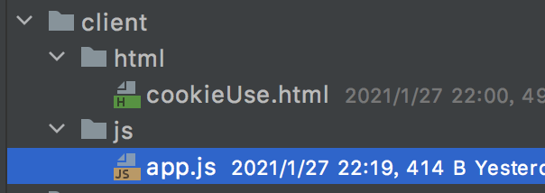

# path

> path模块是node.js中专门用来处理路径的模块。


## resolve

> ​		在模块化开发中html页面和js代码放在不同的页面中，例如给浏览器返回一个html页面，调用`sendFile`函数时，需要传递一个绝对路径。因此node.js提供了一个path模块，专门用来获取一个文件或者文件夹的路径。



```javascript
let {resolve} = require('path');
let path = resolve(__dirname, '../html/cookieUse.html');

/**
 * resolve() 
 * 1. 参数1，设置参照点，即从哪个路径下出发，绝对路径、相对路径都行。
 * 2. 参数2，根据参照点，进行偏移找到目标文件，并返回该文件的绝对路径。
 */
```

