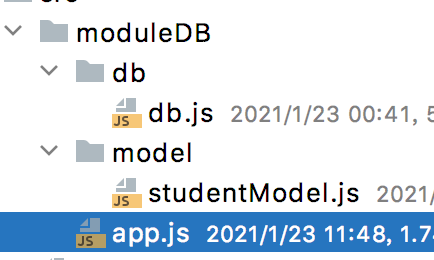

# mongoose模块化

> 模块化的目的就是将业务操作代码和数据库连接代码分离。



## db.js用来连接数据库

```javascript
let mongoose = require('mongoose');

const HOST = 'localhost';
const PORT = '27017';
const DBNAME = 'demo'

// 两种写法
// mongoose.set('useNewUrlParser', true)
// mongoose.set('useFindAndModify', false)
// mongoose.set('useCreateIndex', true)

mongoose.connect(`mongodb://${HOST}:${PORT}/${DBNAME}`,{
    useNewUrlParser: true,
    useUnifiedTopology: true,
    useCreateIndex: true
});


module.exports = function (callback) {
    mongoose.connection.on('open',function (err) {
        callback(err);
    });
}
```


## studentModel.js创建ODM对象

```javascript
let mongoose = require('mongoose');
let schema = mongoose.Schema;
let stuRule = new schema({
    stu_id:{
        type:String,
        required: true,
        unique: true
    },
    name:{
        type:String,
        required: true
    },
    age:{
        type:Number,
        required: true
    },
    address:{
        type:String,
    },
    hobby:[String],
    info:schema.Types.Mixed,
    date:{
        type: Date,
        default: Date.now()
    },
    enable_flag:{
        type:Boolean,
        default: true
    }
});
module.exports = mongoose.model('students', stuRule);
```


## app.js业务代码

```javascript
let db = require('./db/db');
let stuModel = require('./model/studentModel');


db((err)=>{

    if (err){
        console.log('数据库连接失败');
        return;
    }
    console.log('数据库连接成功');

    createObj(stuModel);
    findOneDoc(stuModel);
});

function createObj(stuModel){

    setTimeout(()=>{
        let obj = {
            stu_id: '10003',
            name: 'mary',
            age: 21,
            address: '中国洛阳',
            hobby:['看书','旅游'],
            info:'体验不一样的生活'
        };

        stuModel.create(obj,(err, result)=>{
            if (err){
                console.log('数据库操作失败');
            }
            console.log('create', result);
        });
    },100);
}

function findOneDoc(stuModel){
    setTimeout(()=>{
        stuModel.findOne({stu_id:'10003'},{stu_id:1, name:1, age:1, info:1, _id:0},(err, result)=>{
            if (err){
                console.log('数据库操作失败');
            }
            console.log('findOne', result);
        });
    }, 300);
}
```

