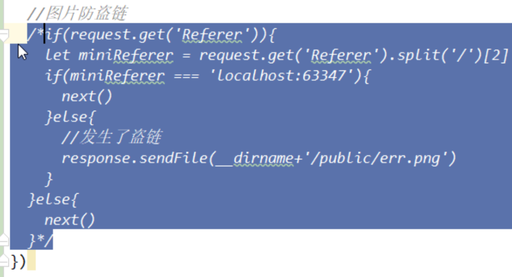
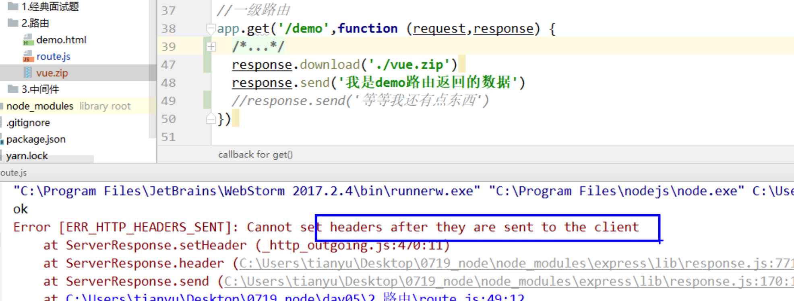

# request对象和response对象

> request和response对象其实是一个读写流对象。

## request对象
> request对象中常用属性和方法：
> 1. request.query	获取查询字符串参数（query参数），拿到的是一个对象
> 2. request.params 获取get请求参数路由的参数，拿到的是一个对象
> 3. request.body	获取post请求体参数，拿到的是一个对象（不可以直接用，要借助一个中间件）
> 4. request.get(xxxx)	获取请求头中指定key对应的value。
>
>  
>
> 说明：
>
> 1. post请求体中的参数，如果不借助中间件时，需要使用可读流来获取。
> 2. express支持参数路由，即在path中设置参数，可以使用params属性获取path中的参数。
> 3. 

## response对象

> response对象常用属性和方法：
>
> 1. response.send()：给浏览器做出一个响应，会自动追加一些默认的响应头。
> 2. response.write()：向浏览器中写入数据，允许多次写入。
> 3. response.end()	关闭可写流，本次请求结束（不会自动追加响应头）
> 4. response.download()	告诉浏览器下载一个文件，可以传递相对路径
> 5. response.sendFile()	给浏览器发送一个文件 备注：必须传递绝对路径
> 6. response.redirect()	重定向到一个新的地址（url）
> 7. response.set(key,value)	自定义响应头内容
> 8. response.get(key)	获取响应头指定key对应的value  很少使用
> 9. response.status(code)	设置响应状态码
>
> 注意：
>
> 1. redirect方法
>    1. 传绝对路径：用于跳转到其他域名的网页。
>    2. 传相对路径：用于跳转到当前域名的网页。
> 2. response.get()方法可以拿到响应头信息，但是响应头信息中的Date字段使用get方法是拿不到的。
> 3. response.sendFile()方法：用来给浏览器发送一个文件，不能使用send()方法发送数据，因为非文本数据是有存储格式的。

## Referer用法

> 1. 用来做防盗链。
>2. 用来做广告计费，根据Referer查看从哪跳转到这个广告的，并记录，到时候根据记录算钱。
>  
>防盗链原理：
> 
>​		当浏览器发送请求时，请求头中有一个`Referer`字段，用来记录本次请求是从哪个站点发送出去的，服务器通过判断Referer字段的域名是否是本站，来决定是否将图片返回给浏览器。`(有些网站会返回一个1KB的错误图片，告诉用户该网站盗用其它网站图片，使用1KB省流量)`

## 请求和响应对象的唯一性

> ​		一次请求只创建一个request对象和一个response对象，并且一次请求有可能会经历多个中间件，因此中间件函数和请求处理函数中的request和response参数都是同一个参数。

## 错误

> 下面这个错误是，send方法已经将响应信息发送给浏览器了，本次请求已经结束，因此不能在设置本次请求的响应头了。
>
> send函数做了什么：
>
> 1. 自动给响应信息添加响应头。
> 2. 将响应信息发送给浏览器。
>
> 说明：
>
> ​		之前的版本中，先后添加download和send方法时会报这个错误，现在是只要后面调用send方法，前面的download自动失效。多个响应以send为主，多个send，以第一个为主。

