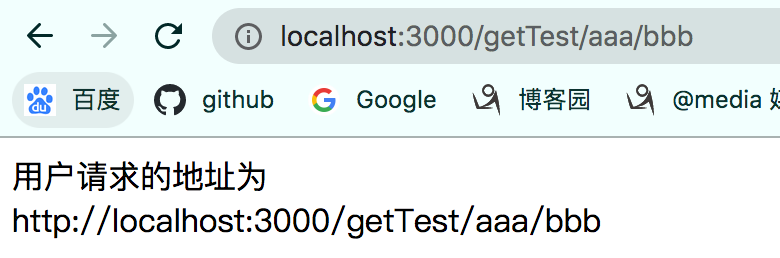
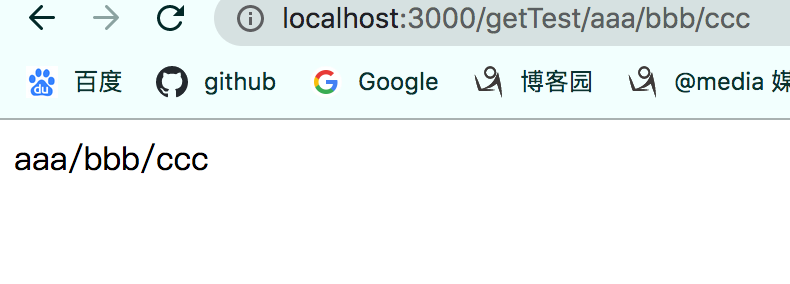

# 后端路由

## express框架路由实现

> express中，定义路由的路径时，不区分大小写.
>
> express寻找路由方式：
> 		express中维护了一个`存储队列`用来保存所有的路由(url与函数映射)、中间件，当express接收到请求时，会去遍历这个队列查看是否有符合条件的路由，有则调用，无则返回404。各个路由和中间件在队列的顺序是代码添加的顺序。

### 路由实现

> 1. 下面代码中添加了两个一级路由，虽然路径相同，但是请求方式不同，因此这是两个路由。通过`请求方式`和`path`来唯一标识一个路由。

### 普通路由

```javascript
const server =  require('express');
let app = new server();
// 使用express内置的中间件，用来解析post请求体，并放到response.body属性中
app.use(server.urlencoded({extended: true}))

// 添加根路由，当以get方式请求地址为http://localhost:3000/时，会调用这个函数处理。
app.get('/', function (request, response) {
    console.log(request.query);
    let data = {name:'这是get请求'};
    response.send(JSON.stringify(data));
});

// 添加一级路由，当以get方式请求地址为http://localhost:3000/test时，会调用这个函数处理。
app.get('/test', function (request, response) {
    console.log(request.query);
    let data = {name:'这是get请求', data:{key:'test', value:'张三'}};
    response.send(JSON.stringify(data));
});

// 添加一级路由，当以post方式请求地址为http://localhost:3000/test时，会调用这个函数处理。
app.post('/test', (request, response)=>{
  	// express.urlencoded中间件解析请求体，并放到body属性中
    console.log(request.body);
    console.log(request.get('Referer'));
    let data = {name:'这是post请求', data:{key:'test', value:'李四'}};
    response.send(JSON.stringify(data));
});

// 添加二级路由，当以post方式请求地址为http://localhost:3000/test/post时，会调用这个函数处理。
app.post('/test/post', (request, response)=>{
  	// express.urlencoded中间件解析请求体，并放到body属性中
    console.log(request.body);
    console.log(request.get('Referer'));
    let data = {name:'这是post请求', data:{key:'test', value:'李四'}};
    response.send(JSON.stringify(data));
});

app.listen(3000, (err)=>{
    if (err){
        console.log('服务器启动失败');
        return;
    }
    console.log('服务器启动成功');
});
```


### 参数路由

> 普通路由的局限性：
>
> * 普通路由中一个路由代表一个函数，但是对于一些电商平台，例如美团网站，上面有十几万个商家，那么就对应需要创建十几万个路由，就好像查询一个学生表，给每个学生写一个SQL语句，这样既浪费时间，维护成本又高。
>
> 参数路由：
>
> * 参数路由就是用来解决这种情况(页面模版一样，只是数据不同)，实现方式是将路径中的某段参数化，匹配所有这种格式的路径，获取路径中的参数，去数据库中查询出数据，呈现在页面上，就像SQL语句的查询条件参数化。
>
> 
>
> 下面代码中定义了一个参数路由，匹配所有三级路径格式为`/getTest/xxxx/xxxx`，即满足下面两个条件的路径就会调用该路由函数：
>
> * 路径为三级
> * 路径中第一个字符串必须是`getTest`，后面两个字符串任意取值。

```javascript
const server =  require('express');
let app = new server();
// 使用express内置的中间件，用来解析post请求体，并放到response.body属性中
app.use(server.urlencoded({extended: true}))

// 添加参数路由，当以get方式请求地址为http://localhost:3000/***/***时，会调用这个函数处理。
app.get('/getTest/:ids/:name', (req, res)=>{
    console.log(req.params); // { ids: '3241m3dsf', name: 'seess' }
  	// 根据ids和name去数据库中取出相应数据

  	// 将数据返回给客户端
    res.send(`用户请求的地址为http://localhost:3000/getTest/${req.params['ids']}/${req.params['name']}`)
});

app.listen(3000, (err)=>{
    if (err){
        console.log('服务器启动失败');
        return;
    }
    console.log('服务器启动成功');
});
```


### 路由冲突

> 路由是通过`请求方式+path`进行标识的，如果`请求方式+path`相同，这表明两个路由相同，就会出现冲突的情况。
>
> 路由冲突不会出现错误，express中有个存储队列保存服务器中注册的所有路由，前者会覆盖后者，原理就是`服务器在找寻路由时，找到了就不会再继续向后寻找了。`

#### 普通路由与参数路由冲突

>  当出现普通路由和参数路由冲突时，按照代码编写顺序，先添加的会先被express遍历出来。下面代码展示了普通路由和参数路由的编写顺序不同，最终调用结果会不同。

```javascript
const server =  require('express');
let app = new server();
// 使用express内置的中间件，用来解析post请求体，并放到response.body属性中
app.use(server.urlencoded({extended: true}))

// 添加参数路由，当以get方式请求地址为http://localhost:3000/***/***时，会调用这个函数处理。
app.get('/getTest/:ids/:name', (req, res)=>{
    console.log(req.params); // { ids: '3241m3dsf', name: 'seess' }
  	// 将数据返回给客户端
    res.send(`用户请求的地址为http://localhost:3000/getTest/${req.params['ids']}/${req.params['name']}`)
});
// 添加普通路由，当以get方式请求地址为http://localhost:3000/getTest/aaa/bbb时，会调用这个函数处理。
app.get('/getTest/aaa/bbb', (req, res)=>{
    console.log(req.params); // { ids: '3241m3dsf', name: 'seess' }
  	// 将数据返回给客户端
    res.send(`aaa/bbb`)
});

// 添加普通路由，当以get方式请求地址为http://localhost:3000/aaa/bbb/ccc时，会调用这个函数处理。
app.get('/getTest/aaa/bbb/ccc', (req, res)=>{
    console.log(req.params); // { ids: '3241m3dsf', name: 'seess' }
  	// 将数据返回给客户端
    res.send(`aaa/bbb/ccc`)
});

// 添加参数路由，当以get方式请求地址为http://localhost:3000/***/***/***时，会调用这个函数处理。
app.get('/getTest/:ids/:name/:age', (req, res)=>{
    console.log(req.params); // { ids: '3241m3dsf', name: 'seess' }
  	// 将数据返回给客户端
    res.send(`用户请求的地址为http://localhost:3000/getTest/${req.params['ids']}/${req.params['name']}/${req.params['age']}`)
});


app.listen(3000, (err)=>{
    if (err){
        console.log('服务器启动失败');
        return;
    }
    console.log('服务器启动成功');
});
```




### 路由器路由

> 上面的路由都杂糅在一个js文件中，没有充分利用模块化思想，引入路由器路由，将不同的业务逻辑放在不同的js文件中，`路由器路由其实是使用中间件的方式来实现的`。
>
> 路由器路由实现方式：
>
> 1. 引入`Router`构造函数。
> 2. 创建一个Router类型的实例对象，该对象是一个小型的服务器对象(app对象)，通过它获取request、response对象并调用服务器对象中的方法。
> 3. 使用get和post方法添加路由。
> 4. 将Router类型实例对象暴露出去。
> 5. 在server.js文件中，通过中间件方式引入Router实例对象。
>
> 路由器路由的优点：
>
> 1. 将路由代码模块化，按照功能放在不同的模块中。
> 2. 维护简单。

```javascript
// 服务器主文件
const server =  require('express');
let app = new server();
// 使用express内置的中间件，用来解析post请求体，并放到response.body属性中
app.use(server.urlencoded({extended: true}))

// 第5步：在server.js文件中，通过中间件方式引入Router实例对象
// 添加UI路由
app.use(UIRouter());
// 添加业务逻辑路由
app.use(Login_RegisterRouter());

app.listen(3000, (err)=>{
    if (err){
        console.log('服务器启动失败');
        return;
    }
    console.log('服务器启动成功');
});
```


```javascript
// UIRouter，UI路由，用来返回页面
// 第1步：引入路由器构造函数
let {Router} = require('express');
let path = require('path')
// 第2步：创建路由器
let router = new Router();

// 第3步：添加路由
// 添加登录路由
router.get('/login',(req, res)=>{
   console.log('login.html');
   // 获取路径，从一个路径出发，获取到目标文件的路径
   let filePath = path.resolve(__dirname, '../../client/login.html');
   console.log(filePath);
   // sendFile只接收绝对路径
   res.sendFile(filePath, err => {
       console.log('文件不存在');
   });
});

// 添加注册路由
router.get('/register', (req, res)=>{
    console.log('register.html');
    // 获取路径，从一个路径出发，获取到目标文件的路径
    let filePath = path.resolve(__dirname, '../../client/register.html');
    // sendFile只接收绝对路径
    res.sendFile(filePath, err => {
        console.log('文件不存在');
    });
});

// 第4步：将Router类型实例对象暴露出去。
module.exports = ()=>{
    return router;
}
```


```javascript
// Login&Register，业务路由，用来处理业务逻辑，一般都是使用ajax来触发这种路由。
const {Router} = require('express');
let router = new Router();
let path = require('path');

// 添加登录路由
router.post('/login', (req, res)=>{
    let user = req.body;
  	// 如果用户名和密码正确，跳转到个人中心页面
    if (user.email === 'admin@qq.com' && user.password === '123456'){
        let filePath = path.resolve(__dirname, '../../client/userCenter.html')
        res.sendFile(filePath);
    }else{
      	// 如果不正确则重定向到登录页面。
        res.redirect('http://localhost:3000/login');
    }
});

module.exports = ()=>{
    return router;
}
```


后端路由和前端路由(SPA)


