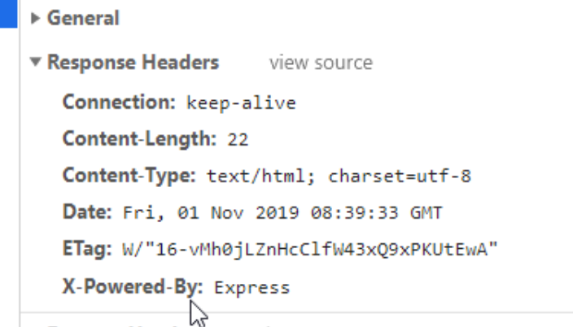

# 服务器对象

```javascript
const express = require('express');

// 服务器对象
const app = new express;
```


## 禁止express返回X-powered-by

> 使用express框架时，express会自动在响应头中添加`x-powered-by`属性，这样会直接暴露当前访问的服务器所使用的框架，更容易遭到攻击。




```javascript
const express = require('express');

// 服务器对象
const app = new express;
// 旧版本express使用这句代码禁用。
app.disabled('x-powered-by');
// 新版本express使用这句代码禁用。
app.disable('x-powered-by');

```

