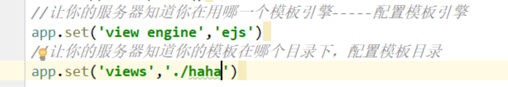

旧版本为view，新版为views

app.set('viewengine', 'ejs');

app.set('view', './haha')

`<% console.log('1') %>`，使用这个方式写，会在服务器的控制台输出log，不会在浏览器控制台输出，那么如果写一个循环会直接让服务器卡死吗？

前后端不分离：前端页面有后端生成，例如上面的图片，js+html标签+数据混合在一起，服务器将其翻译成html文件，调试起来非常痛苦。

前后端分离：后端只传输数据，前端自己通过ajax获取并操作DOM放到html中，此时html与js分离在一起，页面无需经过服务器翻译。

js中如何判断一个对象为空对象：JSON.stringify(obj) === '{}'

小回调地狱

为啥要加一个{errMsg:{}}，因为使用模板页面专门用来显示服务器想要让页面展示的数据，如果服务器没有传数据时，服务器在渲染模版时会出错，因此传一个空对象。

问题：传一个空对象，读取出undefined时，为啥不会显示undefined？

页面之间传递数据，例如注册成功后，跳转到登录页面，将注册的账户名带到登录页面显示，如果实现？

使用查询字符串。

 

登录成功后显示个人中心页面，直接在login路由中使用`res.render('user_center',{数据})`的问题，页面显示的是个人中心，而地址栏中显示的是登录页面的url。

直接渲染时使用查询字符串传值的问题，由于页面上的数据时根据查询字符串决定，此时用户可以随时修改地址栏中的查询字符串，这样就会动态的修改网页中的信息，例如登录完成跳转到个人中心时，用户名昵称使用查询字符串传递，此时我可以随便修改当前个人中心显示的用户名。

使用cookie带数据：

1. 如果在登录成功时，将昵称带入到cookie。

实现7天免登录：

1. 使用cookie记录用户名，有弊端，用户可以通过修改cookie，改成其它用户名的cookie，实现免登录其它人的个人中心。
2. 使用token，一长串字符串，就算用户通过浏览器修改了cookie，蒙对的概率挺低的，但是有可能就有些运气好的蒙对了。
3. 将token切分成多块，保存到多个cookie中，将蒙对的概率降低到最低程度。

mongodb的`_id`字段的存储格式为`j:13454dg45tr2356`，即`j:字符串`。