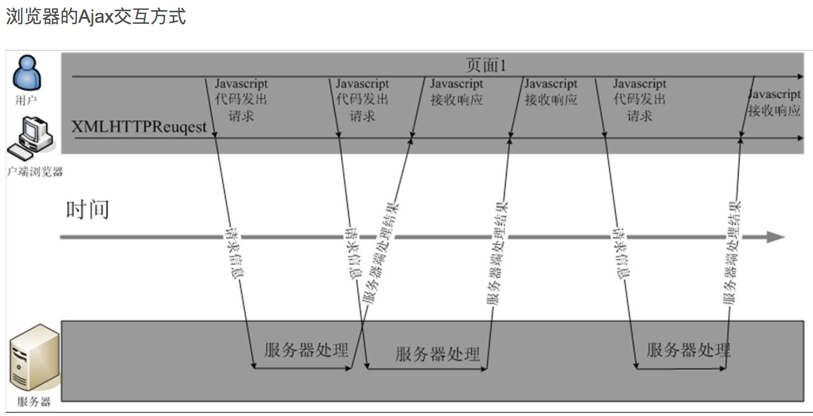

# ajax

> 传统网络请求：
>
> ​		传统的网页与用户交互时，发起网络请求必然伴随着新页面的建立，出现了历史记录，用户可以通过点击`后退`和`前进`键在各个页面来回调转。
>
> ajax技术：
>
> ​		该技术的提出就是为了解决在不生成新页面的情况下，与服务器进行数据交互。即异步网络请求，它是通过浏览器中的ajax引擎模块来实现的。

## ajax引擎工作原理

> ajax请求和传统网络请求的区别：
>
> 1. 传统网络请求是浏览器网络模块直接与服务器进行交互，例如form、a、script、link、img等标签。
> 2. ajax请求是需要将请求发送给ajax引擎，由ajax引擎与服务器进行交互，然后ajax引擎会将响应数据返回，整个过程都是异步的，并不会阻止当前网页中的其它交互。




## 原生ajax请求

> 创建原生ajax请求步骤
>
> 1. 创建`XMLHTTPRequest`对象。
> 2. 给对象的`onreadystatechange`属性设置监听方法，用来监听ajax请求状态，响应数据可以通过该方法获取到。
> 3. 调用`open(method, url)`方法，设置请求所需的参数。
> 4. 调用send()方法，发送请求。
>
> ajax请求状态：
>
> 1. 0：ajax请求未初始化状态，即在open方法调用之前。
> 2. 1：ajax请求初始化状态，即open方法调用完成，send方法还没有调用。
> 3. 2：ajax请求已发送，调用send方法。
> 4. 3：请求处理中（响应中通常有部分数据可用，但是服务器还没有完成响应）
> 5. 4 请求已完成（可以访问服务器响应并使用它）
>
> ajax的get和post请求区别：
>
> 1. get请求：请求参数放在url中。
> 2. post请求
>    1. 调用`setRequestHeader`方法，必须设置Content-type属性，否则服务器获取不到请求体参数，`设置请求头时必须放在open方法之后，否则设置不上去`。
>    2. 将post请求参数传入send方法中。

```html
<!DOCTYPE html>
<html lang="en">
<head>
    <meta charset="UTF-8">
    <title>Title</title>
</head>
<body>
    <button>进行get请求</button>
    <button>进行post请求-urlencode</button>
    <button>进行post请求-json</button>
    <script>
        let btns = document.querySelectorAll('button');
      // 使用ajax发送get请求
        btns[0].addEventListener('click', function (){
            // 定义异步请求对象
            let xhr = new XMLHttpRequest();
            // 创建请求监听，监听状态改变，接收一个函数，函数参数为event，还有一个隐藏参数this，指向xhr对象。
            xhr.onreadystatechange = function (event) {
                console.log('aaaa', this);
                // 当异步请求对象状态为4，并且返回值在2xx时，请求成功。
                if (this.readyState == 4 && (this.status >= 200 && this.status <=299)){
                    console.log(this.response);
                }
            }
          	// 配置请求信息，请求方式+url
            xhr.open('get', 'http://localhost:3000/primary_ajax_get?name=kobe&age=18');
            // 发送请求
            xhr.send();
        });

				// 使用ajax发送post请求，数据格式为urlencode
        btns[1].addEventListener('click', function (){
            let xhr = new XMLHttpRequest();
            xhr.onreadystatechange = function(){
                if (this.readyState == 4 && (this.status >=200 && this.status<=299)){
                    console.log(this.response);
                }
            }
           // 配置请求信息，请求方式+url
            xhr.open('post', 'http://localhost:3000/primary_ajax_post');
           // 设置请求体数据类型，post必须设置content-type字段，否则服务器无法判断数据格式，必须放在open方法之后。
            xhr.setRequestHeader('Content-Type', 'application/x-www-form-urlencoded');
            xhr.send('name=kobe&age=18');
        });

      	// 使用ajax发送post请求，数据格式为json
        btns[2].addEventListener('click', function (){
            let xhr = new XMLHttpRequest();
            xhr.onreadystatechange = function(){
                if (this.readyState == 4 && (this.status >=200 && this.status<=299)){
                    console.log(this.response);
                }
            }
            xhr.open('post', 'http://localhost:3000/primary_ajax_post');
	          // 设置请求体数据类型，post必须设置content-type字段，否则服务器无法判断数据格式
            xhr.setRequestHeader('Content-Type', 'application/json;charset=UTF-8');
            let obj = {name:'赵四', age: 18};
            xhr.send(JSON.stringify(obj));
        });
    </script>
</body>
</html>
```


### XMLHttpRequest对象


## jquery实现ajax请求

>  jquery框架提供了ajax请求实现
>
> 1. $.ajax()，实现ajax请求的核心方法，如果需要详细的配置，建议使用该方法。
> 2. $.get()，该方法是对ajax()方法的简单封装，实现更简单发送ajax请求，没有错误回调函数。
> 3. $post，该方法是对ajax()方法的简单封装，实现更简单发送ajax请求，没有错误回调函数。

```html
<script>
	
	/** ajax方法写法1：
	 * url：url地址
	 * setting：配置信息(method, data, dataType, success, error)
	 * 注意必须严格按照jquery提供的命名写，一个字母都不能错，否则请求时会出现意外，
	 */
	$.ajax('http://localhost:3000/jquery_ajax_get',{
		type:'post',  // 请求方式
    dataType: 'json' // 告诉服务器响应数据期望是json格式。
		data: JSON.stringify({name:'李四', age: 18}), // 请求参数
		success:function (result){  // success: 返回状态码为2xx时的回调
			console.log('ajax_get: '+ result);
		},
		error:function (err) {  // error：返回其它状态码时的回调
			console.log('请求错误：' + err);
		}
	});
	
	/**
	 * ajax方法写法2：
	 * setting：配置信息(url, method, data, dataType, success, error)
	 */
	$.ajax({
		url:'http://localhost:3000/jquery_ajax_post',
		type: 'post',
		data: {name:'王五', age: 18},
		success:function (result){
			console.log('ajax_post: '+ result);
		},
		error:function (err) {
			console.log('请求错误：' + err);
		}
	});
	
	/**
	 * get方法写法：
	 * url: url
	 * data: 请求数据，无参数时可以忽略不写
	 * callback: 请求成功回调
	 * dataType: 数据格式，默认使用urlencode时，忽略不写
	 */
	$.get('http://localhost:3000/jquery_ajax_get',{name:'李四', age: 18},(data)=>{
				console.log(data);
			});
  
	/**
	 * post方法写法：
	 * url: url
	 * data: 请求数据，无参数时可以忽略不写
	 * callback: 请求成功回调
	 * dataType: 数据格式，默认使用urlencode时，忽略不写
	 */
	$.post('http://localhost:3000/jquery_ajax_post',{name: '王五', age:20}, (data)=>{
				console.log(data);
		},'json');
</script>
```


### jquery设置json数据

>  请求格式为json格式
>
> 1. data属性值转成json字符串
> 2. content-type属性值设为application/json

```javascript
$.ajax('http://localhost:3000', {
  type: 'post',
  data: JSON.stringify({name:'张三', age: 18}),  // 将数据转成json字符串
  ContentType: 'application/json;charset=utf-8', // 设置数据格式为json。
  success: function (data) {
		console.log('jquery-get',data);
	},
  error: function(err){
		console.log('jquery-get',err);
  }
});
```


## ajax请求取消

> 由于网络延迟的问题，用户可能向服务器发送多次请求，例如在使用验证码时，用户点了3次，只希望返回第三次的验证码，前两次忽略。
>
> XMLHttpRequest对象提供了`abort`方法，用来取消当前XMLHttpRequest对象发送的请求，有两种情况：
>
> 1. 如果请求没有发出去则自动取消请求。
> 2. 如果请求已经发送出去，则ajax引擎自动将服务器返回数据扔掉，不会传给XMLHttpRequest对象。

```html
<script>
    let btn = document.querySelector('button');
    let xhr = null;
    btn.addEventListener('click', function (){
        if (xhr){
            // 取消上一次异步请求
            xhr.abort();
        }
        xhr = getAutoCode();
    });

    function getAutoCode(){
        // 定义异步请求对象
        xhr = new XMLHttpRequest();
        // 创建请求监听，监听状态改变，接收一个函数，函数参数为event，还有一个隐藏参数this，指向xhr对象。
        xhr.onreadystatechange = function (event) {
            // 当异步请求对象状态为4，并且返回值在2xx时，请求成功。
            if (this.readyState == 4 && (this.status >= 200 && this.status <=299)){
                console.log(this.response);
            }
        }
        xhr.open('get', 'http://localhost:3000/verifiCode');
        xhr.send();
        return xhr;
    }
</script>
```


## 跨域问题

> 同源策略由网景公司提出，现代的浏览器都遵循这个策略，为了保证用户数据的安全。
>
> 同源策略限制的地方：
>
> 1. 不同源的cookie不能相互共享，即其它源的网站不能读取该源的cookie。
> 2. 不同源的DOM不能相互访问，例如网页中的iframe标签，内外不能相互访问。
> 3. ajax不能跨域请求。
>
> 何为同源：协议、域名和端口号都相同时，这两个url地址同源，或者说同域。
>
> ajax不能跨域请求：
>
> ​		例如当前网页地址为`http://www.a.com:80`，网页需要访问`http://www.a.com:8080`这个地址的数据，此时两个地址非同源，ajax进行跨域访问，浏览器不会阻止请求的发出，服务器正常接收到请求，但是服务器返回相应信息时，ajax引擎会拦截响应数据。`下面的例子就是ajax跨域请求`。

```html
<!-- 当前网页地址为http://localhost:8080/test.html -->
<html>
  <body>
  <script>
			// 定义异步请求对象
			let xhr = new XMLHttpRequest();
			// 创建请求监听，监听状态改变，接收一个函数，函数参数为event，还有一个隐藏参数this，指向xhr对象。
			xhr.onreadystatechange = function (event) {
			console.log('aaaa', this);
			// 当异步请求对象状态为4，并且返回值在2xx时，请求成功。
			if (this.readyState == 4 && (this.status >= 200 && this.status <=299)){
					console.log(this.response);
				}
			}
			xhr.open('get', 'http://localhost:3000/primary_ajax_get?name=kobe&age=18');
			xhr.send();
  </script>
  </body>
</html>
```


### jsonp解决跨域

> jsonp方式解决跨域的原理：
>
> ​		由于标签请求资源不会有跨域的限制，利用标签请求数据，绕过来ajax引擎，例如`form`、`img`、`link`、`a`、`script`标签，因此可以借助标签实现跨域请求。
>
> jsonp方式步骤：
>
> 1. 在window对象上创建一个回调函数`callback`。
> 2. 创建一个`script`标签，将请求地址设置在src属性中，其中包括请求参数和回调的方法名。
> 3. 将script标签添加到DOM树中，浏览器会自动下载该资源，并执行。
> 4. 执行完成效果这个script标签。
>
> jsonp方式的局限性：
>
> 1. 需要服务端的配合，返回一个函数调用的字符串。
> 2. 这种方式只能解决get请求跨域，不能解决post请求跨域问题。


```html
<!-- 前端代码 -->
<!DOCTYPE html>
<html lang="en">
<head>
    <meta charset="UTF-8">
    <title>Title</title>
    <script src="http://localhost:3000/jquery-1.12.4.js"></script>
</head>
<body>
<button>进行get请求</button>
<button>进行get请求</button>
<script>
    let btns = document.querySelectorAll('button');
    // 舍弃请求回调函数
    window.jsonp = function (data){
        console.log(data);
      	// 请求处理结束后删除script节点
        let node = document.querySelector('script[src|="http://localhost:3000/jsonp_get?callback=jsonp&name=张三&age=18&method=原生方式"]');
        node.parentElement.removeChild(node)

    }
    btns[0].addEventListener('click', function (){
        let note = document.createElement('script');
      	// 设置请求url，callback参数指定请求的回调方法
        note.src = `http://localhost:3000/jsonp_get?callback=jsonp&name=张三&age=18&method=原生方式`;
        document.body.append(note);
    });

		// jquery实现
    btns[1].addEventListener('click', function (){
        $.ajax({
            url: 'http://localhost:3000/jsonp_get',
            method: 'get',
            dataType: 'jsonp', // 设置为jsonp方式，jquery提供了jsonp的实现方式，jquery会自动在查询字符串后面添加一个callback名称的键值对。
            data: {name: '李四', age: 20, method: 'jquery方式'},
            success: (data)=>{
                console.log(data);
            },
            error: (err)=>{
                console.log('error: '+err);
            }
        });
      
        // jquery的jsonp简写方式
        // $.getJSON('http://localhost:3000/jsonp_get',{name: '李四', age: 20, method: 'jquery方式'},(data)=>{
        //     console.log(data);
        // });
    });
</script>
</body>
</html>
```


```javascript
// 服务器端实现
const server = require('express');
let app = new server();
app.listen(3000, (err)=>{
    if (err){
        console.log('服务器启动失败', err);
        return;
    }
    console.log('服务器启动成功');
})

app.get('/jsonp_get', (request, response)=>{
    console.log(request.query);
    let {callback, method} = request.query;
    let arrs = [1, 2, 3, 4, 5, 'a'];
  	// 发送一个函数调用字符串。
    let func = `${callback}(${JSON.stringify({data:arrs, method})})`;
  	// jsonp({"data":[1,2,3,4,5,"a"],"method":"原生方式"})
    console.log(func);

    setTimeout(()=>{
        response.send(func);
    },3000);
});

```


### cors解决跨域

> 使用cors方式解决跨域问题，不需要让后端编写调用前端方法的字符串了，而是直接传递数据。需要后端在返回数据时，添加一个响应头`Access-Control-Allow-Origin`，表示允许某地址跨域访问本服务器资源。
>
>  
>
> cors解决跨域步骤就一步：
>
> 1. 只需要在响应头中添加`Access-Control-Allow-Origin`属性就行，属性值为需要跨域的url地址的`协议名://主机名:端口号`

```html
<!-- 前端代码 -->
<script>
    let btns = document.querySelectorAll('button');
    btns[0].addEventListener('click', function (){
        $.ajax({
            url: 'http://localhost:3000/cors_get',
            type: 'get',
            data: {name:'张三', age: 18, method: 'cors_get'},
            success:(result)=>{
                console.log(result);
            },
            error: (err)=>{
                console.log(err);
            }
        });
    });


    btns[1].addEventListener('click', function (){
        $.ajax({
            url: 'http://localhost:3000/cors_post',
            type: 'post',
            data: {name:'张三', age: 18, method: 'cors_get'},
            success: (data)=>{
                console.log(data);
            },
            error: (err)=>{
                console.log('error: '+err);
            }
        });
    });
</script>
```

```javascript
// 服务器端实现
const server = require('express');
let app = new server();
app.listen(3000, (err)=>{
    if (err){
        console.log('服务器启动失败', err);
        return;
    }
    console.log('服务器启动成功');
})
// 添加urlencode解析器中间件
app.use(server.urlencoded({extended: true}))


app.get('/cors_get', (request, response)=>{
    console.log(request.query);
    let arrs = [1, 2, 3, 4, 5, 'get_cors'];
// 允许http://localhost:63342站点使用get请求访问http://localhost:3000/cors_get  	
    let url = request.url.split('/')[0];
    let urls = ['http://www.a.com', 'http://www.b.com', 'http://localhost:63342']
    // 该服务器支持多个站点跨域
    if(urls.indexOf(url) > 0){
        response.setHeader('Access-Control-Allow-Origin',url)
    }
    response.send(JSON.stringify(arrs));
});


app.post('/cors_post', (request, response)=>{
    console.log(request.query);
    let arrs = [1, 2, 3, 4, 5, 'post_cors'];
	// 允许http://localhost:63342站点使用Post请求访问http://localhost:3000/cors_post
    let url = request.url.split('/')[0];
    let urls = ['http://www.a.com', 'http://www.b.com', 'http://localhost:63342']
    // 该服务器支持多个站点跨域
    if(urls.indexOf(url) > 0){
        response.setHeader('Access-Control-Allow-Origin',url)
    }
    response.send(JSON.stringify(arrs));
});
```


## ajax的兼容性写法

```javascript
var xhr = null;
try {
	xhr = new XMLHttpRequest(); // IE7及以上、其它浏览器使用该方式创建ajax对象。
} catch (e) {
	xhr = new ActiveXObject('Microsoft.XMLHTTP'); // IE5～IE6需要使用该方法创建ajax对象。
}
```


## 问题：

### 为何aJax需要限制跨域

> 防止CSRF攻击。