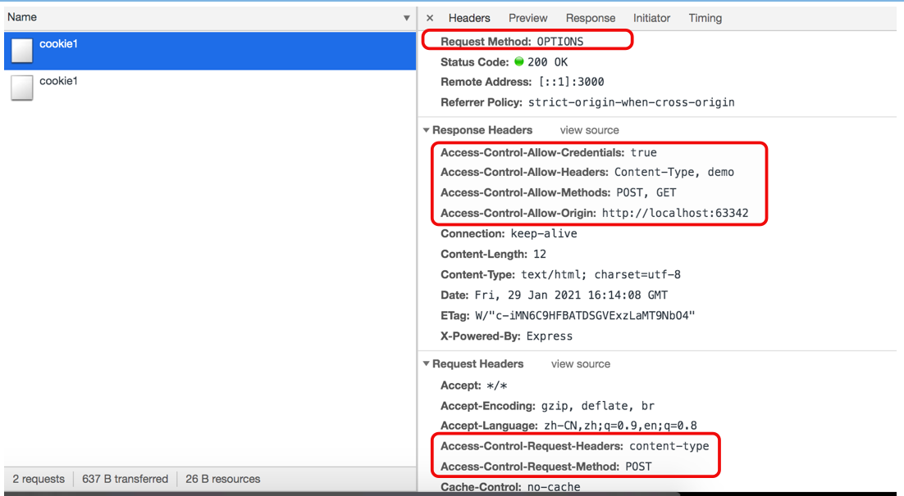
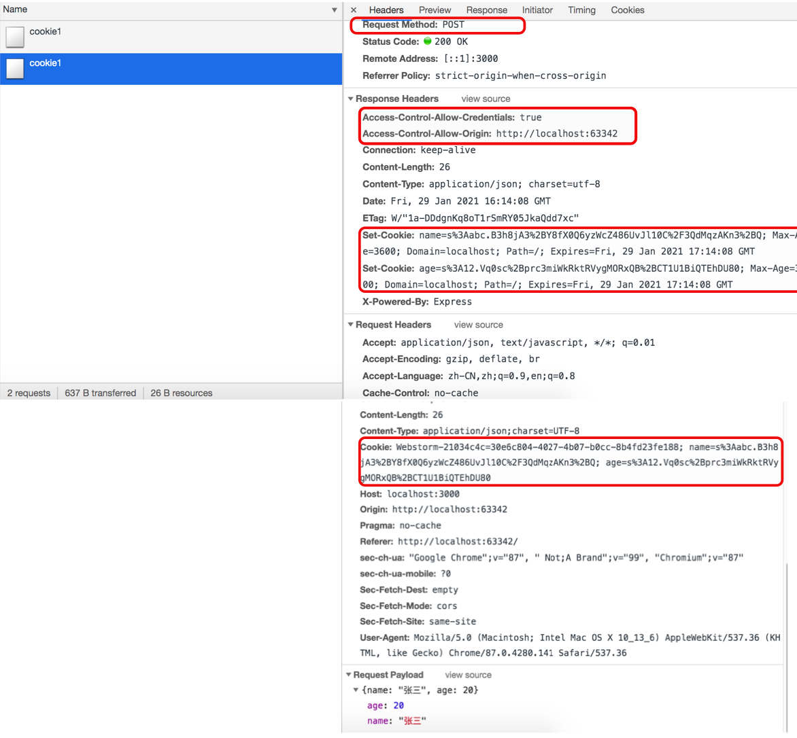

# cors

> 本章将讲解问题：
>
> 1. 如何在跨域时携带cookie？
> 2. jquery如何实现cors？


## 简单请求和非简单请求

> 在进行跨域请求时，分为两种类型的请求，简单请求和非简单请求。
> 1. 简单请求：只需要向服务器发送一次请求。
> 2. 非简单请求：需要向服务器发送两次请求，第一次为预检请求，使用`options`方式进行请求，询问服务器是否支持cors解决跨域的方式，如果支持则正式进行请求，如果不是则停止请求。
>
> 一般跨域发送数据格式不是那三种格式(urlencoded、form、text)的都是非简单请求。

### 简单请求

> 满足下面两个条件的为简单请求：
>
> 1. 请求方式为`GET`、`POST`、`HEAD`。
> 2. http请求头参数不超过以下字段：
>    * Accept
>    * Accept-Language
>    * Content-Language
>    * Last-Event-ID
>    * Content-Type：只限于三个值`application/x-www-form-urlencoded`、`multipart/form-data`、`text/plain`。

### 非简单请求

> 满足下面任意一个条件的为非简单请求：
>
> 1. 请求方式为`PUT`、`DELETE`
> 2. content-type：json、xml等


## Access-Control-Allow-Origin

> 声明：
>
> ​		跨域限制是浏览器中的限制，而不是服务器，即浏览器在接收响应头是查看当前网页的协议、host和端口号与请求的不一致时，就会舍弃响应头并报错。
>
> 通过在响应头中添加`Access-Control-Allow-Origin`字段实现跨域，当浏览器跨域访问时，浏览器会查看响应头中的`Access-Control-Allow-Origin`字段，与当前页面url的协议、host和端口号进行比较，如果一致则接收响应体信息，


## 跨域携带cookie

> 默认cookie不能跨域使用，例如著名的CSRF攻击，就是利用访问网站时自动携带访问网站的cookie的特性，伪造身份。
>
> 使用XMLHttpRequest对象中的`withCredentials`属性和响应头中的`Access-Control-Allow-Credentials`字段来实现跨域携带cookie。
>
> 使用下面两个属性实现跨域携带cookie：
>
> 1. `withCredentials`属性：XMLHttpRequest对象中的属性，表示跨域请求时是否携带cookie或者http认证信息，默认不携带为false。如果为false，服务器发来的cookie也不会保存。
> 2. `Access-Control-Allow-Credentials`字段：响应头中的字段，告诉浏览器，在跨域请求中服务器是否允许浏览器发送cookie，false表示浏览器不要给服务器发送cookie，服务器不会接收。
>
> 注意：
>
> 1. 想要跨域携带cookie，两个字段都需要设置为true，并且`Access-Control-Allow-Origin`字段不能设置为`*`。


## 非简单请求cookie实现

> 以post请求举例：
>
> 1. 将请求头的content-type设置为json，则有才能出发非简单请求。
> 2. 服务器添加`options`路由，设置响应头，告诉浏览器服务器支持的cors属性：
>    1. `Access-Control-Allow-Origin`：服务器支持该地址的跨域行为
>    2. `Access-Control-Allow-Methods`：服务器支持的跨域行为的请求方式
>    3. `Access-Control-Allow-Headers`：服务器支持的字段，与请求头中的`Access-Control-Request-Headers`字段对应。
>    4. `Access-Control-Allow-Credentials`：如果还需要跨域携带cookie时，添加该字段并设置true。
> 3. 服务器添加`post`路由，设置的响应头：
>    1. `Access-Control-Allow-Credentials`：如果还需要跨域携带cookie时，添加该字段并设置true。
>    2. `Access-Control-Allow-Origin`：服务器支持该地址的跨域行为。


### 代码实现

> jquery设置`withCredentials`的写法：xhrFields:{ withCredentials: 'true'}

testCors.html

```html
<!DOCTYPE html>
<html lang="en">
<head>
    <meta charset="UTF-8">
    <title>Title</title>
    <script src="http://localhost:3000/jquery-1.12.4.js"></script>
</head>
<body>
<button id="btn1">原生发送get请求</button>
<button id="btn2">原生发送post请求</button>
<button id="btn3">jquery发送get请求</button>
<button id="btn4">jquery发送post请求</button>
<script>

    $('#btn1').on('click', (err)=>{
        var url = 'http://localhost:3000/cookie1';
        var xhr = new XMLHttpRequest();
        xhr.open('get', url);
        xhr.withCredentials = true;
        xhr.send();
    });

    $('#btn2').on('click', (err)=>{
        let xhr = new XMLHttpRequest();
        xhr.open('post', 'http://localhost:3000/cookie1');
        xhr.withCredentials = true;
    
      	/*
      	* Access-Control-Request-Headers为content-type和demo
      	* 该字段指定浏览器额外发送的请求头字段，用于在预检请求时，询问服务器这些请求头字段是否合法。
      	* 一般是自定义字段和content-type不为text、urlencode、form类型，例如content-type为json。
      	*/
        xhr.setRequestHeader('Content-Type', "application/json;charset=utf-8")
        xhr.setRequestHeader('demo', '123');
      
        xhr.onload = function(event){
            console.log(this.response, this.responseType);
        }
        xhr.send(JSON.stringify({name:'tom', age: 12}));
    });

    $('#btn3').on('click', (err)=>{
        $.ajax('http://localhost:3000/cookie1',{
            type: 'get',
            data: {name:'张三', age: 20},
            xhrFields:{ withCredentials: 'true'}, // jquery中跨域携带cookie写法。
            success: function (data) {
                console.log('jquery-get',data);
            }
        });
    });

    // jquery发送json数据时，无法自动转换，需要开发者手动转换成json字符串，并设置相应的content-type
    $('#btn4').on('click', (err)=>{
        $.ajax('http://localhost:3000/cookie1',{
            type: 'post',
            data: JSON.stringify({name:'张三', age: 20}), // 将数据对象转成json字符串。
            contentType: "application/json;charset=utf-8", // 设置请求体数据格式为json
            dataType: 'json', // 服务器返回的是json字符串，将其转成对象。
            xhrFields:{ withCredentials: 'true'},  // jquery中跨域携带cookie写法。
            success: function (data) {
                console.log('jquery-get',data);
            }
        });
    });

</script>
</body>
</html>
```


corsServer.js

```javascript
const express = require('express');
const bodyParser = require('body-parser');
const {resolve} = require('path');
const app = new express();
app.use(bodyParser.urlencoded({extended: true}));
app.use(bodyParser.json());
app.use(express.static(resolve(__dirname, '../public')));
let coookieParser = require('cookie-parser');
app.use(coookieParser('secretString'));


// 简单请求
app.get('/cookie1', (req, res)=>{
    console.log('get_useCookie', req.cookies);
    // 给响应头设置cookie
    res.cookie('name', 'abc', {
        maxAge: 1000 * 60 * 60,
        domain:'localhost',
        path: '/',
        httpOnly: true,
        signed: true // 开启cookie-parser的签名功能
    });
    res.setHeader('Access-Control-Allow-Origin', 'http://localhost:63342');
	  // XMLHttpRequest.withCredentials=true时，就需要添加这个响应头并且设为true。
    res.setHeader('Access-Control-Allow-Credentials', 'true'); 
    res.send('请求成功');
});

/*
* 非简单请求
* 由于非简单请求需要发送两次请求，因此需要写两个路由，其中一个为预检测请求的路由。
*/ 
// 预检测请求
app.options('/cookie1', (req, res)=>{
    console.log('options');
  	// 告诉浏览器，服务器支持这个地址跨域请求该路由的资源。
    res.setHeader('Access-Control-Allow-Origin', 'http://localhost:63342');
    // 告诉浏览器，服务器支持跨域携带路由
    res.setHeader('Access-Control-Allow-Credentials', 'true')
    // 告诉浏览器，服务器支持这个地址的非简单请求的请求方式
    res.setHeader('Access-Control-Allow-Methods', 'POST, GET')
    // 告诉浏览器，服务器支持Access-Control-Request-Headers字段中说明的字段。
    res.header('Access-Control-Allow-Headers', 'Content-Type, demo');
    res.send('请求成功');
});

// 正式请求
app.post('/cookie1', (req, res)=>{
    console.log('post-useCookie', req.cookies, req.body);
    // 给响应头设置cookie
    res.cookie('name', 'abc', {
        maxAge: 1000 * 60 * 60,
        domain:'localhost',
        path: '/',
        // httpOnly: true,
        signed: true // 开启cookie-parser的签名功能
    });
    res.cookie('age', '12', {
        maxAge: 1000 * 60 * 60,
        domain:'localhost',
        path: '/',
        // httpOnly: true,
        signed: true
    });
    res.setHeader('Access-Control-Allow-Credentials', 'true')
    res.header('Access-Control-Allow-Origin', 'http://localhost:63342');
    res.setHeader('Content-Type', 'application/json;charset=utf-8')
    res.send({name:'占三', age: 13});
});


app.listen(3000, (err)=>{
    if (err) return;
    console.log('服务器启动成功');
});
```

> 说明：
>
> 1. **Access-Control-Request-Headers**与**Access-Control-Allow-Headers**字段的值必须一致，否则非简单请求失败。
>
> 下图为非简单请求的结果：





## 总结

> `origin`与`host`字段说明：
>
> ​		在www.a.com地址使用ajax向www.b.com地址发送请求时，host为www.b.com，origin为www.a.com。
>
> 对于跨域的简单请求：
>
> 1. 在请求头中添加`origin(在哪个请求地址发送跨域请求)`。
> 2. 在响应头中添加`Access-Control-Allow-Origin(允许哪个地址跨域)`。一般直接将响应头中`Access-Control-Allow-Origin: = origin`。
>
> 对于跨域的非简单请求：
>
> 1. 在请求头中添加：
>    1. `origin`：在哪个地址下进行跨域请求
>    2. `Access-Control-Request-Method`：询问是否允许这些请求方式跨域。
>    3. `Access-Control-Request-Headers`：询问在跨域时，是否允许使用这些请求头。
> 2. options响应头：
>    1. `Access-Control-Allow-Headers`：服务端允许使用这些请求头
>    2. `Access-Control-Allow-Methods`：服务端允许这些请求方式跨域
>    3. `Access-Control-Allow-Origin`：允许在这个请求地址发送跨域请求
> 3. 第二次的响应头：
>    1. `Access-Control-Allow-Origin`：允许在这个请求地址发送跨域请求
>
> 如果想要发送cookie：
>
> 1. 请求头中添加`withCredentials：true`
> 2. 在响应头中添加`Access-Control-Allow-Credentials:true`