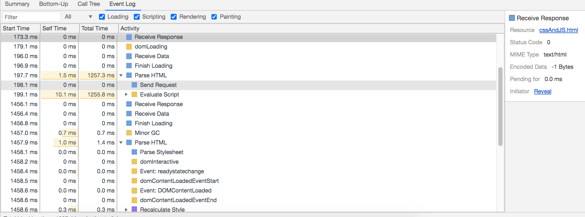

## Chrome浏览器结构

> chrome分为以下几个进程：
>
> 1. browserProcess
> 2. netWorkProcess
> 3. Renderer Process
> 4. PluginProcess
> 5. GPUProcess
> 6. storage Process
> 7. UI Process


## 简单介绍浏览器从url到页面做了哪些事情


## css与JS的阻塞问题

> css解析时：
>
> 1. 阻塞布局树的形成，进而阻塞渲染，结果就是页面上加载不出来。
> 2. 不阻止html的解析和DOM树的建立。
> 3. 阻塞js的解析与运行
>
> js解析时：
>
> 1. 阻塞html解析和DOM树的建立。
> 2. 阻塞css的执行
> 3. 阻塞其它js的解析和运行。
>
>  注意：
>
> 1. 大部分浏览器都有预解析功能，即浏览器会全局查找`href`和`src`属性，并异步下载，因此js虽然会阻塞html的解析，但是阻止不了预解析(获取网页上的`href`和`src`属性，提取下载)，提高性能。

### js阻塞css解析

> 下图展示了js会阻塞css，`evaluate script`耗时1s，此时css文件已经下载完成，等待js运行完成后进行解析。

```javascript
<!DOCTYPE html>
<html lang="en">
<head>
    <meta charset="UTF-8">
    <title>验证css、js阻塞</title>
    <style>
        div {
            width: 400px;
            height: 400px;
            background: gray;
        }
    </style>
    <script>
        let a= -0;
        while (a<9999){
            a++;
            console.log('aaaaa');
        }
    </script>
    <!--1.link进来的css阻塞页面渲染-->
    <link rel="stylesheet" type="text/css" href="http://localhost:3000/">
</head>
<body>
<div></div>
</body>
</html>
```




### js阻塞其它js解析

> ​		 html解析器解析到script标签时，通知js引擎处理js文件，即使后面的scirpt标签包含的js文件下载下来了，也不会先执行，需要等待第一个script标签中的js文件执行完成，才能执行后面的文件。

```html
<!DOCTYPE html>
<html lang="en">
<head>
    <meta charset="UTF-8">
    <!-- 3后才能返回文件 -->
    <script src="http://localhost:3000/"></script>
    <script>
            console.log('aaaaa');
    </script>
</head>
<body></body>
<html>
```


## 回流与与重绘


## 图层

>  
>
> 浏览器创建图层的情况：
>
> 1. 使用css中出现`translateZ`属性、translate3D
> 2. html页面中的video、canvas、iframe标签，浏览器都会给其创建一个单独的图层
> 3. 元素被will-change属性修饰时，浏览器会为该元素创建图层
> 4. 动画属性