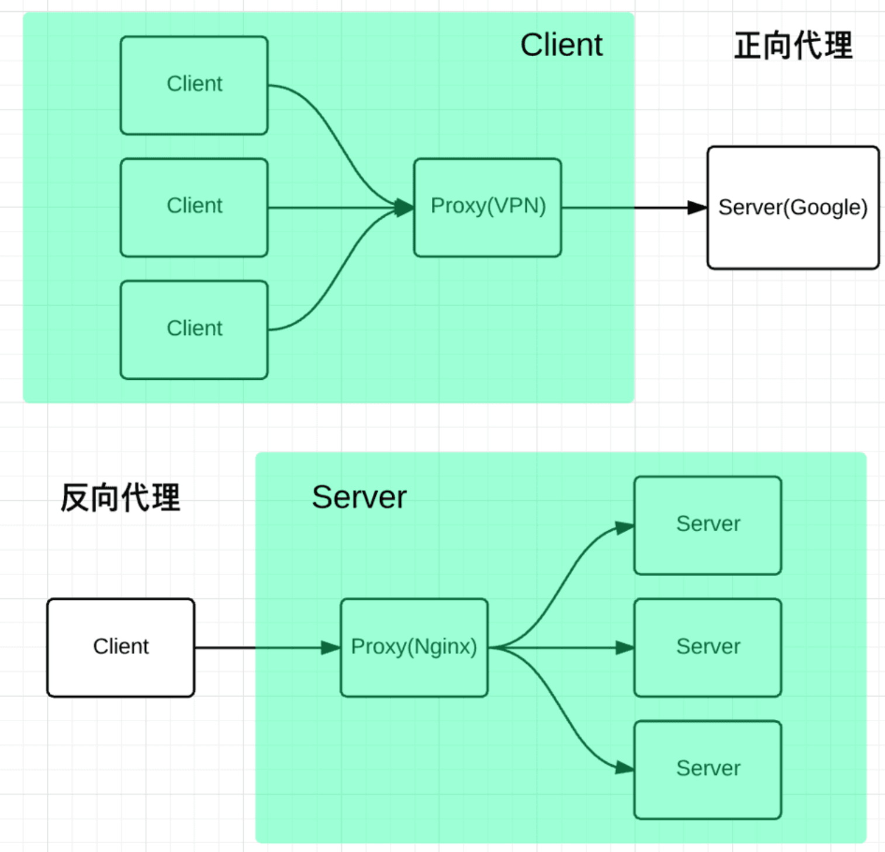
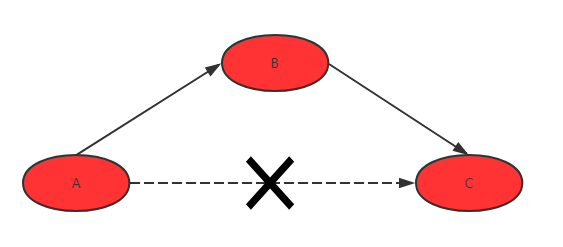
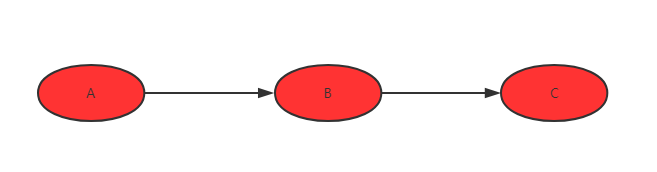

# 002- 正向代理和反向代理

> 正向代理一般用在vpn，翻墙。
>
> 反向代理一般用在服务器的负载均衡。

## 举例理解

> **对于正向代理，理解起来就是：**

1. A需要钱，A知道C由很多钱，想向C借钱
2. 但是A和C有矛盾，于是A想到通过B去借C借钱
3. B向C借到钱了，C不知道是A的存在
4. 这样B就帮助A借到了Z的钱

在这个过程，B就充当了代理借钱的角色，并且是代替A去借钱的，这样就是正向代理。

> **接着是反向代理：**

1. A需要钱，C有很多钱，A不知道C很多钱
2. A找B借钱
3. B知道C有很多钱
4. B向C借钱，并把借到的钱给A，而没有使用自己的钱借给A
5. A拿到钱以后，以为钱是B的，A不知道C的存在
   在这个过程当中，B也充当了代理借钱的角色，不过这次不是代替A去借的，而是用C的钱借给A的，换言之即是代替C将钱借给了A，这就是反向代理。

## 自己的理解

正向代理：代理服务器作为客户端的代理人，与服务器交互。

反向代理：代理服务器作为服务器的代理人，与客户端交互。