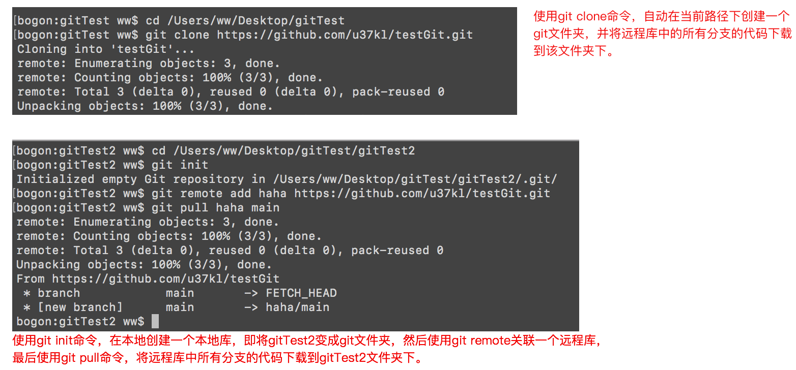

# git

>  git目前最主流的分布式版本管理工具。
>
>  
>
> 版本管理是啥和为啥要有版本管理：
>
> ​		我们可以将项目看成一个游戏，编码视为某个人正在打游戏，`提交代码相当于游戏中的存档`，当代码编写错误时版本的回退相当于选择一个存档重新读档，版本管理就是游戏的存档功能，用来记录项目的开发进度(用来记录着这个人每个阶段游戏的游玩情况)。可以想象一下代码没有版本管理就像游戏没有存档一样，这是一件多么恐怖的事情。开发项目开发是一个不断尝试的过程，为了更好的实现功能会去尝试一些实现方案，如果编写完成时发现当前方案不能满足要求，想回退到修改之前的样子，对不起重写吧。
>
> 

## git结构

> git分布式的实现方式：
>
> ​		与svn这种将代码的版本管理放在服务器中不同，git是没有服务端的，它是在本地实现代码的版本管理，git代码仓库有又四部分组成，`工作区`、`暂存区`、`版本区`和`工作现场`。
>
>  
>
> git工作流程：
>
>   		1. 开发者在工作区中编写代码。
>   			2. 编写完代码，将内容添加到暂存区，作为缓冲。
>   	  		3. 最后将暂存区中的内容提交到版本区，此时版本区为提交的内容生成一个版本号，并建立存档。
>
> git如何管理文件：
>
> ​		每当开发者将代码提交到版本区时，git会自动生成一个hash值作为本次提交的版本号，并记录本次提交的对哪些文件做了操作，工作区和暂存区是没有版本的，换句话说代码写在工作区或者提交到暂存区就和玩游戏只是暂停一下，然后继续玩，没有对游戏进行存档。
>
> ​		
>
> # 文件没有被提交到版本区中，则文件就没有版本号和版本记录，也就没有被git所管理。？


## git命令

> git常用命令：
>
> 1. `git init`，在当前路径下创建一个git仓库。
> 2. `git config --global user.name` ，给git配置全局用户名，用在版本提交记录中当成当前提交者用户名。
> 3. `git config --global user.email`，给git配置全局的邮箱，用在版本提交记录中当成当前提交者用户名。
> 4. `git config --global core.autocrlf false`，该全局配置是否将文件中的回车换行转换成当前操作系统中的，因为linux和window不一样。false表示不转换，使用第三方编译器设置true和false都行。
> 5. `git add`，将工作区代码提交到暂存区，三种写法：
>    1. git add 文件夹或者文件名，提交针对某个文件夹或者文件的操作到暂存区，`git add index.html`
>    2. `git add .`或者`git add *`，提交工作区中所有操作。
>    3. git add *.txt，提交工作区中所有后缀名为txt的文件的操作。
> 6. `git commit -m`，将暂存区中的代码提交到版本区，`git commit -m "本次提交说明信息"`
> 7. `git log`，版本记录详细日志。
> 8. `git reflog`，显示操作记录，查看之前所在的一些git操作。

### 创建git库

> 创建本地git库要求：
>
> 1. 必须选择一个空文件夹，非空文件夹，会将无关文件不小心添加到git版本管理。
>
> ​		当在某个空文件夹路径下使用`git init`命令时，git会在该文件夹下创建一个`.git`文件夹，`.git`文件夹就是版本仓库，可以理解为svn的远程代码仓库，编写的代码的版本会被提交到该文件夹中。

### git全局配置文件

> 1. `git config --global user.name` ，给git配置全局用户名，用在版本提交记录中当成当前提交者用户名。
> 2. `git config --global user.email`，给git配置全局的邮箱，用在版本提交记录中当成当前提交者用户名。
> 3. `git config --global core.autocrlf false`，该全局配置是否将文件中的回车换行转换成当前操作系统中的，因为linux和window不一样。false表示不转换，使用第三方编译器设置true和false都行。
> 4. ` git config --global core.excludesfile  .gitignore文件路径`，给所有本地git库设置文件忽略。
>
> 全局配置文件位置：所有操作系统上git全局配置文件位置，$HOME/.gitconfig
>
> 1. mac：用户文件夹下的隐藏文件。

### 关联远程库

> 关联远程库有两种方式：
>
> 1. `git clone url地址`，在本地该路径文件夹下，创建一个git文件夹，并将代码下载到该git文件夹下。
> 2. `git remote add 远程库别名 远程库url地址`，需要自己使用git init在本地创建一个git库，然后使用该命令，将本地库与远程库管理起来。
>
> git remote命令说明：
>
> 1. 关联命令中add后面的是远程库别名用来代替url，可以任意起(下面展示时使用haha作为别名)，只有进行git push、git pull拉取某一个分支时，需要使用这个别名，使用git clone方式创建的仓库的关联别名为origin，github默认别名为origin，因此最好用origin。
> 2. 如果关联的有错误(例如URL写错了)，可以使用`git remote remove haha`，将当前关联的url删除，重新关联。
>
>  两种方式的区别：
>
> 1. git clone方式，用在给新加入团队的人使用，远程库已经有了，直接使用git clone将远程库down下来。
> 2. 第二种方式，用在创建一个新项目时，此时远程库中没有任何东西，需要开发者自己创建一个本地库，并关联远程库，将一些配置文件(.gitignore文件、readme.md文件)上传到远程库。
>
> 
>
> 下面是两种关联远程库的方式展示，推荐使用第一种省事。



### 代码提交

> 代码提交：
>
> 1. git add命令，将代码从工作区提交到暂存区。
> 2. git commit -m命令，将代码从暂存区提交到版本区。

### 文件/文件夹删除

> 文件/文件夹删除操作方式有三种：
>
> 1. 直接将文件/文件夹扔进回收站，然后使用git add 和git commit命令，将工作区中对该文件/文件夹的操作同步到暂存区和版本区。
> 2. 使用 `git rm`命令删除文件/文件夹，该命令的好处是，删除工作区的文件/文件夹，自动调用git add命令同步到暂存区。
> 3. 使用`git rm -cache`命令，将暂存区中的某个文件删除。一般用在文件没有被git管理，不小心提交到暂存区中。
>
> 使用`git rm`命令的要求：
>
> 1. 该文件/文件夹必须被git所管理，换句话说，该文件/文件夹必须在版本区有版本记录，没有版本记录就会报错。


### 版本日志和误操作检查

> 版本区的提交日志查看方式：
>
> 1. `git log`：详细信息，用来查看当前分支提交的一些操作。
> 2. `git reflog`：查看之前的git操作，当操作git失误导致一些问题时，可以使用该命令查看之前到达执行了哪些操作，找出误操作的命令，修复失误。
>
> `git reflog --all`查看所有执行的git命令。
>
> `git log --pretty=oneline`查看精简版版本log日志。
>
> `git log --graph --pretty=oneline --abbrev-commit`：查看当前git库的版本记录，使用图表示。
>
>  
>
> 
>
> 下面是分别执行git log 和git reflog命令：
>
> 
>
> 

### 版本回退、版本穿梭、撤销

> 三个概念意思：
>
> 1. `撤销`，最好理解，就是将最近的文件操作(文件内容修改、文件的删除操作)还原会最初的状态，例如还原会暂存区的状态，或者还原会最近版本区的状态。
> 2. `版本穿梭包括版本回退`，版本回退就是让工作区、暂存区和版本区回到过去的一个版本状态；而版本穿梭可以让工作区、暂存区和版本区回到过去的一个版本状态，也可以回到未来的一个版本状态
>
>  
>
> 版本回退后，比远程库版本旧，如何提交：
>
> ​		它是借用工作区没有版本来完成提交的，当回退到旧版本时，工作区中的文件也是旧版本的状态，此时拉取远程库中的代码时，会将远程库的版本与工作区进行一个merge操作，解决完冲突后，再提交到版本区形成一个新版本号，此时该版本就比远程库的新，因此就可以提交了。

#### 撤销操作

> ​		上面说了撤销操作时将文件操作还原会初始状态，现实场景为实现某个效果，对工作区代码进行修改，最后发现这种方式不行时，直接撤销当前所有的修改，就像现实中的在黑白上打草稿，不行擦了重写。
>
> 
>
> 撤销操作分为三种：
>
> 1. 通过暂存区恢复工作区：
>    1. `git checkout --  a.txt`，使用暂存区的a.txt覆盖工作区的a.txt。
>    2. `git checkout -- *.txt`，使用暂存区的所有txt文件覆盖工作区的所有txt文件。
>    3. `git checkout -- .`，使用暂存区中的所有文件覆盖工作区的所有文件。
> 2. 通过版本区恢复暂存区：
>    1. `git reset head test.txt`，使用最新版本区的test.txt文件覆盖暂存区中的test.txt文件
>    2. `git reset head *.txt`，使用最新版本区的所有txt文件覆盖暂存区中的同名文件
>    3. `git reset head .`，使用最新版本区的所有文件覆盖暂存区中的同名文件
> 3. 通过版本区恢复暂存区和工作区
>    1. `git checkout head test.txt`，使用版本区的test.txt文件覆盖暂存区和工作区的同名文件
>    2. `git checkout head *.txt`，使用版本区的所有txt文件覆盖暂存区和工作区的同名文件
>    3. `git checkout head .`，使用版本区的所有文件覆盖暂存区和工作区的同名文件
>
> 
>
> 对于新增文件的处理：撤销命令不会清除工作区新增文件。

#### 版本穿梭git reset命令

> 版本回退命令：
>
> 1. `git reset --hard head^`：将head指针指向前一个版本，并且使用前一个版本覆盖暂存区和工作区。
> 2. `git reset --hard head^^`：将head指针指向上上版本，并且使用上上版本覆盖暂存区和工作区。
> 3. `git reset --hard head~3`：将head指针指向倒数第3个版本，并且使用倒数第3个版本覆盖暂存区和工作区。
>
> 版本穿梭命令：
>
> 1. `git reset --hard 版本号`：将head指针指向命令中版本号的版本，并且使用命令中版本号的版本覆盖暂存区和工作区。
>
> 注意：
>
> 1. 使用版本穿梭和版本回退跳到之前的版本时，使用git log将不在显示该版本之后的版本信息了，需要使用git reflog命令找寻最新版本，放在跳转不回去。
> 2. 对于工作区中被版本管理的文件，使用版本回退或者穿梭，会导致工作区和暂存区中修改的内容丢失(例如对文件内容的修改，文件的删除操作)。
> 3. 对于工作区中新增的文件，如果添加到暂存区，如果执行版本穿梭或者回退命令，则该新增文件将被抹掉，如果该文件没有添加到暂存区，则不会被抹掉。


#### git revert命令

> 这个命令叫做版本逆转，该命令的使用场景，例如开发了一段时间，git仓库有了10个版本记录，发现其中第二个版本中编写的内容时错误的时，如果直接使用版本穿梭跳回到第1个版本，这样会导致3～10个版本操作内容丢失，一般的做法是在当前版本中将第2个版本中修改的地方再改回来，然后再提交到版本库形成新的版本，即第11个版本是对第2个版本的修复。
>
>  
>
> git提供了这样的命令，就是`git revert`命令，用来修复某个版本或者逆转某个版本，就像上面的例子，使用git revert命令逆转第2个版本时，该命令会在第10个版本基础上撤销第2个版本所有操作(如果有新增文件就删除该文件，如果有删除文件就恢复该文件，如果有文件内容的修改就恢复)，然后形成新版本提交到git库中，这个命令帮我们实现上面的手动撤销。
>
>  
>
> `git revert 版本号`：撤销某个版本的所有操作，并形成新版本提交，即自动执行`git add . `和`git commit`操作。
>
> `git revert -n 版本号`：撤销某个版本的所有操作，该操作只对工作区修改，需要开发者自己执行`git add . `和`git commit`操作。

#### git reset和git revert命令区别

> 两个命令的区别：
>
> 1. 使用git reset命令，用来将某个版本之后的版本全部废弃。
> 2. 使用git revert命令，用来修改撤销某个版本的修改，该版本之后的版本还是保留。
>
>  
>
> 两种命令使用场景：
>
> 1. git reset命令只用在，从远程库中来去下来的最新版本后，之后记录的版本没有提交到远程库，此时可以使用该命令退回到最近一次拉取的一次远程库版本，不用退回到最近拉取远程库版本之前的版本。
> 2. git revert命令使用在，修改某些版本中错误的操作，该命令会基于当前版本形成一个新的版本。


### 分支操作

> 分支介绍：
>
>  		分支一般用在项目开发中，需要同时做多个任务时，需要使用分支，例如在开发中需要修复上一个版本的bug，但是当前正在开发下一个版本，因此需要建立分支，在修复bug的版本中不能出现下一个版本的代码。
>
> 
>
>   分支的一些命令：
>
> 1. 新建分支：
>    1. `git branch 分支名称`，以当前分支为基础，创建新分支，此时新分支的内容与当前分支一模一样。
>    2. `git checkout -b 分支名称`，创建新分支，并切换到该分支，`git checkout -b dev` 相当于`git branch dev`和`git checkout dev`。
> 2.  切换分支：`git checkout 分支名称`。
> 3. 查看当前git库中的分支：`git branch`，该命令有一些bug，例如从远程库中down下来的新分支，使用该命令找不到，需要先切到该分支，然后这个命令才会显示。
> 4. 合并分支：`git merge 分支名`，将命令中指定的分支合并到当前分支。
> 5. 删除分支，`git branch -d 分支名`，删除某个分支。
> 6. 强制删除分支，`git branch -D 分支名`，git对于没有合并的分支是不让删除的，如果该分支需要废弃的，需要使用该命令。
>
> 注意：
>
> 1. 如果刚刚建立的git库，没有一次版本提交时，不能新建分支，否则会导致主分支被git废掉。
>
> 
>
> 两个分支，都有同一个文件，一个分支修改该文件，另一个分支删除该文件，那么如何合并？
>
> 删除分支时，需要切到其它分支上吗？

#### git switch

> git在新版本添加的命令，用来代替`git checkout -b`和`git branch 分支名`，由于git checkout命令还有版本撤销的操作，git提供了swicth命令将分支操作独立出来。
>
>  
>
> 1. `git switch -c 分支名`：创建分支，并切换到该分支，相当于`git checkout -b 分支名`
> 2. ``git switch 分支名`：切换分支，相当于`git branch 分支名`
>
> 注意：该命令是新版本添加的。

#### git合并方式

> git几种合并方式：
>
> 1. merge合并，将其它分支中的内容合并到当前分支。
>    1. fast-forward，默认提交方式，在合并时只是修改分支指针指向最新的提交版本记录节点。
>    2. no-ff，合并分支时，保留所有合并的commit提交记录。
>    3. squash。
> 2. rebase方式(变基)，将当前分支上的内容提交到指定分支。

##### fast-forward和非fast-forward合并

> 下图中展示了使用fast-forward和非fast-forward方式合并分支后的版本记录，明显发现fast-forward方式合并分支丢失了一个commit提交记录。
>
>  
>
> 操作过程说明：
>
>   		1. 首先创建master分支，并创建a文件，提交到master版本库上。
>   			2. 其次从master上创建dev分支，并创建b文件，提交到dev版本库上。
>   	  		3. 第3步，将master分支合并到dev分支上，生成一个commit版本记录。
>   	    		4. 最后一步，将dev合并到master，即让master指向最新提交版本，这一步就是两者区别：
>   	   1. 使用fast-forward合并分支时，将master指针指向最新提交的版本，即master指针指向dev最新的节点，将dev合并到master分支的版本记录丢失。
>   	   2. 使用非fast-forward合并分支时，将dev合并到master上时，会生成一个新commit到master版本区中，此时dev合并到master分支的版本记录没有丢失。
>
> 注意：
>
> 1. `开发中建议使用非fast-forward方式`。
> 2. 非fast-forward写法，`git merge --no-ff -m '本次合并提交的版本记录位置' 需要合并的分支名`，git merge --no-ff  -m '将dev合并到master上' dev。


##### squash合并

> squash合并与非fast-forward类似，只有一个不同点就是合并完后，不会保留对合入分支的引用。
>
>  
>
> 下面图片的操作流程说明：
>
> 1. 首先在master创建a文件并提交，在master上创建dev分支。
> 2. 然后继续在master分支上创建b文件并提交。
> 3. 切换到dev分支，创建c文件并提交。
> 4. 此时将master合并到dev，dev分支会新建一个版本节点，记录合并内容，如果使用非fast-forward方式合并，会有一条从master分支到dev的线，表示当前节点的形成是通过合并完成的，但是使用squash方式没有。
> 5. 最后将dev合并到master上，master分支会新建一个版本节点，记录合并内容，同样也没有从dev到master的线表示该节点是通过合并完成的。
>
> ```git
> git init
> vim a.txt
> git add .
> git commit -m 'master分支上新建a文件'
> 
> git branch dev
> 
> vim b.txt
> git add .
> git commit -m 'master分支上新建b文件'
> 
> git checkout dev
> vim c.txt
> git add .
> git commit -m 'dev分支上新建c文件'
> 
> git merge --squash master
> git add .
> git commit -m '将master分支上的内容合并到dev上'
> 
> git checkout master
> git merge --squash dev
> git add .
> git commit -m '将dev分支上的内容合并到master上'
> ```
>
> 


##### rebase

>

#### 远程和本地同分支合并

> `开发场景`：		
>
> ​		开发中常常遇到多人在同一个分支下协同开发代码，因此很容易造成一个现象，本地版本区库中的文件和远程版本库中的文件不一致。例如，人员A当前本地库版本与远程库一致，经过一段时间，A向本地库中提交了许多操作(例如新增文件、修改文件等)，此时A的版本库比当时拉取时间的远程库要高几个版本，如果这段时间其它开发者向远程库提交了许多操作，远程库此时的版本也比A拉取时的版本要高出许多版本，那么A如何同步代码？
>
>  
>
> `解决方法`：
>
> ​		向远程库中提交代码必须要做的一件事，先执行一下pull操作，让本地库与远程库同步一下，其实本质上执行了一次merge操作，将远程库中的分支合并到本地库中的同名分支上。
>
>  
>
> `远程库和本地库合并的一个问题`：
>
> ​		如果两个人的两个版本库已经开发了一段时间想要同步一下代码，此时某个人执行pull操作会失败，因为两个仓库不是从同一个库中衍生出来的，因此它们的版本记录是不同的，如果想要强行合并，需要使用pull操作需要添加`--allow-unrelated-histories`参数，表示合并两个仓库的版本记录，例如vue库和react库是两个不同的代码仓库，两个库没有血缘联系(什么叫有血缘联系，使用git clone生成的库，与原始库就是有血缘关系，因为克隆库是从源库中产生的)，因此强行和需要合并版本记录。`下面图片展示了两个没有任何血缘关系的库合并`。


## git pull与git fetch

> git本地库到底有几个分支？
>
> ​		想要弄明白这两个命令，首先需要弄明白本地库中到底有几个分支，假设远程库有`main`和`dev`这两个分支，当第一次使用`git clone`拉取远程库时，本地库其实有3个分支：
>
> 1. origin/main：远程库的主分支
> 2. origin/dev：远程库的开发分支
> 3. main：本地库的主分支
>
> 也就是说当使用`git clone`命令拉取远程库时，git只会给本地库创建一个主分支，其它分支需要自己去创建，这也就是`git branch`命令为何只展示主分支，而其它分支展示不出来的原因。
>
> 创建其它分支方式：
>
> 1. `git checkout dev`，这种方式会自动创建一个本地分支，并使用fast-forward方式将远程分支合并到本地分支中。
> 2. `git checkout -b dev`，`git merge origin/dev`，执行这两个命令等同于第一种方式。


> 解释完了上面的问题后，就要说一说`git pull`与`git fetch`命令区别，`git pull origin dev`这条命令其实执行了三条命令：
>
> 1. `git fetch origin dev`，将远程分支数据拉取到本地的远程分支中。
> 2. ``git checkout dev`，将本地当前分支切换到dev分支
> 3. `git merge origin/dev`，将本地远程分支`origin/dev`合并到本地`dev`上。


## git 文件忽略设置

> git提供的三种文件忽略方式：
>
> 1. 具体git库独享式文件忽略，在`.git/info/exclude`文件中填写需要忽略的文件。
> 2. 全局git库独享式文件忽略，` git config --global core.excludesfile  .gitignore文件路径`，使用git全局命令，给之后本地创建的所有git库设置文件忽略，在电脑任意地方创建`.gitignore`文件，并使用该命令关联。
> 3. 共享式文件忽略，本地创建创建`.gitignore`文件，在该文件中填写忽略的文件，并上传到远程git库中，让其它人也遵循这个忽略规则。
>
> 工作中推荐使用第三种文件忽略策略，保证所有人员的忽略文件一致，如果团队成员的文件忽略不一致，可能有些人提交的文件在另一些人看来是需要忽略的，这就麻烦了。
>
>  
>
> 文件忽略的范围：git文件忽略的范围为git仓库文件夹，即从`.git`文件夹所在的文件夹作为根目录，开始忽略文件。
>
> 
>
> `.gitignore`文件中内容写法：
>
> 1. a.txt，忽略仓库中所有的名为a的txt文件。
> 2. *.txt，忽略仓库中所有的txt文件
> 3. /tmp/*.txt，忽略根目录下的子目录tmp文件夹下的所有txt文件。
> 4. /tmp/ a.txt，忽略根目录下的子目录tmp文件夹下的a.txt文件
> 5. tmp/，忽略仓库中所有的tmp文件夹
> 6. !/tmp/a.txt，不忽略根目录下的子目录tmp文件夹下的a.txt文件
> 7. [123].txt，忽略仓库中所有的1.txt、2.txt和3.txt文件。

## git冲突

> 

## git错误


## git与svn比较

> svn：
>
> ​		svn是一种集中式的版本管理工具，即基于C/S架构，工作区+远程仓库，使用svn管理项目时，所有人都将开发的代码提交到svn服务器中的代码仓库中，所有人通过svn服务器来同步代码，获取别人所写的代码。
>
> 
>
> svn的优缺点：
>
> 1. 优点：
>    1. 交互结构简单，每个人通过与远程代码仓库交互实现与其它人的交互，结构非常简单清晰。
>    2. 维护成本低，只需要维护远程仓库就可以，其它的本地库无所谓，备份非常好备份。
> 2. 缺点：
>    1. 由于借助C/S架构，每次提交代码都需要通过网络提交到远程库，让远程库实现版本管理，一旦断网，本地编写的代码无法进行版本管理。
>    2. 稳定性差，由于所有的资料都保存在远程代码仓库，一旦远程仓库和备份被毁，项目直接废掉。
>    3. 安全性差，长时间联网，被攻击的次数和攻击时间会大大增加。
>
>  
>
> git：
>
> ​		git是一种分布式的版本管理工具，工作区+本地仓库，因此使用git管理项目时，即使没有网络也可以进行代码的版本管理，因为版本管理的仓库在本地，当需要交互时，只需要与对应的人进行代码的同步即可。举例说明，多人合作画漫画，自己画完一副漫画自己进行记录，如果想和其他人整合劳动成果时，只需要相互之间将工作成果+记录放在邮箱中发送给对方即可。
>
>  
>
> git的优缺点：
>
> 1. 优点：
>    1. 在断网情况下，也可以进行版本的管理。
>    2. 稳定性高，由于完整项目资料都保存在每一个人手里，因此即使一个人丢了，项目也不会废掉。
>    3. 安全性高，由于版本管理在本地，无序长时间联网，受到攻击也会大大减少。
> 2. 缺点：
>    1. 维护成本高，每一个都有完整资料，都需要维护。
>    2. 结构复杂，交互繁琐，由于分布式的特点，每个人想和获得完整的代码，需要跟所有人进行一次交互才可以。
>
> 集中式的git：
>
> ​		由于git分布式的特点，每次都需要跟项目中的所有人同步代码，非常繁琐，因此在实际开发中常常使用集中式管理方式，即将一个人的git仓库当成远程仓库(github、公司自己搭建的git仓库)，所有人都与他交互，这就是利用了集中式的管理思想，大大降低代码同步难度。这种集中式的git与svn本质的区别，git集中式并不是真正的集中式，只是让所有人都和某一个人进行交互，但是版本控制还是在本地。
>
>  
>
> svn和git本质的不同：
>
> 		1. 版本管理的位置不同，svn远程仓库才能进行版本管理，本地只是一个工作区，而git在本地进行版本管理，因此`svn只有一个版本仓库，而git中项目有多少人就有多少版本仓库`。
> 		2. 使用svn时，所有的版本号都是由svn服务器生成的统一号码，而使用git时，版本号是由本地git自己生成的版本号(全球唯一的hash码)。


## git使用流程

> 1. 建立git仓库：选择一个空文件夹，调用`git init`命令创建git仓库，git会在该文件夹内创建一个`.git文件夹`，判读一个文件夹是否为git文件夹，就是看文件夹中是否有`.git文件夹`。
> 2. 创建代码文件，此时文件保存在工作区。
> 3. 将代码文件提交到暂存区，使用`git add`命令
> 4. 将代码提交到版本区，使用`git commit`命令。
>
> 文件名颜色：
>
> 1. 红色；工作区中的该文件的内容发生改变。
> 2. 绿色：暂存区中的该文件的内容发生改变。


## git三区

> 文件是怎么保存到三区中，是copy然后覆盖吗？

## git 命令

> 1. `git add`： 将代码提交到暂存区，这个命令不是添加文件，而是将工作区中对文件的`操作同步`到暂存区中(例如修改文件内容、删除文件也使用该命令)，
>    1. `git add 文件名.后缀名`，将工作区中该文件的操作同步到暂存区中。
>    2. `git add *`和`git add .`，将工作区中所有的操作同步到暂存区中。
> 2. `git commit -m '提交日志'`：用来将暂存区中的代码提交到版本区中。
>
>  
>
> 


## 差异对比

> git中的差异对于命令：
>
> * git diff : 比较暂存区与工作区
> * git diff --cached : 比较版本区与暂存区
> * git diff master : 比较版本区与工作区


## 版本日志

> git log
>
> git reflow
>
> 

## 版本回退、版本穿梭和版本撤销

> 版本回退是将版本区文件替换工作区的文件吗？
>
>  
>
> 版本回退是版本区回退到某个版本，还是工作区回退到某个版本？

## 文件删除

> git中删除文件两种方式：
>
> 1. 在工作区中，手动删除文件。
> 2. 使用`git rm`命令删除文件。
>
> 两种方式的区别：
>
> ​		手动点击鼠标删除，该文件操作暂存区和版本区不知道，需要将操作同步到暂存区和版本区(即将暂存区和版本区的该文件删除)；使用命令删除时，git会自动将文件操作同步到暂存区，也就是说暂存区中的文件也会被删除，只需要同步版本区就行。
>
>  
>
> 注意：
>
> 1. 使用`git rm`命令删除该文件时，需要保证该文件已经被git托管了，否则删除报错。
> 2. 使用`git rm`命令删除该文件夹时，必须满足三个条件：
>    1. 该文件夹被git托管。
>    2. 该文件夹中有文件，并且该文件被git托管。
>    3. 不能在该文件夹内，使用`git rm`命令时，即在文件夹内部删除文件夹无法完成该操作。


## 分支

>git使用`git checkout -b 分支名`命令新建分支，会以当前所处于的分支为起点，将工作区、暂存区和版本区中的内容拷贝到新分支中。此时git自动将分支切换到新建的分支上。
>
> 
>
>git分支使用注意：
>
>1.  每次切换分支时，需要将工作区的代码提交到版本区中，否则切换`有时会报错`，并提示用户先将代码提交后在提交后再切换。
>2. 如果有紧急情况，例如某个分支上出现紧急需要修复的bug，但是当前分支代码没有写完，如果提交会报错，这种情况使用工作现场，将当前分支的工作区修改的内容保存到工作现场中，此时工作区中的代码恢复到与当前版本区代码一致，这样就可以切换到目标分支处理bug，之后在切回来，恢复工作区。
>
> 
>
>
>
> 
>
>分支合并：分清谁合并谁？
>
> 
>
>当前创建仓库后，会生成一个主分支master，不要急着创建下一个分支，git在创建分支时会判断当前分支如果没有东西会自动删除该分支，并切换到新创建的分支。`也就是说在创建分支时，当前分支的版本区必须有托管的文件。` 其它空分支会发生这种情况吗
>
> 

### 问题

> 新建分支时，如果工作区中的代码没有同步到暂存区和版本区，新建分支的话，新分支情况？
>
> ​		新建分支将目标分支(在哪个分支下调用的分支创建命令)上版本区的内容，拷贝到新建分支的工作区、暂存区和版本区。(当将工作区中的代码提交到版本区时，工作区内容、暂存区内容和版本区内容一定是一模一样的)
>
> ​		
>
>  
>
> 为何工作区中有未提交内容，切换分支时，有时报错有时不报错？
>
> ​		不报错时因为没有冲突，当两个分支的版本区代码一致时，此时切换到某个分区修改文件内容，没有提交到版本区时，切换分区没有文件；当两个分支的版本区代码不一致时，此时修改其中一个分支工作区的代码并不提交给版本区，切换分支时就会报错。这是因为每次切换分支时，git会自动将两个分支的工作区代码合并，然后放到当前切换到的分支上，如果合并时出现冲突了就会报错(两个分支版本区代码不一致时，它们的工作区也不会一致，此时合并一定报错)，

# 分支的合并是将三区都合并，还是只合并暂存和版本两个区？


 

## git 冲突

> head代表的是啥？当前的分支吗？
>
>  
>
> 当合并分支时，如果出现冲突时，目标分支会处于merging。   
>
>  
>
> 冲突时发生在哪里？发生在版本区吗？ 
>
>  
>
> 当前工作区的代码没有提交到版本区，使用git pull时，会出现冲突吗，本地版本区和远程版本区中的代码没有冲突，但是本地工作区和远程版本区的代码有冲突？


## git使用注意

> 1. git仓库不能嵌套使用，即在git仓库的工作区新建一个文件夹，然后在该文件夹中执行一次`git init`命令，此时又创建了一个git仓库，出现了仓库嵌套的情况，当代码提交时git无法判断暂存区和版本区在哪个位置，因为有两个`.git`文件夹。
> 2. git从当前分支创建新分支时，当前分支必须有托管的文件，否则当前分支会被git删除掉。

## github


> 克隆是将真个远程仓库克隆下来，即远程仓库有多少分支都会被克隆下来。
>
>  
>
> 克隆下来的库名称默认的别名叫origin
>
>  
>
> git branch命令有bug，对于从远程拉取的新分支，使用该命令是看不到的，需要手动切换到该分支一次，之后在使用`git branch`命令就能看见该分支了
>
>  
>
> 带有新分支的克隆：
>
> 使用git clone将远程仓库down下来后，使用git branch命令只能看到master分支，其它down分支看不到。
>
>  
>
>  
>
> 带有新分支的拉取：
>
> 当远程库中新建一个分支时，本地因为没有该分支，因此不能切换到该分支，并且在其它分支中不能拉取该分支，会导致分支紊乱？
>
>  
>
> 在当前分支中拉取使用`git pull origin 分支名称`命令拉取其它分支时，会出现什么后果？
>
>  
>
> 远程仓库有新分支时如何拉取：
>
> 1. 在本地创建一个该分支，然后切换到该分支拉取分支的代码》
> 2. 使用`git pull`命令，拉取远程仓库所有修改的内容，如果有新分支则在本地创建并拉取该分支内容。
>
>  
>
> 带有新分支的上传：
>
> 本地库创建一个新分支，如何上传到github上？

> 别人创建的远程仓库，自己如何不用别人的用户名和密码合法的上传代码，

 

删除github用户名和密码


## git错误

> 当前文件没有被git托管，因此不能删除。
>
> 
>
>  
>
> 当前文件只被托管了一半，版本区没有该文件因此无法删除。
>
> 
>
> 
>
> 使用`git rm`命令删除文件夹时，如果文件夹为空文件夹，即使文件夹被托管，也会报错无法删除。
>
> 
>
>  
>
> 
>
>   
>
>  
>
> 
>
>  
>
> 
>
>  
>
>   
>
> 
>
>  
>
>  下面推送到远程代码仓库错误，因为用户名密码错误，因为你第一次推送时需要输入远程仓库的用户名密码，如果不需要输入则一定使用了默认的用户名密码，如果推送到另一个一台服务器上，此时就会报错。例如两个GitHub账号，使用主号操作，有一天使用小号时推送代码时，就会出错。
>
>  
>
>  
>
>  上传时，远程库不存在master分支。检查一下远程库是否存在master这个分支吗。
>
> 
>
>  
>
> 


