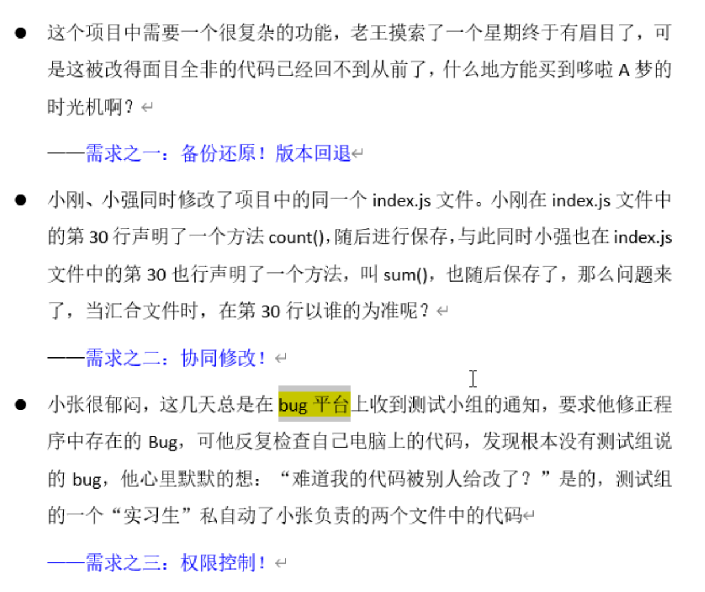

# SVN

> 版本控制的重要性：
>
> 1. 实现代码的备份和版本的回退，相当于悔棋操作。
> 2. 实现权限的控制，即限制允许操作文件的人。
> 3. 实现修改的日志记录，每次修改都会记录哪个人修改了文件的哪些地方，方便追责。
>
>  
>
> SVN：全称subvision，是主流的版本控制软件，它是一种集中式的版本控制逻辑，是基于C/S架构的。使用svn进行版本控制需要搭建svn服务器，在服务器中创建代码仓库，记录各个svn客户端提交的代码。
>
>  
>
> svn的原理：
>
> ​		svn是基于文件进行管理的，即每次向svn服务器提交的最小单位是文件，将文件提交到svn服务器时，`远程代码仓库自己有一个项目版本号，用来记录项目更新，每次提交代码时，这个版本号就会+1，svn会使用该版本号作为本次提交上来的文件的新版本号`。这样每个文件都有一个版本号列表，其中记录着文件更新的情况。
>
> 
>
> 疑问：
>
> 1. 当前远程代码仓库的版本号为7，此时某个文件因为很久没有修改才是1，当修改该文件并提交到远程代码仓库时，文件的版本号为多少?  --- 答案是8，每次提交项目版本号+1，然后将其赋值给文件作为它当前的版本号。

## SVN操作

### SVN操作流程

> SVN分为两种仓库：
>
> 1. 远程代码仓库，SVN服务器中的一个文件夹，保存各个客户端上传的代码。
> 2. 本地代码仓库，本地电脑中的一个文件夹，保存该客户端从服务器中下载的代码和开发者新增的内容。
>
> SVN使用流程：
>
> 1. 搭建svn服务器建立远程仓库，首先选择一台电脑搭建SVN服务器，新建或者选择一个空文件夹作为项目的代码仓库，并为开发该项目的人员配置访问权限。
> 2. 在本地建立本地代码仓库，各个开发者在本地电脑上，安装SVN客户端，并且选择一个空文件夹(本地代码仓库)，点击`check out`将svn服务器中的仓库下载到该文件夹中，会创建一个名为`.svn`的隐藏文件夹，其中有保存着svn的管理信息。`该命令就创建一个本地代码仓库`。
> 3. 每天更新代码和提交代码，每天各个开发者需要更新一下本地代码仓库，然后再在本地代码仓库中编写代码，最后在合适的时间提交将代码提交到svn服务器的远程代码仓库中。

### SVN常用操作

> 1. Check out：拉取远程代码仓库中所有文件，用在第一次从服务器中下载代码的情况，这个命令是将远程代码仓库中所有代码下载到本地。
> 2. Update：更新本地仓库，非常常用的操作，用在之后每次从服务器中拉取文件，会将当前服务器最新版本代码更新到本地，这个操作是增量更新，对于没有发生改变的文件不会下载下来，这就是check out和update的区别。
> 3. commit：向远程代码仓库提交代码，非常常用操作，用来将本地中更新的代码提交到远程代码仓库。
> 4. add：标记当前文件，表示之后该文件需要被提交到远程代码仓库中。
> 5. Show log：查看提交记录。
> 6. compare：查看文件的某两个版本之间修改的地方。
> 7. Revert：版本回退，可以回退某个文件的版本，也可以回退整个项目的版本。
> 8. tag：打标签，用来发版时使用，当前开发的版本符合上线要求时，开发者会将该版本号进行标记，表示该版本是一个符合上线要求的生产版本。
> 9. svn锁：可以给某个文件加锁，让其它开发者只能读取无法修改，但是其他人可以通过修改文件属性去掉锁，一般不要轻易将其他人添加的锁打开。
>
> 注意：
>
>  		`在提交代码时，必须保证本地仓库的版本号与远程仓库的版本号一致，否则提交不上去`，svn原理中说过远程代码仓库会生成一个项目版本号，本地仓库版本号为update或者checkout操作时远程仓库的版本号。每当其他开发者提交代码时，远程代码仓库的版本号就会更新，此时由于本地仓库版本号与远程仓库版本号不一致，需要先update。

## SVN文件忽略

> 配置svn的文件忽略，当本地代码仓库出现该文件时，不会被svn托管上传到svn服务器中，例如out文件夹(编译后生成的可执行文件)、框架生成的文件、IDE开发工具生成的文件夹(.idea)，这些都不能提交到svn服务器中，因此可以设置文件忽略。
>
>  
>
> 1. *.后缀名，表示忽略项目中所有该后缀名的文件。
> 2. 文件名，表示忽略项目中所有该名称的文件夹。例如`.idea`

## SVN版本回退

> 当进行版本回退后如何提交：
>
> ​		当本地进行版本回退后，此时当前版本中文件为旧版本的状态，首先要拉取svn服务器中的代码，svn客户端会将服务器拉取下来的内容与当前本地库的内容做一次merge操作，如果出现冲突时，需要用户手动解决一下冲突，然后在提交到远程库中，远程库会为本次提交生成新的版本。

## SVN调整文件状态

> 使用从cornerstone软件操作svn，文件区会显示当前文件的状态：
>
> 1. 橙黄色?：该颜色表示当前文件还没有被svn托管，需要选中该文件，点击add to working copy，添加到svn中，此时该文件会变成绿色A。
> 2. 绿色A：该颜色表示当前文件为新增文件，并被svn托管。
> 3. 蓝色M：该颜色表示当前文件的内容发生了修改。
> 4. 红色C：该颜色标识表示当前文件出现冲突。
> 5. 红色D：该颜色标识表示当前文件被删除。
> 6. 橙色!：该颜色标识表示当前文件找不到了。不知道该文件状态，一般出现在不通过svn删除而是直接手动删除的，需要修改文件状态，选中右键选择delete，此时文件状态变为`红色D`。
> 7. 暗红色R：该颜色标识表示当前文件已经被替换了，一般出现在，旧版本A中创建过同名文件，之后某个版本B删除了该文件，但是在最近版本C中有新建了该名称文件，此时进行版本回退，回退到版本A中，此时该文件就会被替换成旧版本A的文件。

## SVN冲突

> 冲突：当同一个文件的同一位置，被不同的人操作时，造成该文件的某一行或者某几行需要显示不同的内容，引发了冲突。
>
>  
>
> 举例说明：
>
> ​		张三想要在某个文件的第3行写一段英语，李四也想在该文件的第3行写一段汉语，这样svn不知道应该在该文件的第3行显示英语还是显示汉字。
>
>  
>
> 冲突出现的场景：
>
> 1. 一般本地版本低于远程仓库的版本，本地和远程都修改了某一个文件的某个位置，常常发生在多人协作开发某一个模块，或者公共框架中，基本上后提交代码的人，点击update会出现冲突。
> 2. 分支合并时，公司常常会分出一两个人来在分支中解决bug，然后在合并到主分支中。
>
> 冲突的解决：
>
> 1. 手动解决，每当update出现冲突时，svn会给出现冲突的文件创建三个文件`**.mine文件`、`**.r版本号文件`、`**.r版本号文件`，这三个文件是给svn工具看的，mine保存自己修改的内容，另外两个文件一个保存公共内容，另一个保存服务器中修改的内容。源文件中会使用隔离符号将冲突标注出来。
> 2. 使用第三方工具的图形化页面解决冲突，例如webstorm提供的svn冲突，下图就是利用webstorm解决冲突。

## SVN的使用规范

> 1. 每次提交代码时，必须先update一下，保证本地文件和远程文件版本号一致，查看是否文件中是否出现冲突，防止有些svn版本的bug不提示冲突，导致直接覆盖服务器中该文件的该位置的代码。
> 2. `不要提交非开发者生成的文件`，例如out文件夹(编译后生成的可执行文件)、框架生成的文件、IDE开发工具生成的文件夹(.idea)，这些都不能提交的。
> 3. 勤提交代码，不要攒上几天代码再提交，如果中间电脑损坏，代码会丢失。
> 4. 提交代码前，需要先检查代码是否可以允许，由于JS是单线程允许，某一个地方出现bug可能全局都不能运行。
> 5. 解决冲突时，冲突代码的摆放，优先放在其他人代码，因为他们提交的早。
> 6. 使用checkout命令建立本地仓库时，作为本地仓库的文件夹必须为空，否则一不小心可能将文件夹已存在的与项目无关文件上传到svn服务器中。

## SVN场景错误

> 错误：当前拉取远程代码仓库没有访问权限，或者说输入的用户名和密码不正确。
>
> 
>
> 
>
> 错误：当前提交的版本号过期，也就是说当前文件的版本号低于服务器该文件的版本号，需要先update。
>
> 
>
>  
>
> 错误：出现在update操作时，当前文件发生冲突。
>
> 

## 清除任务队列

>  当前发现出现下面的报错时，也就是说短时间内大量的svn操作导致svn无法完成当前指定任务时，可以调用cleanup，清空任务队列，如果调用cleanup也报错时，直接修改`本地代码仓库的.svn文件夹中wc.db文件`，删除其中的任务列表。
>
> 

## svn的优缺点

> 优点：
>
> 1. 交互结构简单，所有开发者只跟svn服务器沟通就行，所有代码都保存在一处，直接访问服务器就可以拿到最新的代码。
>
> 缺点：
>
> 1. 代码集中式管理，所有svn客户端都需要联网访问它(svn服务器)，因此必须保证svn服务器全天在线才行。如果远程仓库瘫痪，所有svn客户端无法进行正常工作，

