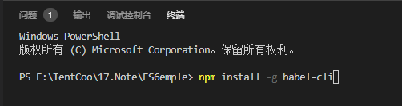

# [Visual Studio Code中Es6的开发环境搭建](https://www.cnblogs.com/ahaMOMO/p/11185616.html)

## 1.打开终端，输入初始化代码。输入代码之后会在目录中出现package.json,可以在红色下划线上写上作者名和描述（不写也可以）

　　**npm init -y**  

 

## 2.安装Babel转换器

　　npm install -g babel-cli  

## 3.安装打包（es5）

　 npm install --save-dev babel-preset-es2015 babel-cli  

 

　然后打开package.json，出现以下红括号的代码则说明安装成功

　

## 4.在根目录创建.babelrc配置文件（注意不是文件夹）。输入以下代码

## 5.最后输入babel 需要转码文件路径 -o 转码结果写入的文件路径。如：

  babel js/1-2es6.js -o es5Js/1-2es6.js   

 

以上就可以实现es6到es5的转换了！

最后，如果不想每次转换都输入这么多重复的路径命令。则可以通过在package.json文件中通过配置以下代码：

　

则可以在终端输入npm run build就可以转换成功！

