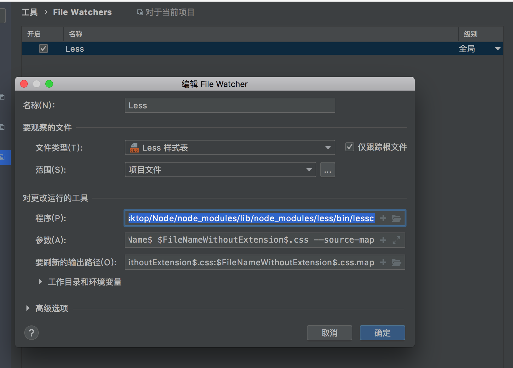
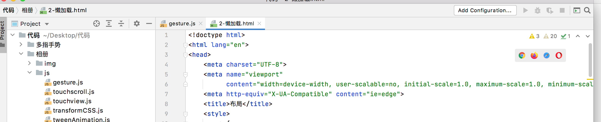
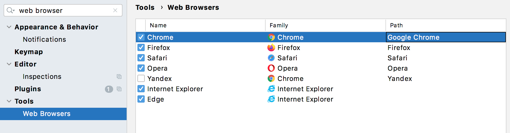
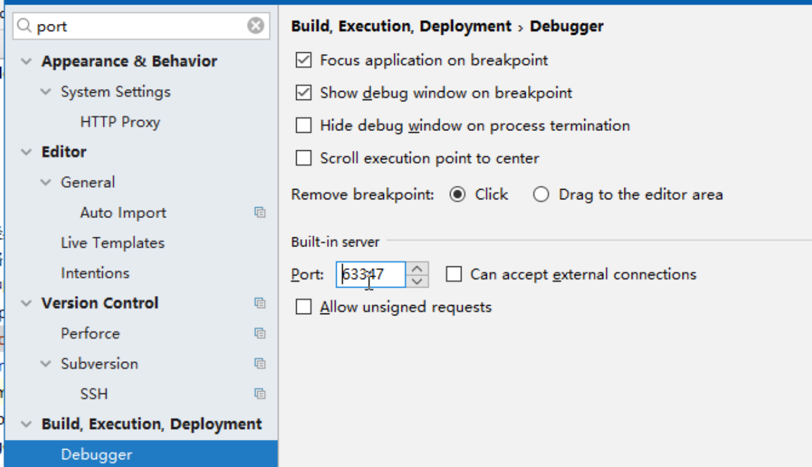

# 快捷键配置

>`shift+command+[`：切换打开的文件
>
>`shift+command+]`：切换打开的文件
>
>`command+ ->`：移动光标到行尾
>
>`command+ <-`：移动光标到行首
>
>`alt+command+ ->`：移动光标到行尾并选中本行
>
>`alt+command+ <- `：移动光标到行首并选中本行
>
>`command + delete`：删除整行
>
>`command + z`：撤销操作
>
>`command + shift + up`：向上添加一个光标，实现同时编辑多个位置。
>
>`command + shift + down`：向下添加一个光标，实现同时编辑多个位置。
>
>`control + alt +down`：复制整行到下一行
>
>`command + shift + up`：将光标移动到代码块开始括号。
>
>`command + shift + down`：将光标移动到代码块结束括号。
>
>`command + shift + F`：代码格式化
>
>`command + F`：查找
>
>`command + alt + F`：替换
>
>`command + control + 向下箭头`：Duplicate Entire Lines，快速复制上一行代码。
>
>
>
>`alt + up`：当前行代码上移
>
>`alt + down`：当前行代码下移
>
>`conmmand + alt + up`：当前代码块上移动
>
>`command + alt + down`：当前代码块下移动
>
>
>
>`command + G`：创建目录
>
>`command + P`：创建项目
>
>`command + shift + n`：创建文件
>
>`alt + delete`：删除文件/目录
>
>
>
>`command + W`：关闭当前选项卡
>
>`command + C + P`：关闭项目
>
>`command + C + O`：关闭其它选项卡
>
>`command + C + A`：关闭所有选项卡
>
>`command + C + left`：关闭当前选项卡左边的选项卡
>
>`command + C + right`：关闭当前选项卡右边的选项卡
>
>
>
>`command + [`：折叠
>
>`command + ]`：展开
>
>`command + alt + [`：全部折叠
>
>`command + alt + ]`：全部展开
>
>

# file watcher

> 用来自动对检测的文件进行编译，例如将less文件编译成css文件

## less配置

> 安装less步骤：
>
> 1.  npm list -g 查看是否有less模块
> 2. `npm install -g less`，使用该命令在终端进行下载，下载完成会显示一个less包保存地址。
> 3. 在webstorm中配置：
>    1. 按照`Preferences --> tool --> file watcher`说明打开配置页
>    2. 点击加号创建，并在程序项中，填写less包保存地址。
>    3. 修改级别为global，所有项目都可以使用。
>    4. 点击确定。
> 4. 可以在刷新的输出路径中设置，生成的css文件和css.map文件的保存路径，多个文件使用冒号隔开，当前设置的是在less所在的当前路径下保存。

# 浏览器配置

> 当编写完代码后，代码区的右上角是有webstorm支持的浏览器按钮，点击某个浏览器按钮图标，可以直接跳转到浏览器中打开该文件。
>
>  
>
> 1. 当出现点击按钮后，无法打开相应浏览器。
> 2. 当编辑完代码后，没有想要的浏览器。
>
> 如果出现上面两种情况，打开webstorm的配置页面，找到`web browser`选项，添加浏览器或者重新给对应浏览器的`path`属性设置路径。

# webstorm端口号设置

> 这是webstorm内置服务器端口号，在编辑html页面时，右上角会出现浏览器图片按钮，点击其中一个按钮，会使用对应浏览器打开这个网页，浏览器url的协议不是`file`，而是`http`，因为webstorm就是一个服务器。

