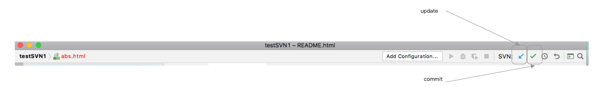
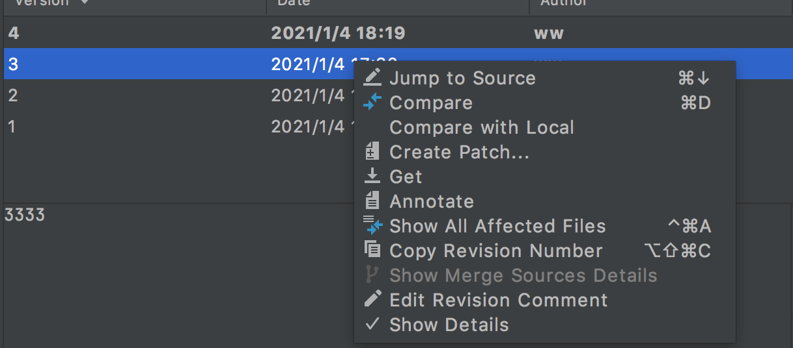

# SVN操作

## 文件状态

> webstorm打开具有svn托管的文件夹时，其中的文件名会有颜色，通过文件名颜色显示文件的状态：
>
> 1. 蓝色：文件被修改但没有提交。
> 2. 亮红色：文件出现冲突。
> 3. 暗红色：新增文件，但没有被svn托管，即之后提交时，该文件不会被提交。
> 4. 绿色：新增文件，并且文件被svn托管，即之后提交时，该文件会被提交。
> 5. 黑色：从服务器中下载下来的文件，这些文件内容和服务器的一致。

## update和commit

## 文件忽略

> Settings→Editor→File Types - ignored files and folders中设置提交时忽略的文件和文件夹

## 版本回退

## 代码冲突

> 右键点击冲突的文件-->subversion --> resolve Text conflict --> 选择冲突文件点击merge --> 左边代码框为本地代码，右边框为服务器代码，中间为解决代码冲突后文件最终内容。

## 查看文件的版本列表

> 查看文件修改的历史记录

> 展示出文件所有历史记录：
>
> 1. jump to source：打开当前版本的文件
> 2. compare：比较当前文件版本内容与指定的版本文件的内容的变换。
> 3. get：表示将文件变成某个版本的内容。

## 比较当前文件与指定版本文件的内容的变化。

## 文件配置-加锁

> 在这里可以给文件加锁。

# Git操作

> webstorm中以文件名颜色来判断文件处于何种状态，但是有时它是不准确的，不要轻易相信。
>
>  
>
> 当打开git文件夹(文件夹中有`.git`文件夹)时，webstorm软件右上角会自动出现git操作按钮，像svn一样。

## git查看历史操作

> 下图展示的是：
>
> 1. 查看当前git库各个分支的提交历史。
> 2. 右上角几个按钮为，常用的快捷按钮，分别为pull、commit、push和show history。

## git各种详细操作

> 其它详细的操作，可以通过选择项目或者选择某个文件，点击右键选择`git`，出现一个详细的操作菜单。
>
>  
>
> 说明：
>
> 1. webstorm的`commit directory`按钮，是一个二合一按钮，即add+commit。

## git版本切换

>webstorm应用右下角展示了当前git库处于哪个分支下，这是一个按钮，点击可以切换分支、合并分支、以及比较分支。

