# webstorm不能提示node代码：coding assistance for node.js不能enable解决方案

问题：node代码不能检测提示补全。

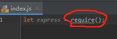

 

 方案一：正常情况下启用coding assistance for node.js即可，这个方案在很多博客中都由介绍，这里我就贴一张图，若能解决你是幸运的，不能解决就继续往下看。

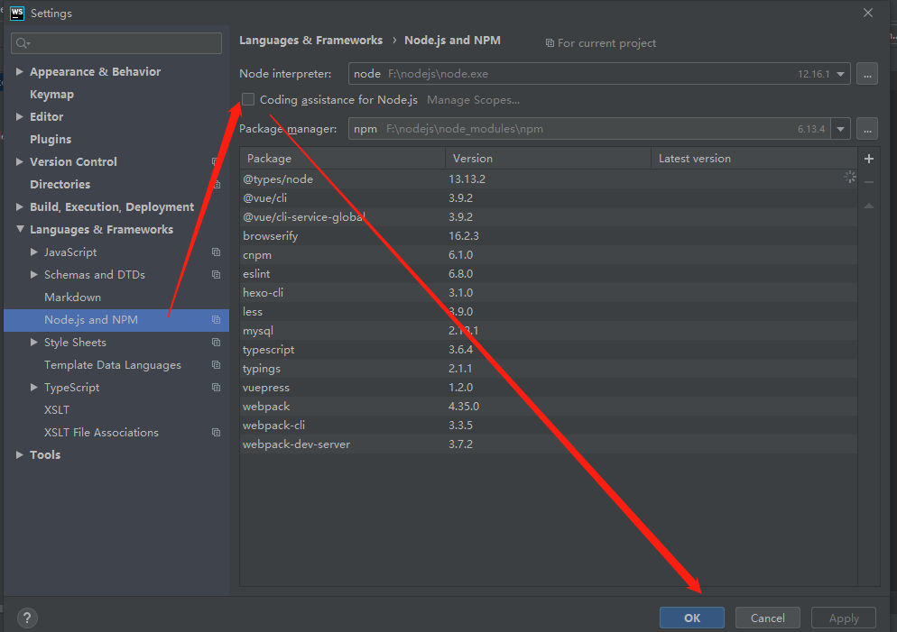

 

 方案二：通过webstorm提供的半自动配置方案来解决：File --> Settings --> Languages & Frameworks --> JavaScript --> Libraries:下载（Download）--添加（Add）--启用(OK)。

下面这三张图来自这篇博客：https://blog.csdn.net/Dobility/article/details/87563057

这个方案能解决你还是幸运的，看到很多网上的提问，这个方案还是不能解决，请继续看一下方案。

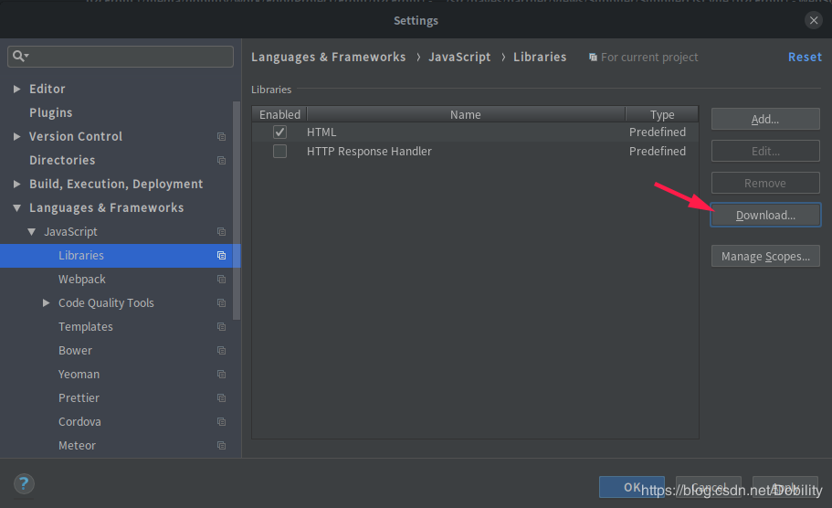

 

 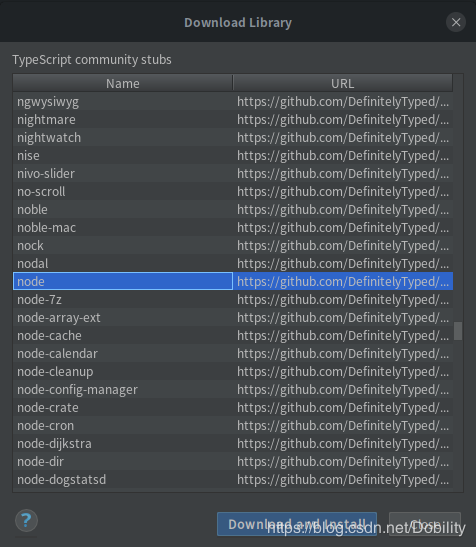

 

 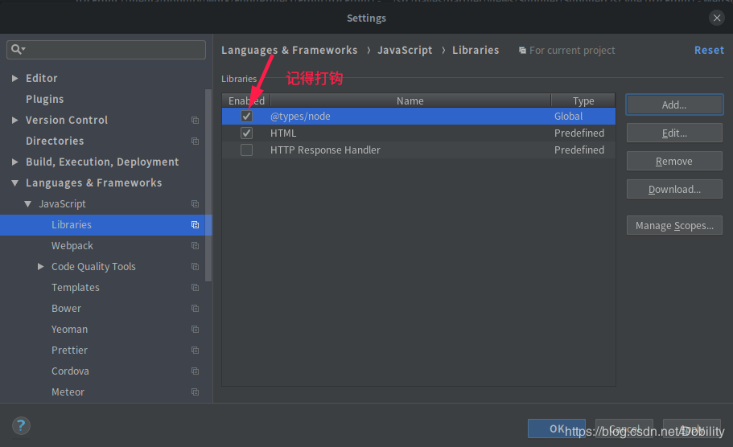

 

方案三（终极篇）：还是在Libraries窗口操作，但在此之前我们需要手动去下载@types/node语法库，百度搜索这个就可以看到，github上可以下载但我觉得还是有点麻烦，别怕npm仓库中有这个语法库，所以通过npm下载就好了！

```
npm install @types/node -g
```

下载完成以后回到WebStorm的Libraries窗口：

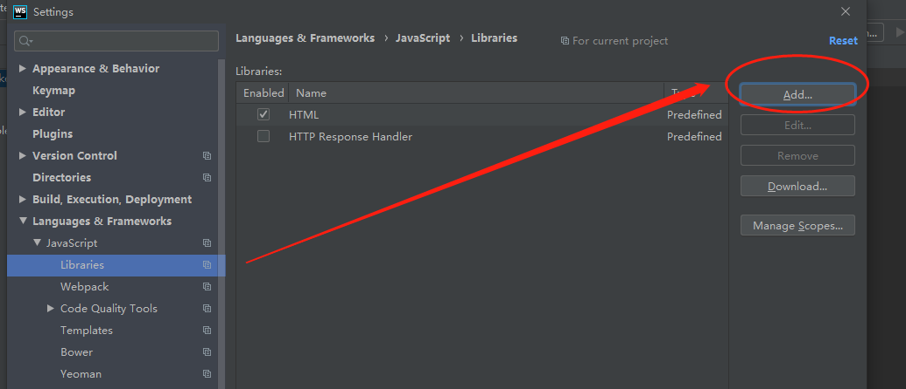

 

 点击Add进入下面这个界面手动添加操作：Name你自己随意把，Framework type选择Node.js Core Modules。然后点击“+”添加语法库。

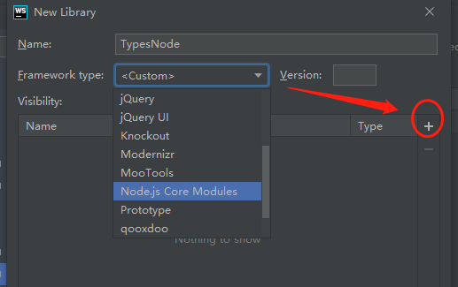

 

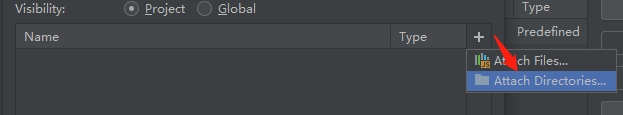

 

这里还有一个问题需要注意，你要找到你的npm安装路径（如果你之前更改了npm的安装路径不记得了建议github上去下载然后找一个路径存吧），默认win系统在c盘：C:\Users\***这里是你的当前系统用户名***\AppData\Roaming\npm\node_modules

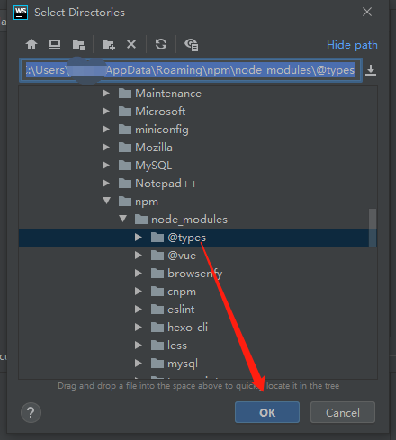

 

 选中@types后点击OK确定，然后又回到了Libraries窗口，勾选刚刚添加的@types（我设置的名称TypeNode），然后OK确认。（这一步完成后就大功告成，如果还不行，建议卸载别用了。。。。哈哈）

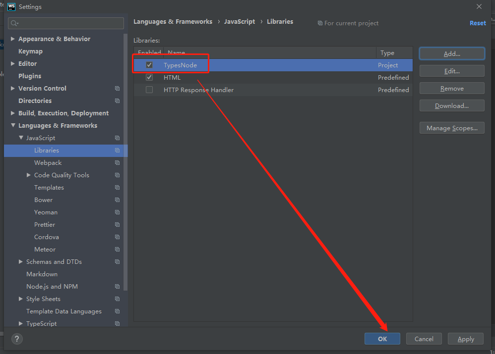

 

 最后效果（别问我括号为什么还是有波浪线，require已经没有了，括号还有这些都说明语法库配置成功了，因为node不允许导入为空）。

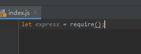

 