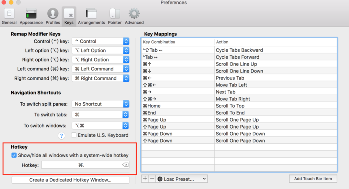

# Mac下终端工具iTerm2安装

https://www.jianshu.com/p/ba08713c2b19

# 一、iTerm2简介：

`Mac OS`自带的终端，用起来虽然有些不太方便，界面也不够友好,`iTerm2`是一款相对比较好用的终端工具.`iTerm2`常用操作包括主题选择、声明高亮、自动填充建议、隐藏用户名和主机名、分屏效果等.

先来看效果图:


##### 二、下载及安装

补充一些关于shell的介绍:
Mac系统默认使用dash作为终端，但是新的Mac系统已经默认使用zsh.查看方法:

可以自行查看系统当前 shell
`$ cat /etc/shells`

```
/bin/bash
/bin/csh
/bin/dash
/bin/ksh
/bin/sh
/bin/tcsh
/bin/zsh
```

以及切换shell
`chsh -s /bin/zsh`
`chsh -s /bin/bash`

其中,
bash的配置文件是 -`/.bash_profile`
zsh的配置文件是-`/.zshrc`
位置在用户家目录下,为隐藏文件

1.在finder根目录中`command + shift + .`显示隐藏文件即可看到.同时可以看到bash 、csh 、dash 、zsh等都在这个目录下,


image.png

`iTerm2`下载地址：[https://www.iterm2.com/downloads.html](https://links.jianshu.com/go?to=https%3A%2F%2Fwww.iterm2.com%2Fdownloads.html)

`1、`下载的是压缩文件，解压后直接双击执行程序文件，或者直接将它拖到 Applications 目录下。

`2、`也可以直接使用`Homebrew`进行安装：

```
$ brew cask install iterm2
```

安装完打开,这是iTem最初的样子,基于此可以安装各种插件来优化了...


截屏2020-05-28 上午10.32.34.png


截屏2020-05-28 上午10.29.07.png

# 三 、配置 iTerm2 主题

iTerm2 最常用的主题是 Solarized Dark theme，下载地址：
[http://ethanschoonover.com/solarized](https://links.jianshu.com/go?to=http%3A%2F%2Fethanschoonover.com%2Fsolarized)
[https://github.com/altercation/solarized](https://links.jianshu.com/go?to=https%3A%2F%2Fgithub.com%2Faltercation%2Fsolarized) github地址

下载的是压缩文件，解压，然后打开 iTerm2，按`Command +`键，打开 Preferences 配置界面，然后Profiles -> Colors -> Color Presets,在下拉列表中选择 Import，选择刚才解压的solarized->iterm2-colors-solarized->Solarized Dark.itermcolors文件.导入成功后,在 Color Presets下选择 Solarized Dark 主题，就可以了。


效果图:


截屏2020-05-28 上午10.45.18.png

# 三 、设置 iTerm2 背景图片

打开 iTerm2，按`Command +`键，打开 Preferences 配置界面Profiles -> Window->Background mage,选择一张自己喜欢的背景图.


[背景图下载一](https://links.jianshu.com/go?to=http%3A%2F%2Fwx1.sinaimg.cn%2Flarge%2F81f8a509gy1fnjdvkkwgoj20zk0m8ak8.jpg)
[背景图下载二](https://links.jianshu.com/go?to=https%3A%2F%2Fpan.baidu.com%2Fs%2F18jNrULbr05npD0Z_ht28Kg)

# 四 、 配置 Oh My Zsh

`Oh My Zsh` 是对主题的进一步扩展,下载地址[https://github.com/robbyrussell/oh-my-zsh](https://links.jianshu.com/go?to=https%3A%2F%2Fgithub.com%2Frobbyrussell%2Foh-my-zsh)

1.一键安装：

via curl方式:

```
$ sh -c "$(curl -fsSL https://raw.githubusercontent.com/ohmyzsh/ohmyzsh/master/tools/install.sh)"
```

via wget方式:

```
$sh -c "$(wget -O- https://raw.githubusercontent.com/ohmyzsh/ohmyzsh/master/tools/install.sh)"
```

2.手动方式安装,如下:
(git地址: [https://github.com/ohmyzsh/ohmyzsh](https://links.jianshu.com/go?to=https%3A%2F%2Fgithub.com%2Fohmyzsh%2Fohmyzsh))

```
## 找到仓库， 然后clone到本地
git clone https://github.com/ohmyzsh/ohmyzsh.git
## 把仓库复制到 .oh-my-zsh目录
cp -r ohmyzsh ~/.oh-my-zsh
## 复制.zshrc
cp ohmyzsh/templates/zshrc.zsh-template ~/.zshrc
## shell换成zsh
chsh -s /bin/zsh
```

3.安装好之后，需要把 Zsh 设置为当前用户的默认 Shell（这样新建标签的时候才会使用 Zsh）：

```
$ chsh -s /bin/zsh
```

4.然后，将主题修改为`ZSH_THEME="agnoster"`。
`$ vim ~/.zshrc`
输入`i`进入编辑模式,将`ZSH_THEME=""`编辑为 `ZSH_THEME="agnoster"`

按下`esc`键,退出编辑,`:wq`保存退出:
修改成功!


`agnoster`是比较常用的 zsh 主题之一，你可以挑选你喜欢的主题，zsh 主题列表：[https://github.com/robbyrussell/oh-my-zsh/wiki/themes](https://links.jianshu.com/go?to=https%3A%2F%2Fgithub.com%2Frobbyrussell%2Foh-my-zsh%2Fwiki%2Fthemes)

```
补充:` 上面提到的via wget安装方式需要安装wget,方法如下:
直接终端使用homebrew安装（前提是已经安装了homebrew）
安装命令：
`$brew install wget
```

检验是否安装成功：
`$ wget http://www.arefly.com/`


image.png

# 五 、配置 Meslo 字体

使用上面的主题，需要 Meslo 字体支持，要不然会出现乱码的情况，字体下载地址：[Meslo LG M Regular for Powerline.ttf](https://codechina.csdn.net/mirrors/powerline/fonts/-/blob/e80e3eba9091dac0655a0a77472e10f53e754bb0/Meslo%20Slashed/Meslo%20LG%20M%20Regular%20for%20Powerline.ttf)

下载好之后，找到对应的字体,直接在 Mac OS 中安装即可。

然后打开 iTerm2，按`Command + ,`键，打开 Preferences 配置界面，然后`Profiles -> Text -> Font -> Chanage Font`，选择 Meslo LG M Regular for Powerline 字体。

# 六 、声明高亮

特殊命令和错误命令，会有高亮显示。

使用 Homebrew 安装：
`$ brew install zsh-syntax-highlighting`

安装成功之后，编辑vim ~/.zshrc文件，在最后一行增加下面配置：
`source /usr/local/share/zsh-syntax-highlighting/zsh-syntax-highlighting.zsh`


```
方式2
执行下面指令自动安装`
`$ git clone https://github.com/zsh-users/zsh-syntax-highlighting.git $ZSH_CUSTOM/plugins/zsh-syntax-highlighting
```

然后编辑`vim ~/.zshrc`文件，找到plugins配置，增加`zsh-syntax-highlighting`插件。


image.png

# 七、自动建议填充

这个功能是非常实用的，可以方便我们快速的敲命令。

配置步骤，先克隆zsh-autosuggestions项目，到指定目录：

```
$ git clone https://github.com/zsh-users/zsh-autosuggestions ~/.oh-my-zsh/custom/plugins/zsh-autosuggestions
```

然后编辑`vim ~/.zshrc`文件，找到plugins配置，增加`zsh-autosuggestions`插件。


# 八、iTerm2 快速隐藏和显示窗体:

打开 iTerm2，按`Command + ,`键，打开 Preferences 配置界面，然后Profiles → Keys →Hotkey，自定义一个快捷键就可以了。




# 九、iTerm2 隐藏用户名和主机名

有时候我们的用户名和主机名太长，终端显示的时候会很不好看，我们可以手动去除。

编辑`vim ~/.zshrc`文件，增加`DEFAULT_USER="SKong"`配置.

但是: 我的电脑没生效,至今未找到原因~~~
`补充:已经找到原因,这个地方应该设置为: DEFAULT_USER="你电脑的用户名"`
比如:我的电脑用户名为pactepacterara,则DEFAULT_USER="pactepacterara"
感谢网友[码渣](https://www.jianshu.com/u/c57aa48a99b8)!


截屏2020-04-27 下午5.09.43.png

效果对比:


截屏2020-04-27 下午5.08.35.png


截屏2020-04-27 下午5.11.21.png


我们可以通过`whoami`命令，查看当前用户


# 十、iTerm2 快捷命令

```
在iterm2中，选中某个路径或者某个词汇，iterm2就自动复制了,很方便。
command + enter 进入与返回全屏模式
command + t 新建标签
command + w 关闭标签
command + 数字 command + 左右方向键    切换标签
command + enter 切换全屏
command + f 查找
command + d 水平分屏
command + shift + d 垂直分屏
command + option + 方向键 command + [ 或 command + ]    切换屏幕
command + ; 查看历史命令
command + shift + h 查看剪贴板历史
ctrl + u    清除当前行
ctrl + l    清屏
ctrl + a    到行首
ctrl + e    到行尾
ctrl + f/b  前进后退
ctrl + p    上一条命令
ctrl + r    搜索命令历史
```

# 十、卸载 oh-my-zsh

进入到.oh-my-zsh/tools目录,依次执行
`$cd .oh-my-zsh/tools`
`chmod +x uninstall.sh`
`./uninstall.sh`
`rm -rif .zshrc`

```
补充`
我们来看一下/.zshrc的文件源码, 很多zsh的配置都在这里面
`vim ~/.zshrc
```


# 注意

> 注意：
>  1、安装过程中涉及到`.zshrc`的配置问题
>  `.bash_profile`中修改环境变量只对当前窗口有效，而且需要 `source ~/.bash_profile`才能使用
>  `.zshrc`则相当于 windows 的开机启动的环境变量
>  你也可以在 `.zshrc`文件中加一行 `source ~/.bash_profile`解决需要 source 才能使用的问题。
>
> 2、安装完iterm2的字体后，会影响mac系统iterm终端的配置：
>  这时需要在iterm系统偏好设置里把字体设置为和iterm2一样。
>
> 3、vscode的终端样式也会出错，原因还是在于字体，command+shift+p打开  `settings.json`，添加字体设置，例如：`"terminal.integrated.fontFamily": "Meslo LG M for Powerline"`


> 美化vscode的终端：
>
> `settings.json`中添加：
>
> ```cpp
> "workbench.colorCustomizations": { // 更多终端颜色配置在此添加
>         "terminal.ansiBlack":"#4b4949" // ANSI背景色
>     }
> ```

