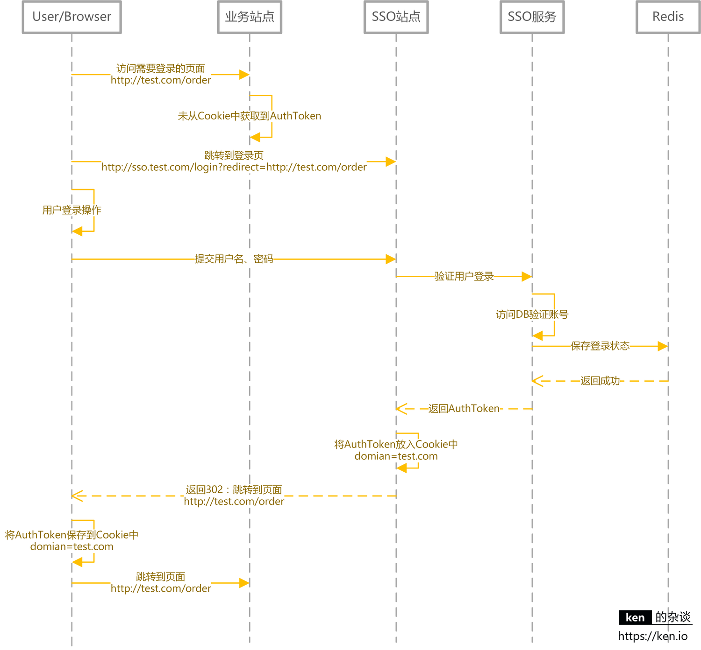
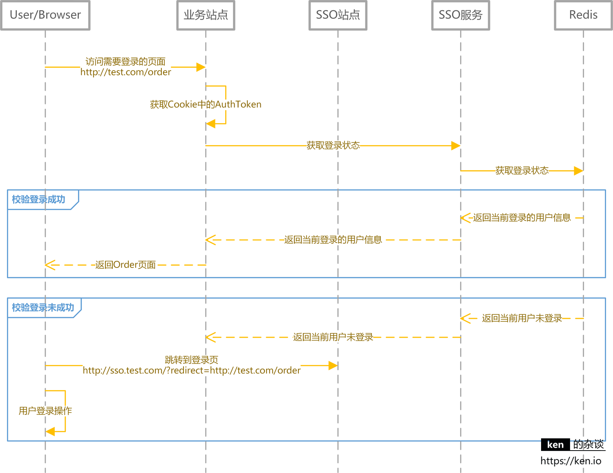
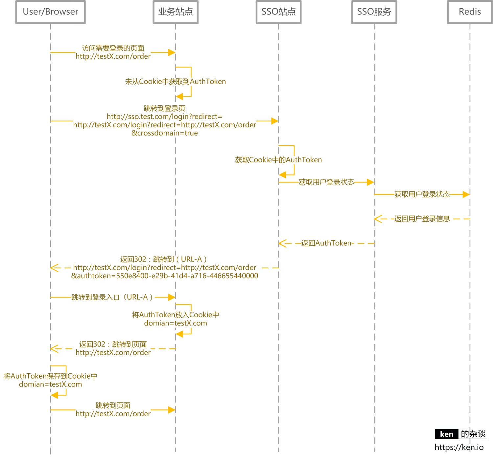
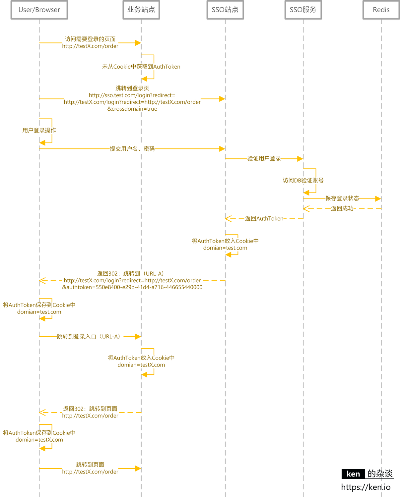

# [单点登录（SSO）的设计与实现](https://ken.io/note/sso-design-implement)

[Solution ](https://ken.io/category/solution)[Arch ](https://ken.io/category/arch)@ 2017-11-25 15:32:53 · 阅读：（20607）

## 一、前言

### 1、SSO说明

SSO英文全称Single Sign On，单点登录。SSO是在多个应用系统中，用户只需要登录一次就可以访问所有相互信任的应用系统。https://baike.baidu.com/item/SSO/3451380

例如访问在网易账号中心（http://reg.163.com/ ）登录之后
访问以下站点都是登录状态

- 网易直播 [http://v.163.com](http://v.163.com/)
- 网易博客 [http://blog.163.com](http://blog.163.com/)
- 网易花田 [http://love.163.com](http://love.163.com/)
- 网易考拉 [https://www.kaola.com](https://www.kaola.com/)
- 网易Lofter [http://www.lofter.com](http://www.lofter.com/)

### 2、设计目标

本篇文章也主要是为了探讨如何设计&实现一个SSO系统

以下为需要实现的核心功能：

- 单点登录
- 单点登出
- 支持跨域单点登录
- 支持跨域单点登出

## 二、SSO设计与实现

### 1、核心应用与依赖

| 应用/模块/对象   | 说明                                |
| ---------------- | ----------------------------------- |
| 前台站点         | 需要登录的站点                      |
| SSO站点-登录     | 提供登录的页面                      |
| SSO站点-登出     | 提供注销登录的入口                  |
| SSO服务-登录     | 提供登录服务                        |
| SSO服务-登录状态 | 提供登录状态校验/登录信息查询的服务 |
| SSO服务-登出     | 提供用户注销登录的服务              |
| 数据库           | 存储用户账户信息                    |
| 缓存             | 存储用户的登录信息，通常使用Redis   |

### 2、用户登录状态的存储与校验

常见的Web框架对于[Session](https://ken.io/note/session-principle-skill)的实现都是生成一个SessionId存储在浏览器Cookie中。然后将Session内容存储在服务器端内存中，这个 ken.io 在之前[Session工作原理](https://ken.io/note/session-principle-skill)中也提到过。整体也是借鉴这个思路。
用户登录成功之后，生成AuthToken交给客户端保存。如果是浏览器，就保存在Cookie中。如果是手机App就保存在App本地缓存中。本篇主要探讨基于Web站点的SSO。
用户在浏览需要登录的页面时，客户端将AuthToken提交给SSO服务校验登录状态/获取用户登录信息

对于登录信息的存储，建议采用Redis，使用Redis集群来存储登录信息，既可以保证高可用，又可以线性扩充。同时也可以让SSO服务满足负载均衡/可伸缩的需求。

| 对象      | 说明                                                         |
| --------- | ------------------------------------------------------------ |
| AuthToken | 直接使用UUID/GUID即可，如果有验证AuthToken合法性需求，可以将UserName+时间戳加密生成，服务端解密之后验证合法性 |
| 登录信息  | 通常是将UserId，UserName缓存起来                             |

### 3、用户登录/登录校验

- 登录时序图

按照上图，用户登录后Authtoken保存在Cookie中。 domian= test. com
浏览器会将domain设置成 .test.com，
这样访问所有*.test.com的web站点，都会将Authtoken携带到服务器端。
然后通过SSO服务，完成对用户状态的校验/用户登录信息的获取

- 登录信息获取/登录状态校验

### 4、用户登出

用户登出时要做的事情很简单：

1. 服务端清除缓存（Redis）中的登录状态
2. 客户端清除存储的AuthToken

- 登出时序图

### 5、跨域登录、登出

前面提到过，核心思路是客户端存储AuthToken，服务器端通过Redis存储登录信息。由于客户端是将AuthToken存储在Cookie中的。所以跨域要解决的问题，就是如何解决Cookie的跨域读写问题。

解决跨域的核心思路就是：

- 登录完成之后通过回调的方式，将AuthToken传递给主域名之外的站点，该站点自行将AuthToken保存在当前域下的Cookie中。
- 登出完成之后通过回调的方式，调用非主域名站点的登出页面，完成设置Cookie中的AuthToken过期的操作。
- 跨域登录（主域名已登录）

- 跨域登录（主域名未登录）

- 跨域登出

## 三、备注

- 关于方案

这次设计方案更多是提供实现思路。如果涉及到APP用户登录等情况，在访问SSO服务时，增加对APP的签名验证就好了。当然，如果有无线网关，验证签名不是问题。

- 关于时序图

时序图中并没有包含所有场景，ken.io只列举了核心/主要场景，另外对于一些不影响理解思路的消息能省就省了。

- 前置知识

1、Session的工作原理和使用经验：https://ken.io/note/session-principle-skill
2、Cookie的特点和使用经验/建议总结：https://ken.io/note/cookie-feature-skill

以上，如有疑问，欢迎联系我：https://ken.io/home/about

