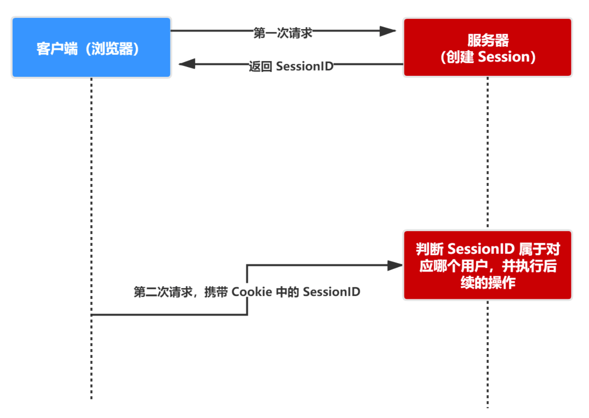
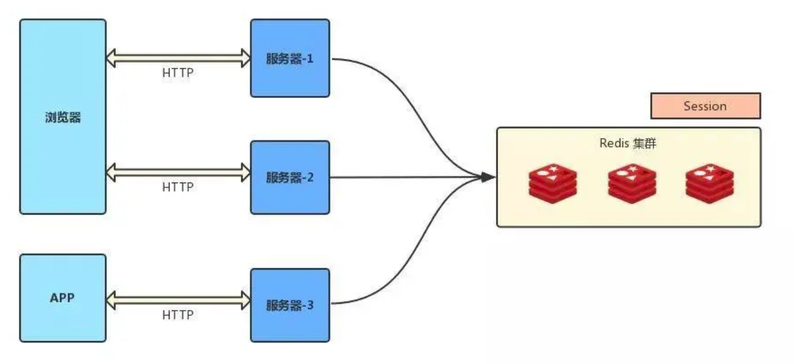
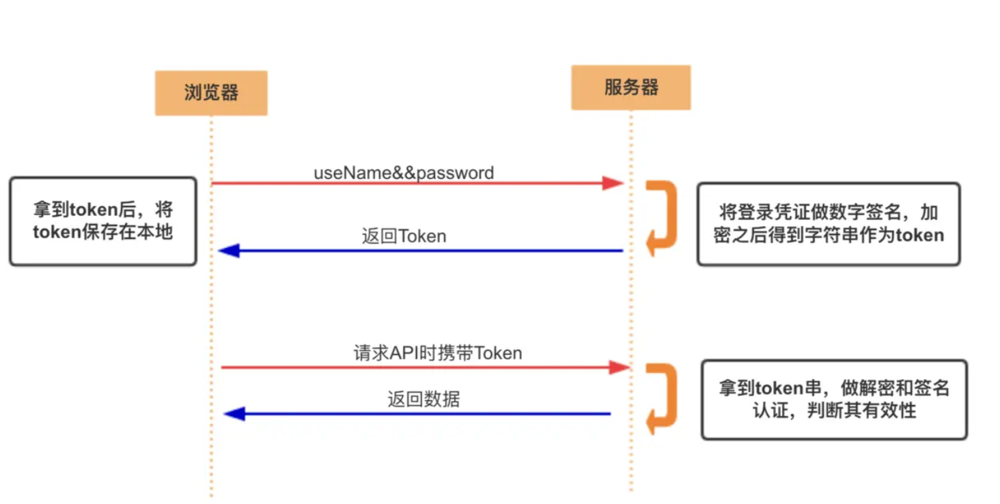
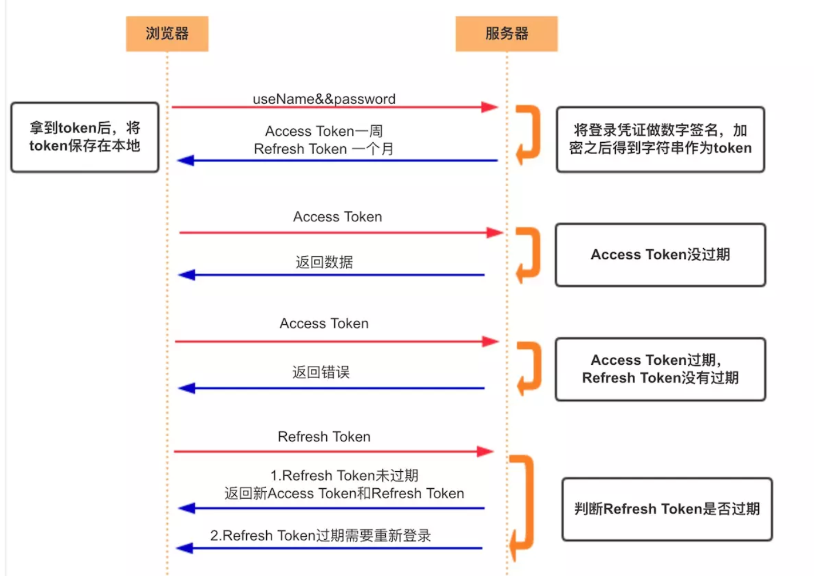

# cookie、session和token

> http协议是无状态的，但是我们有些请求需要依赖其他请求，例如访问权限资源就需要先去获得权限(`访问个人中心需要先登录`)。
>
> http三种会话跟踪方案：
>
> 1. cookie，会话信息保存在客户端，服务器根据cookie知道当前用户身份和做过哪些事情。
> 2. cookie-session，会话信息保存在服务端中。
> 3. token，不保存信息只是一个让服务器验证身份的`ID字符串`。

## 会话跟踪应用场景

> 1. 身份凭证，用户登录，当用户登录成功时给用户一个凭证，下次用户不需要在登录就可以访问。
> 2. 授权，app授权，使用微信账号登录某个软件平台。
> 3. 保存请求产生的一些结果信息，将用户基本信息保存进去，服务器不需要去读取数据库。

## cookie
> cookie 重要的属性
>
> | 属性           | 说明                                                         |
> | -------------- | ------------------------------------------------------------ |
> | **name=value** | 键值对，设置 Cookie 的名称及相对应的值，都必须是**字符串类型** - `如果值为 Unicode 字符，需要为字符编码。 - 如果值为二进制数据，则需要使用 BASE64 编码`。 |
> | **domain**     | 指定 cookie 所属域名，默认是当前域名                         |
> | **path**       | **指定 cookie 在哪个路径（路由）下生效，默认是 '/'**。 如果设置为 `/abc`，则只有 `/abc` 下的路由可以访问到该 cookie，如：`/abc/read`。 |
> | **maxAge**     | cookie 失效的时间，单位秒。如果为整数，则该 cookie 在 maxAge 秒后失效。如果为负数，该 cookie 为临时 cookie ，关闭浏览器即失效，浏览器也不会以任何形式保存该 cookie 。如果为 0，表示删除该 cookie 。默认为 -1。 - **比 expires 好用**。 |
> | **expires**    | 过期时间，在设置的某个时间点后该 cookie 就会失效。 一般浏览器的 cookie 都是默认储存的，当关闭浏览器结束这个会话的时候，这个 cookie 也就会被删除 |
> | **secure**     | 该 cookie 是否仅被使用安全协议传输。安全协议有 HTTPS，SSL等，在网络上传输数据之前先将数据加密。默认为false。 当 secure 值为 true 时，cookie 在 HTTP 中是无效，在 HTTPS 中才有效。 |
> | **httpOnly**   | **如果给某个 cookie 设置了 httpOnly 属性，则无法通过 JS 脚本 读取到该 cookie 的信息，但还是能通过 Application 中手动修改 cookie，所以只是在一定程度上可以防止 XSS 攻击，不是绝对的安全** |
>

### cookie优缺点

> 优点：
>
> 1. 实现服务器的无状态化，使用session方式，需要服务器为每个用户开辟一块独立的内存空间保存数据，`浪费内存空间，服务器集群时还需要实时同步session`。
>
> 缺点或者需要考虑的问题：
>
> 1. cookie大小有限制，每个域只能保存4KB，cookie个数也有限制。
> 2. 只能保存字符串类型，其他类型必须转成字符串。
> 3. 数据保存在客户端，可以被用户篡改，需要进行合法性校验(例如权限保存在cookie，本来没有这个权限，用户修改权限部分，导致用户获得了本不该有的权限)
> 4. cookie是不可跨域的。
> 5. cookie安全性问题，需要防御好`CSRF`和`XSS`攻击。
> 6. 浏览器可能会禁止cookie，无法使用cookie。

## session

> session+cookie实现方式，在服务器中保存会话记录，将会话ID(sessionID)通过cookie发送给浏览器。
>
> session 认证流程：
>
> - 用户第一次请求服务器的时候，服务器根据用户提交的相关信息，创建对应的 Session
> - 请求返回时将此 Session 的唯一标识信息 SessionID 返回给浏览器
> - 浏览器接收到服务器返回的 SessionID 信息后，会将此信息存入到 Cookie 中，同时 Cookie 记录此 SessionID 属于哪个域名
> - 当用户第二次访问服务器的时候，请求会自动判断此域名下是否存在 Cookie 信息，如果存在自动将 Cookie 信息也发送给服务端，服务端会从 Cookie 中获取 SessionID，再根据 SessionID 查找对应的 Session 信息，如果没有找到说明用户没有登录或者登录失效，如果找到 Session 证明用户已经登录可执行后面操作。

> session优点：
>
> 1. 没有存储的局限性
> 2. 可以保存任何类型数据
> 3. 数据保存在服务器中，用户无法像修改cookie一样，修改session。
>
> 需要考虑的问题：
>
> 1. 如果cookie+session配合使用时，如果浏览器禁止cookie怎么办，将sessionID保存到响应体中，用户管理。
> 2. 当每个用户都需要开辟内存空间保存各自的session对象，会导致内存吃紧问题。
> 3. 当使用服务器集群时，如何解决服务器之间的session同步问题。
> 4. 如果使用使用cookie+session时，需要解决跨域问题。

### 分布式下session同步方案

#### session 复制

> 任何一个服务器上的 session 发生改变（增删改），该节点会把这个 session 的所有内容序列化，然后广播给所有其它节点，不管其他服务器需不需要 session ，以此来保证 session 同步

> **优点：** 可容错，各个服务器间 session 能够实时响应。 
> **缺点：** 会对网络负荷造成一定压力，如果 session 量大的话可能会造成网络堵塞，拖慢服务器性能。

#### 粘性 session /IP 绑定策略

> **采用 Ngnix 中的 ip_hash 机制，将某个 ip的所有请求都定向到同一台服务器上，即将用户与服务器绑定。** 用户第一次请求时，负载均衡器将用户的请求转发到了 A 服务器上，如果负载均衡器设置了粘性 session 的话，那么用户以后的每次请求都会转发到 A 服务器上，相当于把用户和 A 服务器粘到了一块，这就是粘性 session 机制。

> **优点：** 简单，不需要对 session 做任何处理。 
> **缺点：** 缺乏容错性，如果当前访问的服务器发生故障，用户被转移到第二个服务器上时，他的 session 信息都将失效。 
> **适用场景：** 发生故障对客户产生的影响较小；服务器发生故障是低概率事件 。
> **实现方式：** 以 Nginx 为例，在 upstream 模块配置 ip_hash 属性即可实现粘性 session。

#### session 共享（常用）

> - 使用分布式缓存方案比如 Memcached 、Redis 来缓存 session，但是要求 Memcached 或 Redis 必须是集群
> - 把 session 放到 Redis 中存储，虽然架构上变得复杂，并且需要多访问一次 Redis ，但是这种方案带来的好处也是很大的：
>   - 实现了 session 共享；
>   - 可以水平扩展（增加 Redis 服务器）；
>   - 服务器重启 session 不丢失（不过也要注意 session 在 Redis 中的刷新/失效机制）；
>   - 不仅可以跨服务器 session 共享，甚至可以跨平台（例如网页端和 APP 端）

## token

### Access Token

> - **访问资源接口（API）时所需要的资源凭证**
> - **简单 token 的组成：** uid(用户唯一的身份标识)、time(当前时间的时间戳)、sign（签名，token 的前几位以哈希算法压缩成的一定长度的十六进制字符串）
> - 特点：
>   - 服务端无状态化、可扩展性好，基于 token 的用户认证是一种服务端无状态的认证方式，服务端不用存放 token 数据。用`解析 token 的计算时间换取 session 的存储空间`，从而减轻服务器的压力，减少频繁的查询数据库。
>   - 支持移动端设备，并且跨程序，有些移动设备对cookie支持的不好，而`token说白了就是一个字符串，请求时将其当作参数发给服务端就行`。

> AccessToken流程
>
> 1. 客户端使用用户名跟密码请求登录
> 2. 服务端收到请求，去验证用户名与密码
> 3. 验证成功后，服务端会签发一个 token 并把这个 token 发送给客户端
> 4. 客户端收到 token 以后，会把它存储起来，比如放在 cookie 里或者 localStorage 里
> 5. 客户端每次向服务端请求资源的时候需要带着服务端签发的 token
> 6. 服务端收到请求，然后去验证客户端请求里面带着的 token ，如果验证成功，就向客户端返回请求的数据

### Refresh Token

> `refresh token 是专用于刷新 access token 的 token`。如果没有 refresh token，也可以刷新 access token，但每次刷新都要用户输入登录用户名与密码，会很麻烦。有了 refresh token，可以减少这个麻烦，客户端直接用 refresh token 去更新 access token，无需用户进行额外的操作。

> - Access Token 的有效期比较短，当 Acesss Token 由于过期而失效时，使用 Refresh Token 就可以获取到新的 Token，如果 Refresh Token 也失效了，用户就只能重新登录了。
> - Refresh Token 及过期时间是存储在服务器的数据库中，只有在申请新的 Acesss Token 时才会验证，不会对业务接口响应时间造成影响，也不需要向 Session 一样一直保持在内存中以应对大量的请求。

### token验证思路

> token时间换空间的实现思路：
>
> 1. 将用户信息和一串随机数合并在一起，保证字符串的随机性。
> 2. 对字符串进行摘要，并和字符串拼接成新的字符串。
> 3. 对新生成的字符串进行加密，秘钥只有服务器知道，生成的加密后的字符串就是token。
> 4. 服务器拿到token时，先进行解密，然后将数据部分进行摘要。
> 5. 生成的摘要与token字符串本身携带的摘要进行比较，如果相等，证明token合法性。
>
> token结构`[数据部分]+[随机数].[对点前面的字符串进行摘要获得摘要字符串]`

## cookie、session与token比较

> token、cookie与session就像残血版和完整版，token只是一个身份ID，而cookie和session是一个会话跟踪机制，区别是cookie由客户端保存会话信息，session有服务器保存会话信息。
>
> 1. 从本质上就区别了token与session。session功能有`身份验证`和`会话信息保存`，token只有身份验证。一般token只作为`APP的授权`和`身份的验证`，而session因为有内存空间，可以保存这个用户与服务器通信的所有会话信息。因此如果为其他网站提供用户信息，例如第三方登录这种，一般使用token，而不是session。
> 2. token扩展性比session好，可以轻松的堆加服务器，而session需要做好各个服务器的session实时同步。同时有一定负载存储空间和带宽压力
> 3. 只用cookie这种方式已经被舍弃了，一般都是使用cookie+session，只用session也可以，只不过sessionID需要应用自己保存。
> 4. 都需要考虑跨域问题

## SSO与OAuth2.0

> 它们两个都是使用token技术解决一些问题，很容易搞混了。
>
> * SSO是单点登录(single sign on)，用来解决公司中存在不同的系统，实现一次登录多系统访问。
> * OAuth2解决使用第三方账号登录某个系统，例如使用微信账号登录知乎网站。