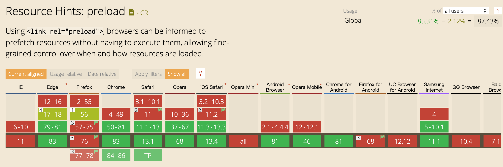

## [通过link的preload进行内容预加载](https://www.cnblogs.com/shenjp/p/13029185.html)

Preload 作为一个新的web标准，旨在提高性能和为web开发人员提供更细粒度的加载控制。Preload使开发者能够自定义资源的加载逻辑，且无需忍受基于脚本的资源加载器带来的性能损失。

<link> 标签的rel属性preload 可以在页面中的header部分中申明一些资源的获取请求，可以指定某些资源在页面加载完成之后即可需要。对于这种即可需要的资源，我们希望在页面加载的生命周期中更早的阶段去获取，在浏览器的主渲染机制进入前就进行预加载。这种方式可以使资源更早的得到并加载，且不会阻塞页面的初步渲染，进而提升网页的性能。下面就通过使用link 的preload机制来实现。

## **一、基础使用**

link 标签最常用的形式就是用来加载CSS文件。

```
<link rel="stylesheet" href="index.css" />
```

但是这里我们也可以使用 preload 作为 rel 的属性值。这种方法就是将 link 塞入到一个预加载容器中，这个预加载器也可以用于我们需要的各种任意的资源。为了完成预加载，我们还需要指定 href 和as 属性，指定需要呗预加载的资源路径和类型。

下面是一个简单的例子：

[](javascript:void(0);)

```
<!DOCTYPE html>
<html lang="en">
<head>
  <meta charset="UTF-8">
  <title>preload</title>
  <link rel="preload" href="style.css" as="script" />
  <link rel="preload" href="main.js" as="script" />

  <link rel="stylesheet" href="style.css" />
</head>
<body>
  <h1>Hello world</h1>
  <script src="main.js"></script>
</body>
</html>
```

[](javascript:void(0);)

这里，我们先预加载了CSS和JS文件，在后面的页面渲染中，一旦有使用到他们，就可以立即使用，这个例子可能看起来不是很明显，但是预加载的好处是可以更清晰直观的得到展示，对于更大的文件来说，比如在CSS中引用的资源，图片或者字体，会更加的明显。

preload 还有很多优势，使用 as 来指定将要预加载的内容类型，可以使浏览器：

- 更精准的优化资源加载的优先级；
- 匹配未来的加载需求，在适当的情况下，重复利用同一资源；
- 为资源应用正确的 [内容安全策略](https://developer.mozilla.org/zh-CN/docs/Web/HTTP/CSP)；
- 为资源设置正确的 [Accept](https://developer.mozilla.org/zh-CN/docs/Web/HTTP/Headers/Accept) 请求头。

有哪些类型的资源可以被预加载？

- audio： 音频文件
- video： 视频文件
- document： 一个将要被嵌入到 [](https://developer.mozilla.org/zh-CN/docs/Web/HTML/Element/frame) 或者 [](https://developer.mozilla.org/zh-CN/docs/Web/HTML/Element/iframe) 内部的 html 文档
- embed： 一个将要被嵌入到 [](https://developer.mozilla.org/zh-CN/docs/Web/HTML/Element/embed) 内部的资源
- fetch： 哪些将要通过 fetch 和 XHR 请求来获取的资源，比如一个 ArrayBuffer 或 JSON 文件
- font： 字体文件
- image： 图片文件
- object： 一个将会被嵌入到 <embed> 内部的文件
- script： JavaScript 文件
- style： 样式表
- track： WebVTT 文件
- worker： 一个JavaScript 的 web worker 或者 shared worker

注意：这里可以进一步阅读 [link-element-extensions ](https://w3c.github.io/preload/#link-element-extensions) 来了解关于这些属性值，以及在其他 preload 方案中的特性细节，同时，关于 as 属性的有效值的完整列表是有 Fetch 方案来制定的，可以查看 [concept-request-destination](https://fetch.spec.whatwg.org/#concept-request-destination) 来了解更多。

 

## 二、包含一个 MIME 类型

link 元素还可以接受一个 type 属性，这个属性可以包含该元素所指向资源的 MIME 类型。在浏览器进行预加载的时候，浏览器将使用 type 属性来判断它是否支持这一资源，如果浏览器支持这一资源，才会开始预加载，否则对其忽略。

下面是个简单的实例：

[](javascript:void(0);)

```
<!DOCTYPE html>
<html lang="en">
<head>
  <meta charset="UTF-8">
  <title>preload</title>
  <link rel="preload" href="media.mp4" as="video" type="video/mp4" />
</head>
<body>
  <h1>Hello world</h1>
  <video controls>
    <source src="media.mp4" type="video/mp4" />
    <source src="media.webm" type="video/webm" />
    <p>Your browser doesn't support HTML5 video.</p>
  </video>
</body>
</html>
```

[](javascript:void(0);)

在这个例子中，支持 MP4 格式的浏览器将会预加载并私用 mp4 资源，以使得视频播放器的表现尽可能流畅，而对于不支持mp4 的浏览器也能仍然能够加载视频的 webm 资源，但是无法体验到预加载带来的好处。

 

## 三、获取跨域

如果你已经有了一个可以正确工作的 [CORS](https://developer.mozilla.org/zh-CN/docs/Web/HTTP/Access_control_CORS) 设置，那么你同样可以预加载那些跨域的资源，只需要在 link 标签中设置好 [crossorigin](https://developer.mozilla.org/zh-CN/docs/Web/HTML/Element/link#attr-crossorigin) 属性即可。

注意：如果是预加载字体文件，那么即使是非跨域的情况下，也需要设置这一属性。具体的细节可以参考 [font-fetching-requirements](https://drafts.csswg.org/css-fonts/#font-fetching-requirements)

例如以下的实例：

[](javascript:void(0);)

```
<!DOCTYPE html>
<html lang="en">
<head>
  <meta charset="UTF-8">
  <title>preload</title>
  <link rel="preload" href="fonts/font.eot" as="font" type="application/vnd.ms-fontobject" crossorigin="anonymous">
  <link rel="preload" href="fonts/font.woff2" as="font" type="font/woff2" crossorigin="anonymous">
  <link rel="preload" href="fonts/font.woff" as="font" type="font/woff" crossorigin="anonymous">
  <link rel="preload" href="fonts/font.ttf" as="font" type="font/ttf" crossorigin="anonymous">
  <link rel="preload" href="fonts/font.svg" as="font" type="image/svg+xml" crossorigin="anonymous">
</head>
<body>
  <h1>Hello world</h1>
</body>
</html>
```

[](javascript:void(0);)

type 属性可以确保浏览器只获取自己支持的资源。

 

## 四、结合媒体查询的加载

link 标签还有一个非常棒的属性，是能够接受一个 media 属性，它可以接受 媒体类型 或者有效的 媒体查询 作为属性值，能够使你响应式的预加载。

可以看下面的实例：

[](javascript:void(0);)

```
<head>
  <meta charset="utf-8">
  <title>Responsive preload example</title>

  <link rel="preload" href="bg-image-narrow.png" as="image" media="(max-width: 600px)">
  <link rel="preload" href="bg-image-wide.png" as="image" media="(min-width: 601px)">

  <link rel="stylesheet" href="main.css">
</head>

<body>
  <header>
    <h1>My site</h1>
  </header>

  <script>
    var mediaQueryList = window.matchMedia("(max-width: 600px)");
    var header = document.querySelector('header');

    if (mediaQueryList.matches) {
      header.style.backgroundImage = 'url(bg-image-narrow.png)';
    } else {
      header.style.backgroundImage = 'url(bg-image-wide.png)';
    }
  </script>
</body>
```

[](javascript:void(0);)

可以看到，link 上面包含了一个 media 属性，因此，当符合该条件的情况下，资源才会被预加载。

 

## 五、动态加载

另一个惨景是，当你想要手动加载一个资源，但又不想立马使用，我们可以使用脚本来动态生成预加载资源。

```
var preloadLink = document.createElement("link");
preloadLink.href = "myscript.js";
preloadLink.rel = "preload";
preloadLink.as = "script";
document.head.appendChild(preloadLink);
```

这就等于浏览器将预加载这个js文件，但并不会实际执行它。

如果想要执行，也可以通过脚本来控制：

```
var preloadedScript = document.createElement("script");
preloadedScript.src = "myscript.js";
document.body.appendChild(preloadedScript);
```

 

## 六、其他资源预加载机制

除了 preload 之外，还有一些别的预加载机制，但是都没用 preload 更方便，更灵活。

\1. <link rel="prefetch"> 参考 [prefetch](https://developer.mozilla.org/zh-CN/docs/Web/HTTP/Link_prefetching_FAQ) 作用是告诉浏览器加载下一页面所要用到的资源，因此该方法的优先级非常低，也就是说该方法的作用是加速下一页面的加载速度。

\2. <link rel="subresource"> 该方法只有Chrome支持，它的问题是开发者无法控制资源加载的优先级，因此浏览器在处理此标签时，优先级很低，低到用了等于没用。

 

## 七、兼容性

参考[caniuse](https://caniuse.com/#search=preload)

很遗憾，IE11不支持，在firefox 中有一些局限性，仅可缓存资源可以预加载。这包括以下值：script, style, image, video, audio, track, fetch, and font（不支持font/collection）



 

 

## 八、检测特征

前面所有的例子都是基于一种假设，那就是浏览器支持 preload ，至少实现了 样式和脚本的预加载，但是如果假设不成立，一切都白搭。

为了判断浏览器是否支持 preload，我们修改了 DOM 的规范从而能够获知 rel 支持那些值（是否支持 rel=‘preload’）。

在MDN上没有关于如何检测浏览是否支持的代码，参考gitHub 上的一段代码

[](javascript:void(0);)

```
var DOMTokenListSupports = function(tokenList, token) {
  if (!tokenList || !tokenList.supports) {
    return;
  }
  try {
    return tokenList.supports(token);
  } catch (e) {
    if (e instanceof TypeError) {
      console.log("The DOMTokenList doesn't have a supported tokens list");
    } else {
      console.error("That shouldn't have happened");
    }
  }
};

var linkSupportsPreload = DOMTokenListSupports(document.createElement("link").relList, "preload");
if (!linkSupportsPreload) {
  // Dynamically load the things that relied on preload.
}
```

[](javascript:void(0);)

讨论地址：[https://github.com/w3c/preload/issues/7](https://link.jianshu.com/?t=https://github.com/w3c/preload/issues/7)

 

## 九、Vue 中如何使用 preload

在 [Vue-cli](https://cli.vuejs.org/zh/guide/html-and-static-assets.html#html) 中有提供相应的配置和使用方法，配合webpack的插件 [preload-webpack-plugin](https://github.com/vuejs/preload-webpack-plugin) 来使用。

 

## 十、能否使用 HTTP/2 Push 来完成 preload 的工作？

答案是不行，尽管这两个有很多相似的地方，但这两个最主要的还是功能互补，并不能相互取代。

HTTP/2 Push 的优势是能够主动推送资源给浏览器，也就是说，服务器甚至不需要等到资源请求就能将资源推送给浏览器。

而 Preload 的优势在于其加载过程是透明的，一旦资源加载完毕或出现异常，应用可以获得事件通知。这一点是 HTTP/2 Push所不具备的。另外，Preload 还能加载第三方资源，但 HTTP/2 Push 不能。

此外，HTTP/2 Push 没办法将浏览器的缓存和非全局 cookie （non-global cookie） 考虑进去。也就是说，服务器推送的内容可能已经存在于客户端的缓存中，从而导致毫无意义的网络传输。（不过一份新的规范旨在解决该问题——[cache digest specification](https://link.jianshu.com/?t=https://tools.ietf.org/html/draft-kazuho-h2-cache-digest-00)，Github 上的 一个轻量级 Web服务[H2O](https://link.jianshu.com/?t=https://github.com/h2o/h2o)器实现了该功能，H2O在1.5版中引入了基于cookie 的[cache-aware server push](https://link.jianshu.com/?t=https://github.com/h2o/h2o/pull/432)，原理是在首次 Server Push 完成后，在客户端存一个指纹，服务端后续检查到指纹存在时，先在指纹中查询要 Push 的资源，没查到才推送），但是非全局的 cookie就没这么好运了。对于这类型的资源，Preload 才是你的朋友。

Preload还有一个HTTP/2 Push 所不具备的能力是可以进行内容协商（content negotiation）,也就是说如果你想通过 [Client-Hints](https://link.jianshu.com/?t=https://www.smashingmagazine.com/2016/01/leaner-responsive-images-client-hints/)或者 HTTP 头的 accept 信息获取最合适的资源格式，HTTP/2 Push 帮不了你。

 