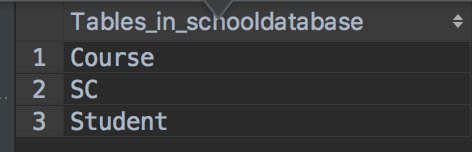
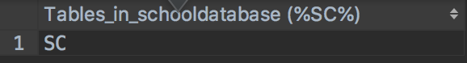
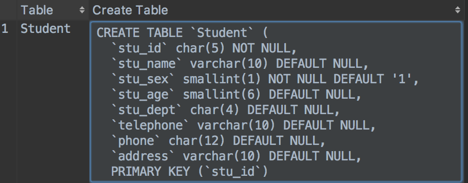
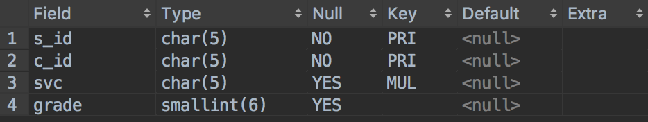

# 数据库表结构操作

[TOC]
## 数据表创建

#### 创建语句

```SQL
--模版
create table if not exists 数据库名称.表名(
    列名 数据类型 [完整性约束]，
    列名 数据类型 [完整性约束]，
    .
    .
    列名 数据类型 [完整性约束]
) character set 字符集 collate 校验规则;

--案例
create table SC
(
	s_id char(5) not null,
	c_id char(5) not null,
	grade smallint(6) null

) CHARACTER SET utf8 collate utf8_general_ci;

```

---
#### 查看数据表信息
```sql
--模版
show tables
show tables like '表名'
show create table 数据库名.表名 // 查看表的创建语句
describe 表名 或者 desc 数据库名.表名 //查看数据表中列信息

--案例
show tables;
show tables like 'Student';
show create table Student;
desc Student;
```
上面案例的运行结果：










>Null：表示该列是否可以存储 NULL 值。
Key：表示该列是否已编制索引。PRI 表示该列是表主键的一部分，UNI 表示该列是 UNIQUE 索引的一部分，MUL 表示在列中某个给定值允许出现多次。
Default：表示该列是否有默认值，如果有，值是多少。
Extra：表示可以获取的与给定列有关的附加信息，如 AUTO_INCREMENT 等。

---
#### 删除语句
```SQL
 --模版
drop table if exists 表名;
drop table if exists 表名1,表名2,表名3;
drop table if exists 表名 RESTRICT;// 限制删除，如果当前表中的主键是其它表的外键时，则删除失败。
 
 --案例
 drop table if exists SchoolDataBase.Student;
 drop table if exists SchoolDataBase.Student restrict;
```
>删除注意：
>1. 删除表需要有删除权限，删除后，用户在该表上的权限不会自动删除。
>2. 删除操作会删除表中的所有数据，并且无法恢复。
>3. 慎用删除操作，注意不要删除系统表，否则MySQL无法正常运行。

>删除表条件：
>
>1. 默认数据表删除都是限制删除，如果该表是其它表的主表(其它表参照该表建立外键)时，无法删除。

---
#### 修改语句

##### 添加列
```SQL
--模版
alter table 数据库名.表名 add column 列名 数据类型 [列级完整性约束] [first|after 已存在的列名]

--案例
alter table SchoolDataBase.SC add column strVarChar varchar(10) not null;
```


##### 修改列的数据类型和完整性约束
```SQL
--模版
alter table 数据库名.表名 modify column 列名 数据类型 [列级完整性约束] 

--案例
alter table SchoolDataBase.SC modify column strVarChar char(10) not null;
```

修改列属性注意事项：

1. 如果数据表有数据，那么<u>修改后的数据类型与修改前的不一致</u>，或者<u>修改后的数据长度缩小</u>,则修改失败。
2. <u>不设置列级完整性约束</u>或者<u>替换成其他完整性约束</u>，则表示删除或者修改列级完整性约束。


##### 修改列名称
```SQL
--模版
alter table 数据库名.表名 change 旧列名  新列名 数据类型 [列级完整性约束] 

--案例1-修改列名+数据类型
alter table SchoolDataBase.SC change test svc char(10) default '';

--案例1-修改列名
alter table SchoolDataBase.SC change test svc char(4) default '';

```
修改列属性注意事项：

1. 修改列名时，必须设置数据类型，就算只修改列名，也要设置一个相同的数据类型和长度。
2. change也可以实现数据类型和约束的修改，如果表中有数据，则修改时数据类型、数据长度、完整性约束要符合已存在的数据，否则修改失败。
3. 不设置完整性约束，则相当于删除当前列上所有的列级完整性约束。


##### 删除列
```SQL
--模版
alter table 数据库名.表名 drop column 列名

--案例
alter table SchoolDataBase.SC drop column test;

```
删除列注意事项：
1. 如果当前列存在外键约束，无法删除，需要先删除外键。


##### 添加表级完整性约束
```SQL
--模版
alter table 数据库名.表名 add PRIMARY KEY(属性名1，属性名2)
alter table 数据库名.表名 add constraint 约束别名 foreign key(属性名1) references 其他表(属性名1);

--案例
alter table SchoolDataBase.SC add PRIMARY KEY(s_id, c_id);
alter table SchoolDataBase.SC add constraint k_foreign_sid foreign key(s_id) references Student(stu_id);

```
添加表级完整性约束事项：
1. 添加外键约束时，要保证充当外键的那一列的数据为null，否则会出现外键中存在参照表主键没有的值，导致添加失败。

##### 删除表级完整性约束
```SQL
--模版
alter table 数据库名.表名 drop PRIMARY KEY;
alter table 数据库名.表名 drop foreign key(属性名1);

--案例
alter table SchoolDataBase.SC drop PRIMARY KEY;
alter table SchoolDataBase.SC drop foreign key k_foreign_sid;
```

#### 修改表名和修改表的字符集
```SQL
--模版
alter table 数据库名.表名 rename to 表的新名;
alter table 数据库名.表名  convert to character set 字符集 collate 校验规则;

--案例
alter table SchoolDataBase.SC rename to S_C;
alter table SchoolDataBase.S_C convert to character set utf8 collate utf8_general_ci;
```

----
#### 实例测试

```SQL
-- 创建学生表
create table SchoolDataBase.Student
(
	stu_id char(5) primary key,
	stu_name varchar(10) not null,
	stu_sex smallint(4) check(between 1 and 2) DEFAULT 1,
	stu_age smallint(6) null,
	stu_dept char(4) null,
);

-- 创建课程表
create table SchoolDataBase.Course
(
	c_id char(5) not null
		primary key,
	c_name varchar(10) null,
	c_pre_id char(5) null,
	c_credit smallint(6) null,
	constraint course_ibfk_1 foreign key (c_pre_id) references schooldatabase.Course (c_id)
);

-- 创建学生课程成绩表
create table SchoolDataBase.SC
(
	s_id char(5) not null,
	c_id char(5) not null,
	grade smallint(6) null

);
-- 添加列
alter table SchoolDataBase.SC add column test char(7) not null  AFTER c_id;
-- 修改列数据类型
alter table SchoolDataBase.SC MODIFY column test smallint not null;
-- 修改列的完整性约束
alter table SchoolDataBase.SC MODIFY column test smallint default 1;
-- 修改列名称
alter table SchoolDataBase.SC change test svc smallint default 1;
-- 使用change修改数据类型和完整性约束
alter table SchoolDataBase.SC change svc svc char(5);
-- 添加表级完整性约束
alter table SchoolDataBase.SC add constraint PRIMARY KEY(s_id, c_id);
alter table SchoolDataBase.SC add constraint k_foreign_sid foreign key(s_id) references Student(stu_id); #添加完整性约束需要清空数据表中的数据，以免造成数据不匹配导致外键添加失败
alter table SchoolDataBase.SC add constraint k_foreign_cid foreign key(c_id) references Course(c_id);
alter table SchoolDataBase.SC add constraint k_svc foreign key(svc) references Course(c_id);
-- 删除表级完整性约束
alter table SchoolDataBase.SC drop foreign key k_foreign_sid;
alter table SchoolDataBase.SC drop foreign key k_foreign_cid;
alter table SchoolDataBase.SC drop PRIMARY KEY;
-- 删除列
alter table SchoolDataBase.SC drop column svc;
-- 修改表名
alter table SchoolDataBase.SC rename to S_C;
-- 修改表的字符集，修改表的字符编码为utf-8，校验规则为忽略大小写
alter table SchoolDataBase.S_C convert to character set utf8 collate utf8_general_ci;

```
