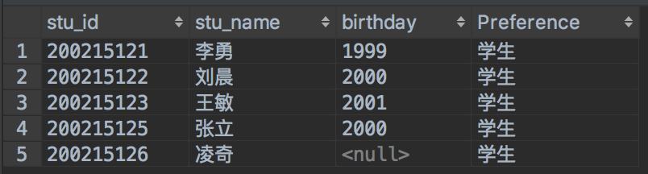
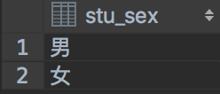
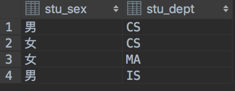
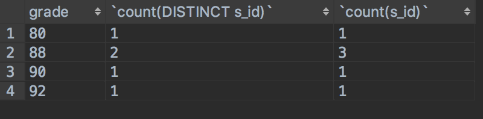

[toc]


## select语句结构

#### select语句结构展示

```sql
select [distinct] 目标列表达式 [as 列别名], [目标列表达式] 
from 表名1, [表名2] 
[where 条件表达式]
[group by 列名, [列名] [having 列名]]
[order by 列名];
```

#### 目标表达式
 目标表达式可以是<u>列名</u>、<u>常量</u>、<u>表达式</u>或者<u>函数</u>。
```sql
-- 学生表：学号、姓名、年龄、专业，查询结果在下面
select stu_id, stu_name, 2019-Student.stu_age as birthday, '学生' as Preference from Student;

-- 统计表中学生数
select count(1) from Student;

--通配符*
select * from Student;
```


>说明(上图为第一条语句查询结果)：
>1. 上面的例子展示了目标表达式5种形式，基本表的列名、表达式(2019-stu_age，表示学生的出生日期)、常量、聚集函数count以及通配符“\*”
>2. 通过使用常量可以给结果表增加一列基本表没有的列。
>3. 使用as给列去别名，用来在结果表中展示，<u>列的别名只是为了展示用的，不能用在where子句中，，否则会出现“ERROR 1054 (42S22): Unknown column”这样的错误提示信息</u>。

#### 结果集的去重操作
使用 <u>distinct</u> 关键字对查询出的结果集进行去重操作，删除列中重复数据。
```sql
-- 查看学生表中的性别列，并去重。
select DISTINCT stu_sex from Student;

-- 查看性别和专业两列，并去重
select DISTINCT stu_sex, stu_dept from Student;

-- 查询每个分数段的人数
select grade, count(DISTINCT s_id), count(s_id) from SC GROUP BY grade;
```
SQL语句1结果
SQL语句2结果 
 SQL语句3结果 


##### distinct的局限性
>1. 如果结果集只有一列，像上面第一条语句，则会删除重复元组正常使用，如果结果集至少两列时，distinct则会想复合主键一样，只有两列对应都不相同才算不同元组，也就是说添加distinct的结果列，会将结果列的所有列组成一个主键。
>2. distinct只能放在第一个目标表达式前面，或者放在聚集函数里面。
>3. 放在聚集函数中，则会对当前聚集函数生成的列进行去重。

#### 聚集函数
##### 5种聚集函数：
* count(统计元组数)
* sum(列值相加)
* avg(列值平均值)
* max(列值中最大)
* min(列值中最小)。

```sql

--所有聚集函数展示
select count(1), count(*), count(stu_id), count(stu_age), sum(stu_age), sum(DISTINCT stu_age), avg(stu_age), max(stu_age), min(stu_age) from Student;

-- 平均值的四舍五入和向下取整
select truncate(123.456,2), round(avg(stu_age), 1), avg(stu_age) from Student;
```
##### 聚集函数使用注意：
>1. count函数中填写数字和“\*”一个意思，都是获取行数。
>2. count(\*)和count(列名)区别在于前置会将列中的null值也统计进去，而后者会忽略null值，统计非null值。
>3. round进行四舍五入，正数表示保留小数几位，负数表示整数部分保留几位；truncate进行向下取整。

## 连接
连接前提：进行比较的属性必须具有可比性，字符串和整数就没有可比性。

#### 概念：
1. 等值连接与非等值连接：区别在于在连接条件中<u>使用等于号(=)运算符比较被连接列的列值</u>，否则是非等值连接。
2. 自然连接：在等值连接的基础上，进行比较的<u>两个属性必须是相同值域(或者说两个属性表述的是同一件事)</u>，<u>删除连接后重复的属性</u>，既连接用的两个属性只能保留一个，保留哪个都一样。
3. 外连接：返回的查询结果集合中，不仅包含符合连接条件的元组，还包含<u>其中一个表中匹配失败的元组</u>。
4. 内连接：<u>使用比较运算符</u>，筛选出符合连接条件的元组，其中使用" = "又叫做等值连接，使用其他比较运算符的叫非等值连接。


```sql

-- 等值连接，年龄和成绩连接，只要属性具有可比性，并且使用“=”比较。
select stu_id, stu_name, grade from Student join SC on stu_age=grade;

-- 自然连接，两个属性必须语义相同，都表示学号，并且去除重复列。
select stu_id, stu_name, grade from Student join SC on stu_id=s_id;

-- 左外连接，将左表中没有匹配元组添加到结果集中
select stu_id, stu_name, grade from Student left join SC on stu_age<grade;

-- 右外连接，将右表中没有匹配元组添加到结果集中
select Cource.c_id, c_name, grade from SC right join Cource on Cource.c_id=SC.c_id;

-- 内连接，使用比较运算符连接数据
select stu_id, stu_name, grade from Student join SC on stu_age<grade;
```


## where子句
#### 查询条件
>1. 比较运算符：<、>、>=、<=、=、!=
>2. 确定范围：between and、not between and
>3. 确定集合：in、not in
>4. 字符串匹配：like、not like
>5. 空值判断：is null、is not null
>6. 多重条件：and、or

```sql
-- 比较
select * from Student where stu_age>18;
-- 查询[18,20]岁的学生
select * from Student where stu_age between 18 and 20;
-- 查询CS和IS专业学生
select * from Student where stu_dept in ('CS', 'IS');
-- 查询专业名中有S的专业的所有学生
select * from Student where stu_dept like '%S';
select * from Student where stu_age>18 and stu_dept='CS';
```
#### 隐式连接查询
使用where子句中添加连接条件实现连接查询。
```sql
-- 连接查询所有选修课程3的学生。
select stu_id, stu_name, grade from Student, SC where stu_id=s_id and c_id='3';
```

#### 子句的执行顺序
如果有多个where查询条件时，数据库系统按照从右到左的顺序依次执行，因此根据情况来安排子句的摆放顺序，提高查询效率。
```sql
-- 先将SC中课程3筛选出来，然后与Student表进行连接，这样比先连接后筛选效率高。缩小连接的次数。
select stu_id, stu_name, grade from Student, SC where stu_id=s_id and c_id='3';
```

#### 嵌套查询
##### 不相关子查询
介绍：将一个查询结果作为另一个查询语句的查询条件，前置查询结果的得出不需要借助后者帮助。
```sql
-- 内层查询结果作为外层的查询条件，并且内层查询不需要外层提供帮助。 
select * from Student where stu_id in (select s_id from SC where c_id='3' and grade>84);
```
##### 相关子查询
介绍：与不相关子查询相反，内层查询需要借助外层帮助，换句话内层查询就像方程式一样，需要外层传递一个值，才能获得查询结果
```sql
-- 查询成绩在84以上的学生，内层查询结果需要外层传入stu_id。
select * from Student where stu_id in (select s_id from SC where stu_id=SC.s_id and grade>84);
```
>查询过程说明：
外层取出第一个元组，将stu_id传入到内层查询中，筛选出与stu_id相符并成绩大于84的学生保存到查询表中，然后再从外层取出第二个元组进行上面操作，知道取出所有外层元组。

>嵌套查询使用注意：
>1. 嵌套查询可以多层嵌套。
>2. 内层查询结果至多返回一列，多于一列则报错。

## order by
介绍：对查询出的结果集进行排序，一般用在最外层的查询语句中，不要用在内层查询中。
```sql
-- 根据年龄倒叙排列，年龄相同根据专业正序排列。
select * from Student ORDER BY stu_age DESC , stu_dept ASC;

-- 不要在内层查询中使用order by，无意义，并且有的数据库可能不支持这样写法。
select * from Student where stu_id in (select s_id from SC where grade > 80 ORDER BY s_id)ORDER BY stu_age;
```
## limit
介绍：对查询结果进行分页操作，提取部分数据。
```sql
-- 在查询结果中，获取从偏移量为2开始，长度为2的数据。
select * from Student limit 2,2;
```
>说明：数据的偏移量从0开始计算，既第一条数据下标为0。

## group by与having
#### 介绍：
>group by是用来对结果集进行分组的，细化聚集函数的使用场景，不用group by，聚集函数统计的是整个结果集，使用则是统计每个组的数据。

```sql
-- 统计除MA专业外，其他各个专业的学生数。
select stu_dept, count(1) from Student GROUP BY stu_dept HAVING stu_dept !='MA'; 

-- 将多个属性组成属性组，然后进行分组，就像复合主键一样。
select stu_dept, stu_sex, sum(1) from Student GROUP BY stu_dept, stu_sex HAVING stu_dept !='MA' and stu_sex='男';

-- 统计专业人数>1的元组。having子句中可以使用聚集函数。
select stu_dept, count(1) from Student GROUP BY stu_dept HAVING count(stu_dept) >1;

-- where子句和group by一起使用。
select stu_age, count(stu_id), count(stu_age) from Student where stu_sex='男' group by stu_age;
```

#### having子句与where子句区别
1. where子句作用于整个表，而having子句只所用于每个组。
2. where子句不能使用聚集函数，而having可以使用。

## 数据的交集、并集和差集
介绍：对多个表的数据进行集合操作。
使用条件：进行集合操作的两个表必须列数相同，并且对应的列数据类型一致，数据长度可以不同。
```sql
-- s_id为char(10)，c_id为char(1)，列数和相应列数据类型一致
select s_id from SC UNION SELECT  c_id from SC;
```

## 连接和相关子查询的联系和区别