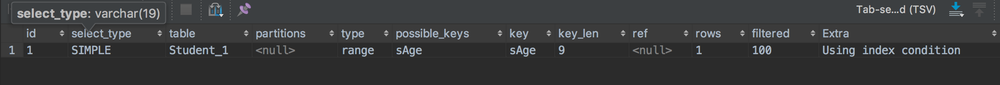

# 索引介绍
## 为什么使用索引


数据库的查询是通过遍历数据表的所有数据，筛选出需要的数据， 当数据表的数据过大时，这样的查询方式会消耗大量时间，因此需要对数据建立一种快速定位的技术，这就有了索引。就像汉语词典中的目录功能，加快我们查询字的时间。


## 索引的优缺点

>优点：
>1. 加快定位数据的速度，快速查询到想要的数据。
>2. 支持任何数据类型添加索引，整数、小数、字符串、时间、文本。

>缺点：
>1. 增加了索引维护成本，对表进行增删改时，也需要修改相应的索引。
>2. 索引的建立也需要占用存储空间。

# 索引的使用
## 索引类型

索引按关联的列分为：单列索引和组合索引

索引按约束分为：普通索引、唯一索引、主键索引、全文索引和空间索引

> 单列索引：一个索引只包含一个列。
>
> 组合索引：一个索引包含多个列，例如复合主键表中，建立的主键索引就是组合索引。
>
> 唯一索引：建立索引的列的数据必须时唯一的，可以为空，但只能有一个为空。
>
> 主键索引：数据库默认会在表的主键上建立索引，声明表的主键时自动建立索引。
>
> 全文索引：使用在text或者blob这类数据类型上，进行加快text或者blob类型数据的查询。

## 索引创建、修改、删除和查询方式

```sql
-- 创建表时添加索引
create table if not exists Student_1(
  	stu_id char(5),
	stu_name varchar(10) not null,
	stu_sex smallint(4)  DEFAULT 1,
	stu_age smallint(6) null,
	stu_dept char(4) null,
  stu_addr char(20), -- 学生地址
  stu_desc text, -- 学生简介
  
  primary key(stu_id),  -- 主键索引
  unique index sName(stu_name(10)), -- 唯一索引
  index sAddr(stu_addr(20)), -- 普通索引
  fulltext index description(stu_desc) -- 全文索引
) character set utf8 collate utf8_general_ci;

create table if not exists SC_1(
  	s_id char(5) not null,
	c_id char(5) not null,
	grade smallint(6) null,
  index s_c(s_id,c_id)  -- 组合索引
) character set utf8 collate utf8_general_ci;

-- 使用create 创建索引
create index sAddr on SchoolDataBase.Student_1(stu_addr(8)) -- 基本索引;
create unique index sName on SchoolDataBase.Student_1(stu_name(8));-- 唯一索引
create fulltext index description on SchoolDataBase.Student_1(stu_desc) ;-- 全文索引
create index s_c on SchoolDataBase.SC_1(s_id, c_id);-- 组合索引

-- 使用alter创建索引
alter table SchoolDataBase.Student_1 add index sAddr(stu_addr(8)); -- 基本索引;
alter table SchoolDataBase.Student_1 add unique index sName(stu_name(8));-- 唯一索引
alter table SchoolDataBase.Student_1 add fulltext index description(stu_desc(8));-- 全文索引
alter table SchoolDataBase.SC_1 add index s_c(s_id, c_id);-- 组合索引
```

```mysql
# 模版
alter table 数据库名.数据表名 drop index 索引名;
drop index 索引名 on 数据库名.数据表名;


-- 使用alter删除索引
alter table SchoolDataBase.Student_1 drop index sAddr; -- 基本索引;
alter table SchoolDataBase.Student_1 drop unique index sName;-- 唯一索引
alter table SchoolDataBase.Student_1 drop fulltext index description;-- 全文索引
alter table SchoolDataBase.SC_1 drop index s_c;-- 组合索引

-- 使用drop删除索引
drop index sAddr on SchoolDataBase.Student_1;
drop unique index sName on SchoolDataBase.Student_1;
drop fulltext index description on SchoolDataBase.Student_1;
drop index s_c on SchoolDataBase.SC_1;

```

```mysql
# 模版
show index from 数据库名.数据表名

-- 查询表中所有索引，方式1
show index from SchoolDataBase.Student_1;

-- 查询表中所有索引，方式2
show keys from SchoolDataBase.Student_2;
```


> 索引查询结果说明：
>
> 1. table：索引所在的表
> 2. non_unique：索引是否限制列值唯一，主键索引和唯一索引为0。
> 3. key_name：索引名称
> 4. Column_name：建立索引的列的列名。
> 5. index_type：索引类型。
> 6. Seq_in_index：用在组合索引中，每个列在组合索引中的位置，例如SC_1中的组合索引，s_id位置为1，c_id位置为2.


## 查看执行select时命中的索引


查看查询语句是否命中索引的方式是在select语句前加上“ explain ”单词。

```sql
explain select * from Student_1 where stu_age<1;
```



> 字段解释：
>
> select_type(select语句查询类型)：SIMPLE(简单查询)，SUBQUERY(子查询)，UNION RESULT(联合查询)
>
> Type(查询时表的遍历方式)：
>
> 1. all，将整个表遍历一遍，没有使用到索引。
> 2. index
> 3. Range：对索引列进行范围遍历
> 4. ref：根据索引查找一个或者多个值。explain select * from Student_1 where stu_age=4;
> 5. EQ_REF：连接时使用primary key 或 unique类型，select * from student_1 left join s_c on stu_id = s_id;
> 6. Const：表最多有一个匹配行,因为仅有一行,在这行的列值可被优化器剩余部分认为是常数,const表很快,因为它们只读取一次。
>
> ppssible_key： 可能使用的索引
>
> key：实际使用的索引
>
>  rows：估计查询到多少行数据


## 索引命中规则


```mysql
# 实验环境解释
-- 学生表1，其中建立了不同数据类型的索引
create table if not exists Student_1(
  stu_id char(5),
	stu_name1 varchar(5),
  stu_name2 varchar(5),
	stu_age double null,
  stu_birth TIMESTAMP,
  stu_addr text,
  stu_sex TINYINT,
  primary key(stu_id),
  index sName1(stu_name1(5)),
  index sName2(stu_name2(2)),
  index sAge(stu_age),
  index sBirth(stu_birth),
  fulltext index sAddr(stu_addr)
) character set utf8 collate utf8_general_ci;

-- 学生表2，其中建立了组合索引
create table if not exists SchoolDataBase.Student_2(
  stu_id char(5),
	stu_name1 varchar(5),
  stu_name2 varchar(5),
	stu_age double null,
  stu_birth TIMESTAMP,
  stu_addr text,
  stu_sex TINYINT,
  primary key(stu_id),
  index n1_n2_age(stu_name1,stu_name2, stu_age, stu_birth, stu_sex)
) character set utf8 collate utf8_general_ci;

# 数据
insert into SchoolDataBase.Student_1 value('1','李勇','李勇', 12,'1991-04-01 12:13:22','北京市通州区临河里花季纤细史蒂夫史蒂夫我看见恶化发史蒂夫史蒂夫',1);
insert into SchoolDataBase.Student_1 value('2','网站啊', '网站啊', 9,'2001-05-01 11:13:22','潍坊市通州区临河里花季纤细史蒂夫史蒂夫我看见恶化发史蒂夫史蒂夫',2);
insert into SchoolDataBase.Student_1 value('3','消息风','消息风', 51,'2012-04-023 10:13:22','天峨县通州区临河里花筛选出人史蒂夫史蒂夫',1);
insert into SchoolDataBase.Student_1 value('4','大傻瓜天', '大傻瓜天', 36,'1999-08-01 07:13:22','北京市通州区临河里新东风风行地方史蒂夫',2);
insert into SchoolDataBase.Student_1 value('5','嘻嘻哈哈', '嘻嘻哈哈', 27,'1980-12-01 06:13:22','北京市通州区临河里花季纤细史蒂呈现出如果如果人生蒂夫',2);
insert into SchoolDataBase.Student_1 value('6','网名', '网名', 43,'2005-11-3 12:13:22','北京市通州区临河里花季纤细史蒂夫史蒂夫下次人人相处现场风格',2);
insert into SchoolDataBase.Student_1 value('7','玲玲吧', '玲玲吧', 77,'2019-03-01 12:13:22','北京市通州区临河里花季纤细史蒂夫史蒂你牛逼牛逼牛逼',1);
insert into SchoolDataBase.Student_1 value('8','明明呵呵时', '明明呵呵时', 69,'2020-04-01 12:13:22','北京市通州区临河里花季纤细121东方的飞飞飞蒂夫',1);
insert into SchoolDataBase.Student_1 value('9','明明呵12', '明明呵12', 44,'2020-09-01 12:13:22','北京市通州区临河里花季纤细121东方的飞飞飞蒂夫',1);

insert into SchoolDataBase.Student_2 value('1','李勇','李勇', 12,'1991-04-01 12:13:22','北京市通州区临河里花季纤细史蒂夫史蒂夫我看见恶化发史蒂夫史蒂夫',1);
insert into SchoolDataBase.Student_2 value('2','网站啊', '网站啊', 9,'2001-05-01 11:13:22','潍坊市通州区临河里花季纤细史蒂夫史蒂夫我看见恶化发史蒂夫史蒂夫',2);
insert into SchoolDataBase.Student_2 value('3','消息风','消息风', 51,'2012-04-023 10:13:22','天峨县通州区临河里花筛选出人史蒂夫史蒂夫',1);
insert into SchoolDataBase.Student_2 value('4','大傻瓜天', '大傻瓜天', 36,'1999-08-01 07:13:22','北京市通州区临河里新东风风行地方史蒂夫',2);
insert into SchoolDataBase.Student_2 value('5','嘻嘻哈哈', '嘻嘻哈哈', 27,'1980-12-01 06:13:22','北京市通州区临河里花季纤细史蒂呈现出如果如果人生蒂夫',2);
insert into SchoolDataBase.Student_2 value('6','网名', '网名', 43,'2005-11-3 12:13:22','北京市通州区临河里花季纤细史蒂夫史蒂夫下次人人相处现场风格',2);
insert into SchoolDataBase.Student_2 value('7','玲玲吧', '玲玲吧', 77,'2019-03-01 12:13:22','北京市通州区临河里花季纤细史蒂夫史蒂你牛逼牛逼牛逼',1);
insert into SchoolDataBase.Student_2 value('8','明明呵呵时', '明明呵呵时', 69,'2020-04-01 12:13:22','北京市通州区临河里花季纤细121东方的飞飞飞蒂夫',1);
insert into SchoolDataBase.Student_2 value('9','明明呵12', '明明呵12', 44,'2020-09-01 12:13:22','北京市通州区临河里花季纤细121东方的飞飞飞蒂夫',1);


# 规则
-- 不使用where子句的不会使用索引
explain select * from Student_1;

-- 在使用=运算符时，查询条件类型不匹配不使用索引，stu_id为整型，判断条件为小数，无法使用stu_id列上的索引。
explain select * from Student where stu_age=3.4; -- 使用了Student表，其中stu_age为smallInt类型

-- like '%xxx' 无法使用索引；'xxx%'这样就行
explain select * from Student_1 where stu_name1 like '%时';
explain select * from Student_1 where stu_name1 like '明明%';

-- 使用or时，如果有一列没有建立索引，则不会使用任何索引
explain select * from Student_1 where stu_name1 = '明明呵呵时' or stu_sex = 1;

-- 组合索引，遵循最左原则，想使用该索引，where子句中必须包含索引中第一列条件，即stu_name1的条件
explain select * from SchoolDataBase.Student_2 where stu_name1 = '网站啊' and stu_name2 = '网站啊';
explain select * from SchoolDataBase.Student_2 where stu_name1 = '网站啊' and stu_age > 0;
explain select * from SchoolDataBase.Student_2 where stu_name2 = '网站啊' and stu_age > 0;


```


### 索引长度

上面创建索引时，列名后面跟着一个数字，表示索引截取列值的有效长度。

例如：建立一个学生姓名的索引，设置两个索引长度分别为2个汉字和4个汉字。

| 学生姓名   |
| ---------- |
| 明明呵呵时 |
| 明明呵12   |

```mysql
# stu_name1的索引长度为5，stu_name2的索引长度为2;
-- 索引出来的数据只有一条
explain select * from student_1 where stu_name1 = '明明呵呵时';

-- 索引出来的数据为两条，因为索引长度为2，两个学生前缀都是“明明”。
explain select * from student_1 where stu_name2 = '明明呵呵时';
```

总结：索引会根据长度来截取列值，并当成一个区分其他索引值的key，当索引长度越小时，列值生成的索引key的重复率越高，查询出来的误差越大。


## 全文索引

使用全文索引条件：

1. 存储引擎必须使用MyISAM引擎。
2. 只能在CHAR,VARCHAR,TEXT上设置全文索引，并且搜索时最少4个字符。
3. 停止字中的词会被忽略，该词语没有语义或者出现次数非常多，例如英文的the、或者中文“ 的、我、是”等等。


#  索引使用场景


1. 列值重复率高时，不要使用索引，例如性别列。
2. 索引长度要适中，不易过大或者过小，过小则数据的索引值重复率高，数据的区分度低，索引效果差，过大则索引值重复率低，区分度高，索引效果好，相应的索引表更大，增删改慢。


