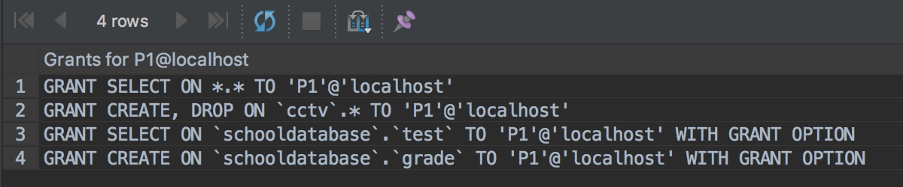
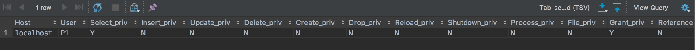
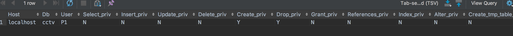
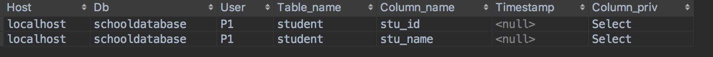

[TOC]

# 创建、删除与查询用户
mysql中创建的用户名就是连接数据库的账号名。

```SQL
# 模版
-- 创建用户
create user '用户名'@'IP地址' identified by '密码';
-- 删除用户
drop user '用户名'@'IP地址';

# 案例
-- 创建本地连接用户
create user zp3sss@'localhost' identified by '123456'; 
-- 创建远程连接的用户，该用户必须用前三位是192.168.1的IP地址才能连接成功。
create user zp3sss@'192.168.1.%' identified by '123456';  
-- 创建远程连接用户，任意IP可以连接成功
create user zp3sss@'%' identified by '123456'; 

-- 删除本地用户
drop user zp3sss@'localhost';
-- 删除远程用户
drop user zp3sss@'192.168.1.%';
drop user zp3sss@'%';

-- 查询Mysql中创建了多少用户
select user,host from mysql.user;
```

>创建的用户账号是绑定在具体的IP段上，为了最大程度保证合法用户连接数据库，限制非法IP盗取账号和密码连接数据库，因此将连接IP分为四种：
>
>1. localhost：该账号只能在数据库所在的计算机上连接，使用其他电脑无法远程连接。
>2. 192.168.1.100：该账号只能使用IP为192.168.1.100的电脑连接。
>3. 192.168.1.%：该账号需要使用前三位为192.168.1的IP段的电脑才能连接。
>4. %：该账号可以使用任意电脑连接。

# 权限
## 权限级别说明
数据库分为四种权限级别：
+ 全局性管理权限：管理员权限，拥有最高级别权限，可以对任何数据库做任何操作：
    - 创建数据库，并拥有该数据库所有操作权限。
    - 创建用户。

+ 数据库级别权限：针对具体数据库的权限，拥有操作该数据库的权限：
    - 创建、删除、修改数据库，
    - 创建、删除、修改表结构(属性数据类型、完整性约束)，
    - 创建、修改、查看索引、触发器、存储过程、视图，
    - 插入、删除、修改、查询数据

+ 数据表级别权限：针对具体数据库中的具体表的权限，拥有操作该数据表的权限：
    - 创建、删除、修改表结构
    - 创建、修改、查看索引、触发器， 
    - 插入、删除、修改、查询数据

+ 列级别权限：针对具体数据库中具体表的部分列的权限，拥有操作这些列的权限：
    - 向表中插入数据，不过只能插入有操作权限列的数据，如果没有操作权限的列存在非空约束，则插入失败。
    - 查询有操作权限列数据。
    - 修改有操作权限列的数据。

>不同的权限级别的create、alter、drop含义不同：
>1. 表级别的create、alter、drop针对表的创建、删除和修改。
>2. 数据库级别的create、alter、drop针对数据库或者该数据库下表的创建、删除和修改。
>3. 全局管理级别的create、alter、drop针对所有数据库或者所有数据库下表的创建、删除和修改。


## 权限指令

+ 列级权限：
    - insert、update、select
+ 表级权限：
    - 具体表中数据操作权限：insert、update、select、delete
    - 具体表的表结构操作：reference、create、drop、alter
    - 具体表上的关系模式操作：create View、show View、create Index、create trigger

+ 数据库级权限：
    - 某数据库的任意表表中数据操作权限：insert、update、select、delete
    - 某数据库的任意表的表结构操作：reference、create、drop、alter
    - 某数据库的任意表表上的关系模式操作：create View、show View、create Index、create trigger
    - 某数据库创建临时表操作：create temporary table
    - 对当前数据库的操作：create、drop、alter 


+ 全局性管理权限：
    - 拥有任意数据库的所有操作权限。
    - 拥有授权给其他用户操作数据库的权限。
    - 拥有创建用户权限。


## 授权操作
### 授权语句
```sql
# 模版
grant 权限指令 on 数据库名.数据表 to '用户名'@'IP地址' [with grant option];

# 案例
-- 授予用户P1本地查询Student表的stu_id和stu_name两列的权限并且授予的权限可以再授予他人
grant select(stu_id, stu_name) on SchoolDataBase.Student to 'P1'@'localhost' with grant option;

-- 授予P1用户增删改查Student表中数据的权限并且授予的权限可以再授予他人。
grant select,insert,update,delete on SchoolDataBase.Student to 'P1'@'localhost' with grant option;
```
>with grant option说明：该字段表示该用户拥有将权限授予的他人的权利。  
> 举例：房东给了我居住他房子的权限，但是你不能转租给其他人，使用with grant option后，房东不仅给了我居住房子的权限，并且允许我将居住权限赠予他人，实现我和我朋友一起居住该房子的权限。

### 设置权限级别
>四种权限作用域：
>1. 列级权限：select(列名) SchoolDataBase.Student
>2. 表级权限：SchoolDataBase.Student
>3. 数据库级权限：SchoolDataBase.*
>4. 全局管理权限：\*.\*<br/>
>
>通过设置权限命令和作用域来划定用户在哪个区域拥有哪个权限，如果想要在某个区域拥有所有权限，则使用all或者all privileges。


#### 列级权限

列级insert权限命令：如果未被授权的列是非空约束时，插入失败，例如下面stu_age是not null约束时，用户P1插入数据会失败。
```sql
-- 查询部分列权限
grant select(stu_id, stu_name) on SchoolDataBase.Student to 'P1'@'localhost' with grant option;

-- 插入部分列值权限
grant insert(stu_id, stu_name, stu_sex) on SchoolDataBase.Student to 'P1'@'localhost' with grant option;

-- 修改部分列值的权限
grant update(stu_age, stu_dept) on SchoolDataBase.Student to 'P1'@'localhost' with grant option;
```


#### 表级权限
表级权限是作用于某个具体表上的，只能对该表进行相应操作。
##### 对具体表数据进行增删改查
授权给本地连接的用户P1可以对Student表中的数据进行增删改查操作。
```sql
-- 对表中数据进行增删改查
grant select,insert,update,delete on SchoolDataBase.Student to 'P1'@'localhost' with grant option;
```

##### 对具体表结构进行创建、删除和修改
授权给本地连接的用户P1可以对Student表的结构进行创建、删除和修改，例如创建删除表、修改属性名、属性类型和完整性约束。
```sql
-- 创建、删除、修改表的权限
grant create, drop, alter on SchoolDataBase.Test1 to 'P3'@'%' with grant option;
```
##### 创建具体表的外键约束
创建外键时，涉及到多表，因此需要满足两个条件：
1. 对从表(创建外键的表)有alter权限。
2. 对主表有建立外键约束的权限。

```sql
# 创建外键权限，给SC表添加外键
-- 授权P3用户创建外键时可以使用的主表Student
grant references on  SchoolDataBase.Student to 'P3'@'%' with grant option;

-- 授权P3用户创建外键时可以使用的主表Cource
grant references on  SchoolDataBase.Cource to 'P3'@'%' with grant option;

-- 授权P3用户可以修改SC表
grant alter on  SchoolDataBase.SC to 'P1'@'localhost' with grant option;
```


##### 创建索引
##### 创建触发器

#### 数据库级权限
针对具体数据库的操作权限的操作，当授权用户数据库级别权限时，相当于对数据库中的每个表授予的该操作权限。

例如，将对SchoolDataBase数据库进行select的权限授予用户时，该用户可以对数据库中的每个表进行查询操作。
```sql
grant select on SchoolDataBase.* to 'P1'@'localhost';

-- 用户可以查询SchoolDataBase数据库下所有表和视图，Student、Cource和SC
select * from SC;
```

##### 创建视图
由于视图是基于1张或者n张基本表，因此创建视图需要满足两个条件：
1. 视图定义中的select语句涉及到的表具有查询权限。
2. 在该数据库下创建视图的权限。

基于单表视图，Student表的视图
```SQL
# 视图权限授予 
-- 允许在SchoolDataBase数据库下创视图
grant create view on SchoolDataBase.* to 'P1'@'localhost' with grant option;

-- 授予创建视图时的select语句涉及到访问Student表部分属性的权限。
grant select(stu_id, stu_name) on SchoolDataBase.Student to 'P1'@'localhost' with grant option;

-- 对当前视图的查询和视图定义的查询权限grant show view,select on SchoolDataBase.studentgrade to 'P1'@'localhost' with grant option;

-- 对当前视图的删除权限，有了drop权限后，创建视图可以使用“ or replace ” ，毕竟该字段的意思就是如果视图已存在则删除并替换。
grant drop on SchoolDataBase.studentgrade to 'P1'@'localhost' with grant option;

# P1用户创建视图
-- 创建基于Student的视图
create or replace View StudentGrade as select stu_id, stu_name from Student;

-- 查询视图
select * from SchoolDataBase.StudentGrade;

-- 查询视图定义语句
show CREATE VIEW StudentGrade;
```

基于多表的视图
```sql
# 视图权限授予
-- 允许在SchoolDataBase数据库下创视图
grant create view on SchoolDataBase.* to 'P1'@'localhost' with grant option;

-- 授予创建视图时的select语句涉及到访问Student表部分属性的权限。
grant select(stu_id, stu_name, stu_dept) on SchoolDataBase.Student to 'P1'@'localhost' with grant option;

-- 授予创建视图时的select语句涉及到访问SC表部分属性的权限。
grant select(s_id, c_id, grade) on SchoolDataBase.SC to 'P1'@'localhost' with grant option;

-- 对当前视图的查询和视图定义的查询权限
grant show view,select on SchoolDataBase.studentgrade1 to 'P1'@'localhost' with grant option;

-- 对当前视图的删除权限，有了drop权限后，创建视图可以使用“ or replace ” ，毕竟该字段的意思就是如果视图已存在则删除并替换。
grant drop on SchoolDataBase.studentgrade1 to 'P1'@'localhost' with grant option;

# P1用户创建视图
-- 创建基于Student与SC表的视图
create or replace View StudentGrade1 as select stu_id, stu_name, c_id, grade, stu_dept from Student, SC  where Student.stu_id=SC.s_id;

-- 查询视图中的数据
select * from SchoolDataBase.StudentGrade;

-- 查询视图结构
show CREATE VIEW StudentGrade;
```

##### 授予用户某个数据库所有权限
```sql
grant all privileges on SchoolDataBase to 'P1'@'localhost';
```
#### 全局管理权限
数据库的管理员，是所有用户中权限最高的，拥有对任何数据库进行任何操作的权限。
```sql
-- 用户P1拥有全局的查询权限，即可以查询任何数据库的任意表
grant select on *.* to 'P1'@'localhost';

-- 用户P1拥有全局的创建和删除权限，即可以创建和删除任何数据库或者任何数据表。
grant create, drop on *.* to 'P1'@'localhost';

-- 
grant all privileges on *.* to 'P1'@'localhost';
```


#### 权限配合
从上面的创建视图或者添加外键的授权我们可以看出，想要完成某个操作有时需要多个权限配合才能完成。

例如：给SC表添加外键时，我们需要：
1. Student和Cource表的references权限。
2. SC表的alter权限

因此我们在授权给别人操作权限时，应该考虑的方面：
1. 操作涉及到哪些表。
2. 需要这些表做什么操作。
3. 考虑分配的权限级别，保证权限分配的最小化，不会出现分配不符合身份的权限。

### 撤销操作
```sql
# 模版
revoke 权限命令 on 数据库名.表名 from '用户名'@'IP地址';

# 案例
-- 取消P1@localhost用户对student表的select、insert、delete权限。
revoke select, insert, delete on SchoolDataBase.Student to 'P1'@'localhost';
```
### 权限查询
#### 权限验证过程
为了数据库中数据的安全，每次用户发送给DBMS的指令都需要进行权限验证，保证用户的数据的操作是合法的。<br/>

>连接验证过程：
1. 在建立连接时，DBMS查询user表，是否有该用户记录。
2. 查看该用户连接的IP地址是否符合user表中创建时设置的要求。
3. 查看密码是否正确。

>权限验证过程：
>1. 检测SQL语句中涉及到了对哪些数据库和表的操作权限。
>2. 验证该用户是否全部拥有这些权限，如果没有全部拥有，则报错并告诉用户权限不够，否则返回操作结果。

#### 保存权限的数据表
MySQL使用user、db、table_priv、column_priv这四张表来保存用户权限，并通过这四张表来验证用户权限。
>四张权限表介绍：
>1. user表，保存用户的全局管理级别权限。
>2. db表，保存用户的数据库级别的权限。
>3. table_priv表，保存用户的表级别的权限。
>4. column_priv表，保存用户的列级别的权限。

举例：使用show命令查看用户P1的所有权限。
```sql
grant select on *.* to 'P1'@'localhost' with grant option;
grant create, drop on CCTV.* to 'P1'@'localhost' with grant option;
grant create on SchoolDataBase.grade to 'P1'@'localhost' with grant option;
grant select(stu_id, stu_name) on SchoolDataBase.Student to 'P1'@'localhost' with grant option;
grant select on SchoolDataBase.test to 'P1'@'localhost' with grant option;
```
> 上面授权语句执行后，用户P1当前所有权限

>P1在user表中的权限

>P1在db表中的权限

>P1在table_priv表中的权限

>P1在column_priv表中的权限



#### 查询用户权限
```sql
-- 查询user表，获取用户P1的全局管理级别权限有哪些。
select * from mysql.user where user='P1' and host='localhost';

-- 查询db表，获取用户P1的数据库级别权限有哪些。
select * from mysql.db where user='P1' and host='localhost';

-- 查询table_priv表，获取用户P1的表级别权限有哪些。
select * from mysql.tables_priv where user='P1' and host='localhost';

-- 查询表，获取用户P1的列级别权限有哪些。
select * from mysql.columns_priv where user='P1' and host='localhost';

-- 查询用户P1所拥有的权限
show grants for 'P1'@'localhost';
```

## 角色
MySQL中没有角色一说，用户与权限是直接绑定的，而在其他一些数据库中例如Oracle或者SQLServer中都有角色概念，将用户和权限分离，将权限绑定在角色身上，然后再将角色赋予到用户上。

>直接绑定在用户上的缺陷：
>将权限绑定到用户上时，我们需要管理每个用户的权限，并且还要控制用户对权限的传播。<br/>
>进入角色概念好处：
>1. 用户与权限的绑定与解绑直接通过添加或者删除角色就可以，非常方便，不需要像以前一样一个个添加或者删除权限。
>2. 新增权限时，直接对角色添加，这样角色关联的用户全部有该权限。

