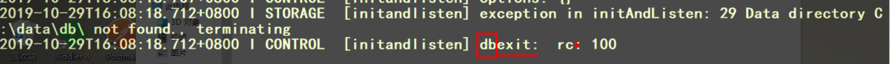
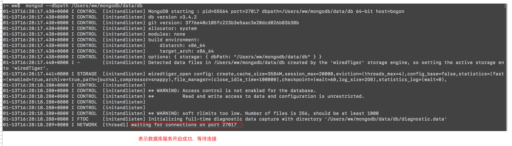
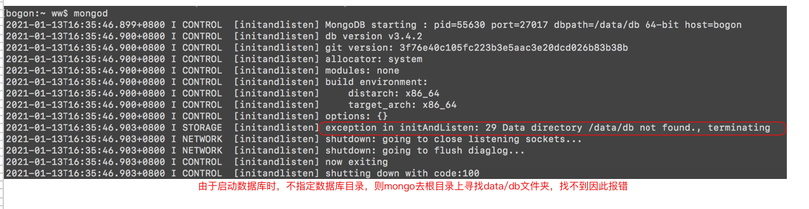
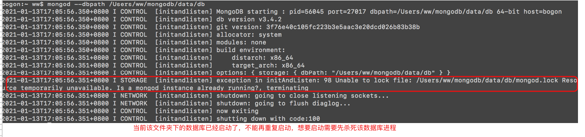
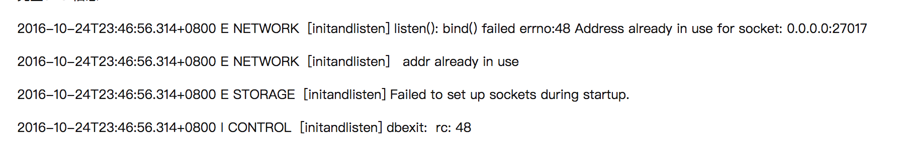
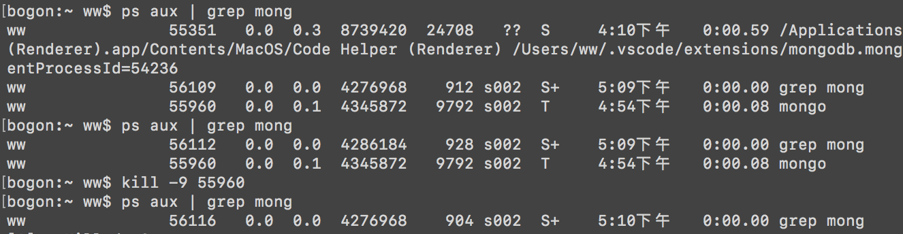

## mongoDB安装步骤

> 安装步骤：
>
> 1. 在官网下载mongoDB(社区版免费)，https://www.mongodb.com/try/download/community
>
> 2. 解压安装包
>
> 3. 配置环境变量，执行`open ~/.bash_profile`命令，配置mongoDB路径。
>
>    
>
> 4. 选择一个电脑的一个位置，创建data文件夹，在data文件夹中创建db文件夹，关系为`./data/db`，用来存放数据库文件。
>
> 5. 执行` mongod --dbpath /Users/ww/mongodb/data/db`命令，打开mongoDB数据库服务，并指定数据库路径。
>
> 注意：
>
> 1. 启动`mongod`命令，为启动数据库服务，如果后面不加--dbpath，那么会去磁盘根目录上查找是否存在着`data/db`目录，没有直接报错，由于不想在根目录有数据库文件，因此启动数据库时指定数据库路径。



### 配置文件

> mongo配置文件(mongod.conf)：
>
> ```ini
> # 日志
> systemLog:
> # 日志为文件
>   destination: file
> # 文件位置
>   path: /usr/local/var/log/mongodb/mongo.log
> # 是否追加
>   logAppend: true
> #进程
> processManagement:
> # 守护进程方式
>   fork: true
> storage:
>   dbPath: /usr/local/var/mongodb
> net:
> # 绑定IP，默认127.0.0.1，只能本机访问
>   bindIp: 127.0.0.1
> # 端口
>   port: 27017
> ```
>
> 根据配置文件设置的信息打开mongo数据库服务。
>
> `mongod --config /Users/ww/mongodb/etc/mongod.conf`


## mongo数据去启动错误

>  直接执行`mongod`命令，由于根目录没有`/data/db`路径，因此报错。
>
> 
>
> 
>
>  当前该文件夹下的数据库已经启动，不能再重复启动了。
>
> 
>
>   
>
> 启动数据库时失败，当前端口号已经被其它程序占用。
>
> 


# 杀死开启的数据库进程

> 1. `执行ps aux | grep xxxx`命令，寻找xxxx对应的进程号，例如`ps aux | grep mong`，寻找mong开头的进程的进程号。
>
>    
>
> 2. 执行`kill -9 xxxx`命令，杀死该进程号的进程，例如`kill -9 55960`。


