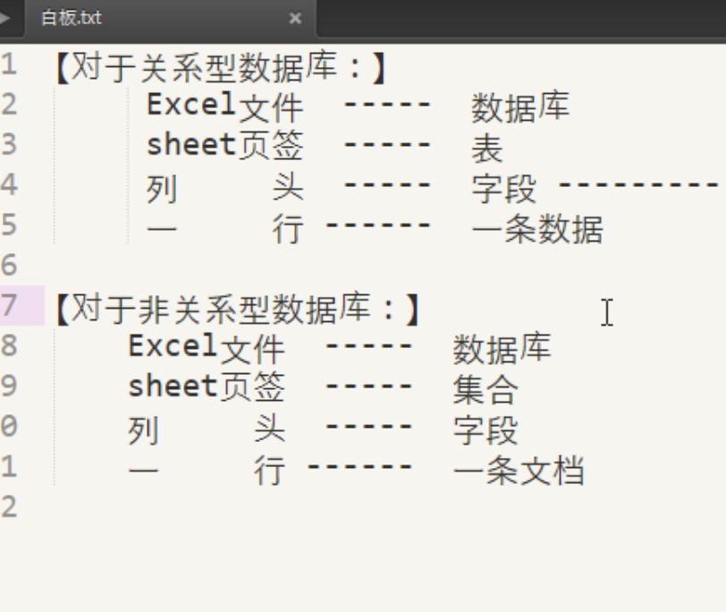
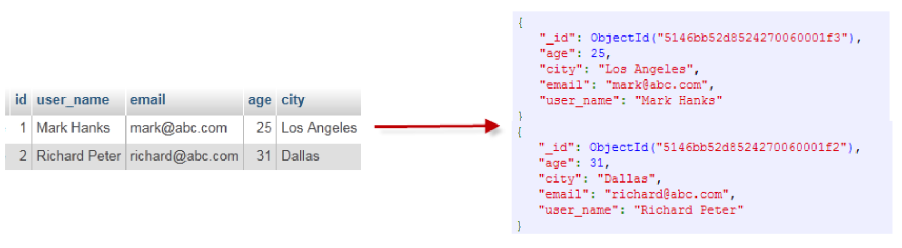
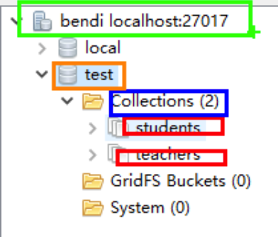

数据库的几个意思：

1. 连接数据库，是连接到了数据库管理软件，不是其中保存数据的数据库，一定要分清楚。
2. 操作数据库，是对数据库管理软件所管理的数据仓库进行增删改查。

举例：一个up主，在B站上传了许多种类多视频，他将这些视频进行分类，新建了游戏、电影、解说和其它四个文件夹，将视频分类放在这些文件夹中，此时up主使用浏览器打开B站输入账号密码登录(这就是连接上数据库管理软件)，进入到自己的主页，有四个文件夹(这就相当于数据库)，分别对文件夹的文件进行增删改查操作(这就相当于操作数据库)。

橙色框：数据库

红色框：集合 --相当于表