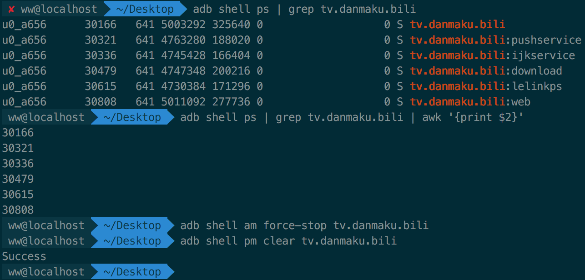

# adb常用命令

```javascript
// 查看与电脑相连的所有设备
adb devices 

// -s表示指定某个设备执行adb命令
adb -s 设备号 其他指令 // 例如 adb -s 77f72fff install xxx.apk，将xxx包安装到77f72fff设备中。		
```


## 安装卸载apk

> `adb install xxx.apk`：使用adb命令给andriod安装应用程序。
>
> 当电脑连接了多个手机时，使用`adb devices`显示多个设备，如果想要安装到指定设备时，需要使用
>
> `adb -s 7ff0011f33 install xxx.apk`

```javascript
// 使用adb命令给andriod安装应用程序
adb install app包的地址
-r：允许覆盖安装，即如果手机已经存在该app时，覆盖安装。
-d：允许降级安装，即如果之前已经安装高版本，在安装低版本时会报`[INSTALL_FAILED_VERSION_DOWNGRADE]`错误。
-t：允许测试包
-g: 安装包时，授予所有运行时权限，`在android 6.0以上直接允许所有权限，不用弹框`

adb install -r xxx.ap
adb install -r -d xxx.apk // 安装xxx包，如果降版本的覆盖安装。
```

```javascript
adb uninstall bundleID
-k：keep user data and cache directories // 卸载app时保留app一些数据
```

## adb 文件传输

> `adb push`：将文件传输到手机中。
>
> `adb pull`：将文件从手机中下载到电脑上。 

```java
// adb push 文件路径 保存路径
adb push /User/ww/Desktop/text.jpg /sdcard/download/text.jpg

// adb pull 文件在手机中的路径 保存的路径
adb pull /sdcard/download/text.jpg  // 将手机内存中download目录下的text下载到当前所处路径中。
adb pull /sdcard/download/text.jpg User/ww/Desktop/temp // 将手机内存中download目录下的text下载到指定路径中。
```


## adb录屏与录屏命令

> `adb shell screencap 截屏后图片保存在手机中的路径`
>
> `adb shell screenrecord 录屏后视频保存在手机中的路径`

```java
// 截屏并将图片保存到download文件夹下
adb shell screencap /sdcard/download/screen1.png

// 录屏并将视频保存到download文件夹下
adb shell screenrecord /sdcard/download/screen1.mp4
```


## 查看应用程序信息

> `adb shell am monitor`：当启动应用程序时，终端打印报名，`这个命令可以获取未知app的包名`。
>
> `adb shell pm list packages`：查看手机安装的所有app的包名。
>
> `adb shell pm list packages -f`：查看手机安装的所有app的包名，-f表示打印app安装路径
>
> `adb shell ps | grep 包名`：查看某个app开启的所有进程
>
> `adb shell am force-stop 包名`：强制杀死某个app，并不会清除app缓存数据。
>
> `adb shell pm clear 包名`：删除某个app所有缓存数据，执行该命令后，再次打开app就像第一次打开一样。
>
> **下面以哔哩哔哩app为例**

```java
// 获取哔哩哔哩app的包名
adb shell am monitor // tv.danmaku.bili
// 查看该app开启的所有进程
adb shell ps | grep tv.danmaku.bili
// 杀死app
adb shell am force-stop tv.danmaku.bili
// 清除app所有缓存数据
adb shell pm clear tv.danmaku.bili

```



> `adb shell ps | grep android.process.acore | awk '{ print $2 }'`：awk为筛选，读取第二列数据。

## 查看手机信息

> `adb shell cat /proc/cpuinfo`：查看手机cpu参数
>
> `adb shell  cat /sys/class/net/wlan0/address`：获取机器MAC地址
>
> `adb shell getprop ro.product.model`：查看手机型号，例如当前测试机手机型号为`MIX 2S`
>
> `adb shell getprop ro.build.version.release`：查看android版本
>
> `adb shell wm size`：查看屏幕分辨率
>
> `adb shell wm density`：查看屏幕密度


## 日志

```java
// 将日志保存到某个路径下
adb logcat > /User/ww/Desktop/log/app.log

// 打印日志详细时间的简单数据，并保存到某个路径下
adb logcat -v time > /User/ww/Desktop/log/app.log

// 需要打印时间和级别是Warning及以上的信息，mac下需要加双引号，否则报no matches found: *:W的错误。
adb logcat -v time "*:W" > /User/ww/Desktop/log/app.log
  
// 清除日志缓存
adb logcat -c
```

> android级别：
>
> 1. V —— Verbose（最低，输出得最多）
> 2.  D —— Debug
> 3.  I —— Info
> 4.  W —— Warning
> 5.  E —— Error 
> 6. F —— Fatal 
> 7. S —— Silent（最高，啥也不输出）

