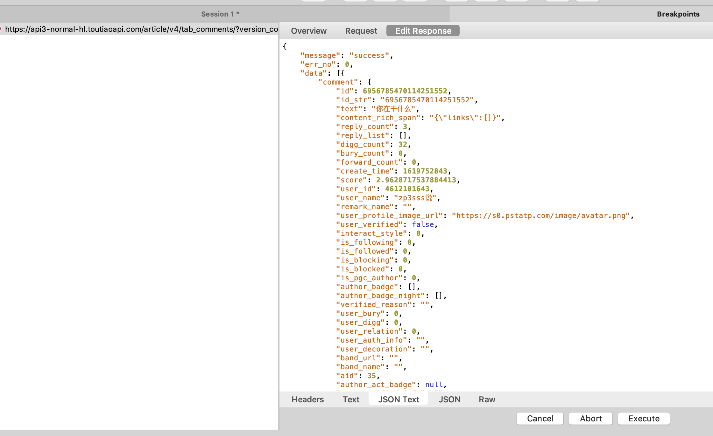

# charles使用

## 配置Charles

> 配置Charles：
>
> 1. proxy --> proxy settings --> proxies选项卡中，配置http proxy 设置端口，勾选 `enable transparent http proxying`
> 2. proxy --> ssl proxy settings --> ssl proxying选项卡中，勾选`enable ssl proxying`，配置远程需要抓取的地址，默认`*:443`，抓取所有443端口的请求。
> 3. 修改手机网络，保证手机和本地电脑处在同一个网段，开启手动代理，配置IP地址(本地电脑的IP)和端口号(proxy settings设置的端口号)。
> 4. Help --> ssl proxying --> install Charles root certificate ， 给本地mac安装charles证书，打开`钥匙串找到证书并修改为始终信任`
> 5. help --> ssl proxying --> install Charles root certificate on mobile device or remote Browser ， 给手机端安装证书。
> 6. 打开手机浏览器访问`chls.pro/ssl`，下载证书。
> 7. iOS安装证书：
>    1. 设置 --> 通用 --> 描述文件 --> 打开charles proxy CA 安装证书。
>    2. 设置 --> 通用 --> 关于本机 --> 证书信任设置，信任证书。
> 8. andriod安装证书：
>    1. 设置 --> 网络 --> 打开连接的网络 --> 高级设置 --> 安全证书管理(从存储设备安装)。

## repeat

> repeat就是使用charles重新发送请求。
>
> repeat：重新发送一次。
>
> repeat advanced：可以自定义`重发次数`、`每次重复的延时时间`、`并发数`。
>
> ```dart
> iterations:10   //请求次数
> concurrency:2   //请求的并发数
> delays: 1000
> 
> // 表示开启两个线程同时请求请求该接口，每次请求与上一次请求间隔1s，接口总共请求10次，也就是说每个线程请求5次。
> ```

## 测试数据配置

> 测试数据：
>
> 1. 本地测试数据，将接口返回的数据封装到本地文件中，开发机请求该接口时，charles拦截
> 2. 远程测试数据，将接口转发到另一个服务器上某个接口上，一般用在切换环境，例如从某个接口或者整个app从开发环境转到灰度环境。
>    1. 单个接口转换
>    2. 所有请求都转换到另一个服务器中。

### 本地测试数据(map local)

> 开发机请求本地测试数据详细说明：
>
> 1. 创建该接口的测试数据，如果懒得创建，可以通过选择某个接口，右键选择`save Response`，将响应数据保存到本地文件中。
> 2. 选择该接口，右键选择`map local`, 在map to的local path中配置本地文件。
> 3. 之后操作开发机时，接口数据就都是本地文件中配置的数据了。

### 远程测试数据(map remote)

#### 单接口远程测试数据配置
> 开发机配置单接口远程测试数据：
> 1. 在charles中抓取到目标接口时，选中该接口右键选择`map remote`。
> 2. 配置map to参数，目标机器的`scheme`、`domain`、`port`、`path`、`query`。

#### 这个app所有接口远程测试数据配置

> 这个接口远程数据配置，换句话说`服务器地址迁移`，将app请求地址从开发环境切换到仿真环境或者生产环境。这种配置有两种实现方式：
>
> 1. 开发人员给测试人员打一个针对某个环境的测试包。
> 2. 使用charles工具，将请求地址转发到某个环境中。
> 开发机配置整个app的所有接口：
>
> 1. proxy --> external proxy settings，选中`use external proxy servers`，选中`web proxy(http)`。
> 2. 配置IP和端口号。
>
> 


## 接口参数的修改

> charles提供了三种修改方式：
>
> 1. compose，对目标接口进行备份，生成一个可编辑的接口，修改完请求参数后，立即发送请求，查看响应数据。
> 2. breakpoint，断点调试，在某个接口上打一个断点，当app在请求该接口时，会停在该接口中，之后可以对请求参数或者响应参数进行配置。
> 3. rewrite

### compose

> 这部分功能时，将抓取到的请求数据进行修改，再重新发送请求，测试请求参数。
> 配置步骤：
>
> 1. 选中某个接口，右键选择`compose`，可以增删改`请求参数`。
> 2. 修改完成后，点击`execute`，调用接口。
>
> 

### breakpoint

> 配置方式：
>
> 1. 选中某个接口右键，选择`breakpoint`.
> 2. 在proxy --> breakpoint settings中可以看到所有加了断点的接口，然后配置断点信息。
> 3. app请求该接口，charles会进入该断点接口，编辑完数据后，点击`execute`。
>
> 
>
> `query: *`：表示匹配所有请求参数。
>
> `response`：在断点打在响应中，即当服务器返回响应数据时，将其拦截，等待用户编辑完响应数据，然后在发送给app。
>
> 
>
> 进入断电，编辑完响应数据后，点击`execute`，继续执行。
>
> **注意**：接口都有超时时间，编辑时间不要超过超时时间。

### rewrite

> 请求时，charles拦截匹配的接口，并根据rewrite中的配置信息，修改其中的参数。
>
> 配置步骤：
>
> 1. tool --> rewrite --> rewrite settings弹框中配置对接口中参数的重写 --> location中点击add，给某个接口添加配置。
> 2. Type-action，添加匹配规则。
> 3. 配置完成后点击OK，app重新请求接口，就会看到接口中国呢的某些数据发生改变了。
>
> 
>
> 
>
> 
>
> 将该接口响应数据中的value为`zp3sss`替换成`1212121`。
>
> 

## 限速


> 重要字段的含义   
>
> **bandwidth：带宽，即在传输管道中可以传递数据的能力** 
>
> **utilisation:  网络传输利用率，作为可用带宽的缩放因**子
>
> round-trip latency：请求往返延迟 ，它用于描述客户端向服务器和服务器向客户端的每次请求            
>
> mtu:  最大传输单位,任何传输的TCP数据包的最大尺寸
>
> reliability：可靠率，丢包，衡量连接完全失败的可能性。**这是非常有用的模拟不可靠的网络条件**
>
> stability：稳定率，抖动，衡量一个连接的稳定性，描述网络延迟变化的程度。可以模拟移动网络，定期连接质量差。抖动对于实时性的传输是一个重要参数，例如视频
>
> unstable quality range:   此处设置主要针对于Stability中设置中的范围

