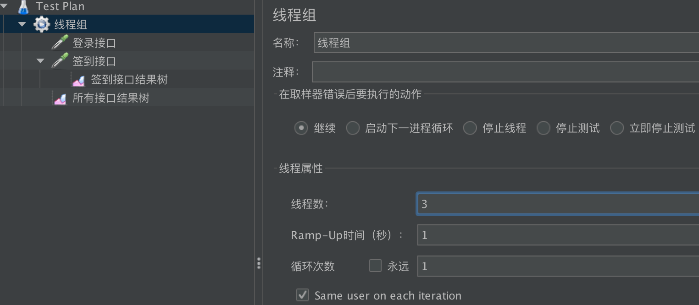
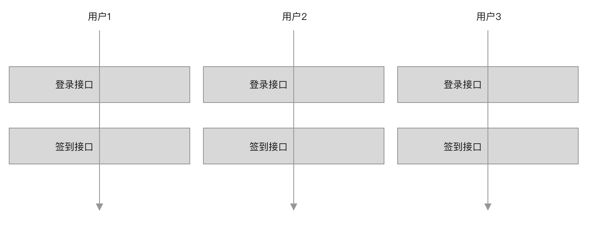
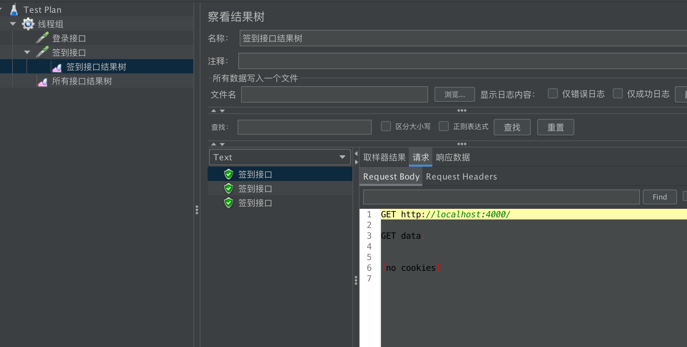
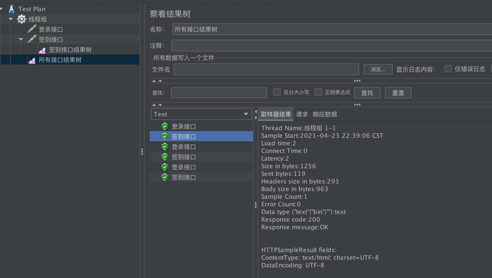

# jmeter小试牛刀

> TestPlan：测试计划，代表了整个测试项目。
> 线程组：代表某个模块的测试，内部包含需要测试的接口和一些其他配置。
> 理解：可以理解为公司中的各个部门，TestPlan只是一个集合用来包含这些线程组，真正重要的测试配置都在线程组中。

> 上图脚步中定义了两个监听器(结果树)，用来接口测试结果，这两个结果树放在了不同的作用域中，一个是全局作用域(所有接口结果树，收集该线程组中所有接口执行结果)，另一个是局部作用域(签到接口结果树，只收集该线程组中签到接口的执行结果)。

## 理解运行流程

> 在线程组中可以配置线程数，也就是模拟用户，上图有3个线程数，也就是模拟现实中3个用户并发访问登录签到接口。`每个用户按照接口排列顺序依次请求`。

## 签到接口结果树

## 所有接口结果树

