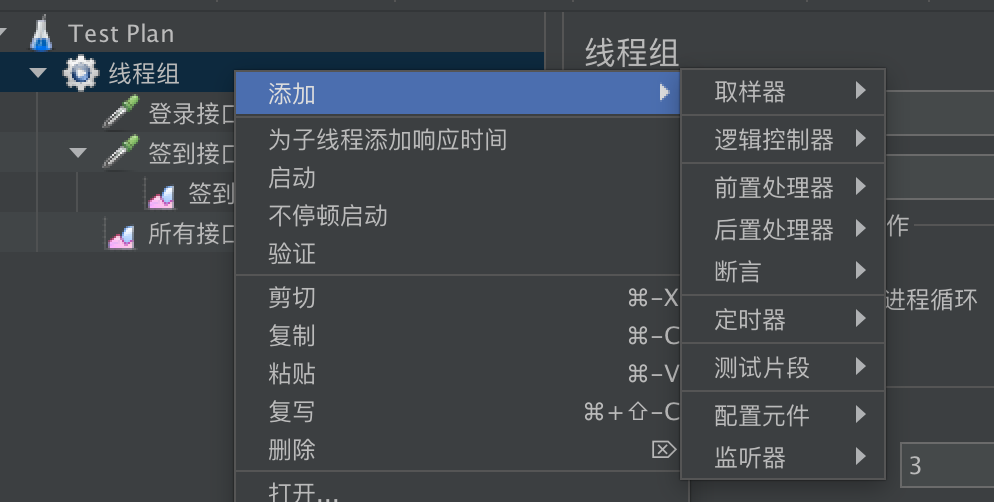
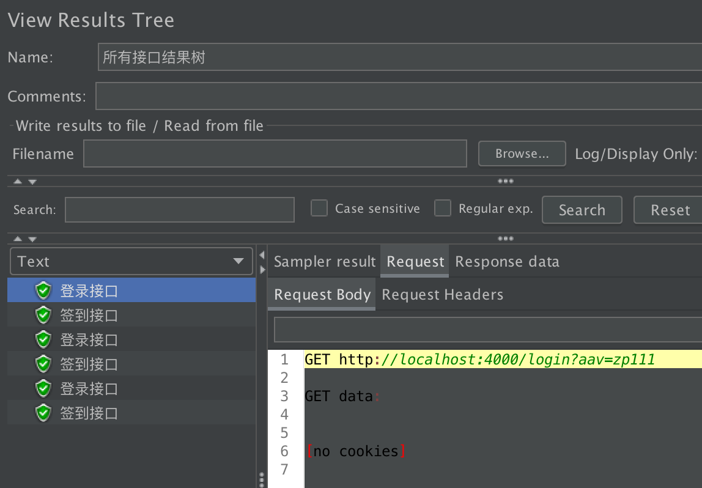
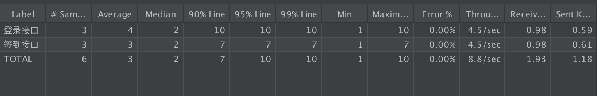
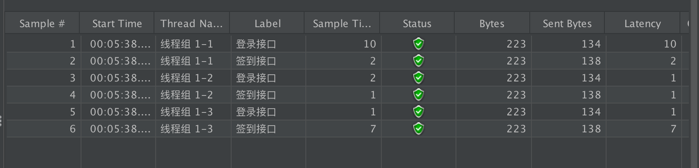
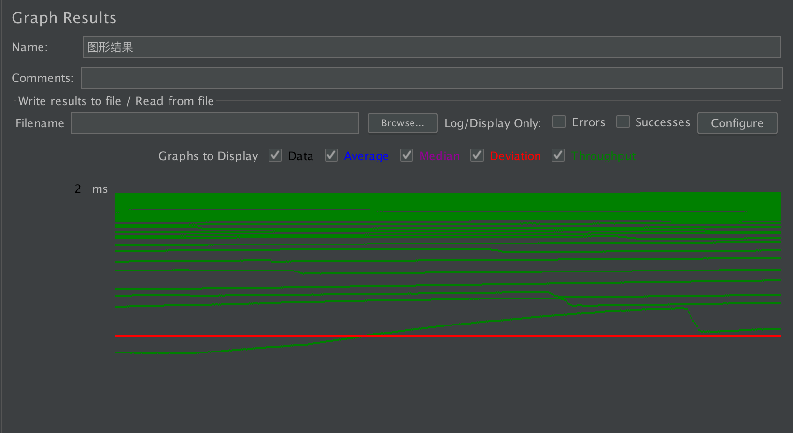

# 测试零件

## 取样器

> 定义各种测试样本，例如创建各种测试接口，http、jdbc、ftp

## 逻辑控制器：

> 添加流程控制，例如if、while、switch、once等。用来控制取样器执行流程。

## 前置处理器：

> 在前取样器执行之前可以进行一些配置操作，例如设置用户参数(`请求参数化，一般使用cvs`)、取样器超时时间等。

## 后置处理器：

> 用来在某个测试中建立两个接口的关联，例如登录和签到接口，这两个接口是依赖关系，签到接口依赖着登录接口，签到接口需要拿到登录接口返回的token值，才能进行下面的访问。

## 断言：

> 理解为代码中的try-catch，例如`响应断言`，设置一个值，当响应数据与其匹配时，触发该响应断言。`响应数据出现不符合期望情况时，给出错误提示`

## 定时器：

> 做定时任务，例如同步定时器，用在某一时间段高并发测试中，换成现实中的例子就是，抢票系统中都是某事在某个时间段访问压力非常大，可以使用同步定时器模拟某个时间段高并发访问时，服务器抗压能力。

## 配置元件：

> 抽离sample(取样器)中的配置参数，你可以理解为项目开发中的把一些配置信息单独封装到一个文件中，其他地方需要使用时，通过变量访问。例如线程组中的接口的IP地址和端口号都一致时，可以在配置元件的`http request default`中将IP地址和端口号作为变量保存，线程组的接口就不需要填写了，默认从配置元件中取。

## 监听器：

> 监听器用来获取测试报告用的。
>
> 1. `view request tree`(查看结果树)，如果想看测试后每个接口请求响应数据时，可以使用结果树
> 2. `Aggregate report`(聚合报告)，如果想要看看脚本跑完每个接口执行多少次、接口耗时、接口qps时可以使用这个报告
> 3. `view request table`(查看结果表格)：如果各个接口在哪个线程下跑的，开始时间多少可以使用表格。
> 4. `Graph result`(图表)：可视化查看，一般不用这个，太丑了。

