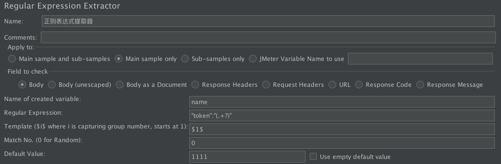
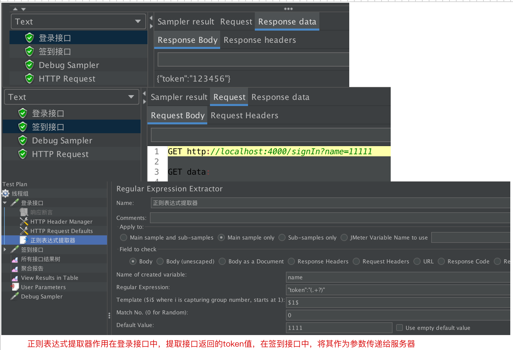

# Regular Expression Extractor(提取合规的表达)

> 正则表达式后置提取器：一般用在提取某个接口的响应数据(`响应头`或者`响应体`)，用在下一个接口中作为参数。

> `apple to `：该提取器作用范围，可以在sampler中创建一个子sampler，就像文件夹套文件夹。
>
> 1. Main samples and sub-samples:匹配范围包括当前父取样器并覆盖至子取样器。
> 2.  Main samples only：只匹配当前父取样器
> 3.  Sub-samples only：仅匹配子取样器
> 4.  Jmeter Variable Name to use:支持对Jemter变量值进行匹配
>
> 
>
> field to check：提取哪个地方的数据，body(响应体)、response code(响应状态码)、response headers(响应头)。
>
> 1. `Name of created variable`：给匹配出来的数据起一个变量名，之后就可以使用`${name}`访问
> 2. `regular expression`：使用正则表达式匹配。
> 3. `template`：正则表达式使用小括号区分原子组，选择哪个原子组，格式为`$数字$`
> 4. `match`：由于源数据中可能会提取到多个数据，使用数组记录，match>0表示选择某第几个，match=0表示选择任意一个，
> 5. `default value`：当没有匹配到时，选择的默认值。

## 用法

> 规定提取器的作用范围，放在某个`sampler`下，则只对这个sampler起作用，放在`thread group`下对所有的`sampler`起作用。
>
> 实际使用场景：
>
> ​		当两个接口有依赖关系时，前一个接口的响应数据需要作为下一个接口的参数时，可以使用regular expression extractor。

