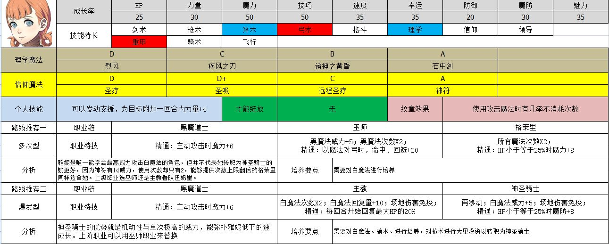
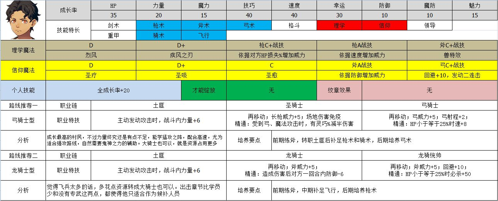

## 主角

## 黑鹫班

### 艾黛尔贾特

### 修伯特

### 多洛缇雅

### 菲尔迪南特

### 林哈尔特

### 佩托拉

### 卡斯帕尔

### 贝尔娜提塔

## 青狮班

### 帝弥托利

### 杜笃

### 菲力克斯

### 梅尔赛德司

### 亚修

### 雅妮特

### 希尔凡

### 英谷莉特

## 金鹿班

### 库罗德

### 洛廉兹

### 希尔妲

### 拉斐尔

### 莉丝缇亚

### 伊古纳兹

### 玛莉安奴

### 雷欧妮

## 修道院

### 玛努艾拉

### 汉尼曼

### 西提司

### 芙莲

### 锥里尔

### 卡多莉奴

### 阿罗伊斯

### 吉尔伯特

### 萨米亚

