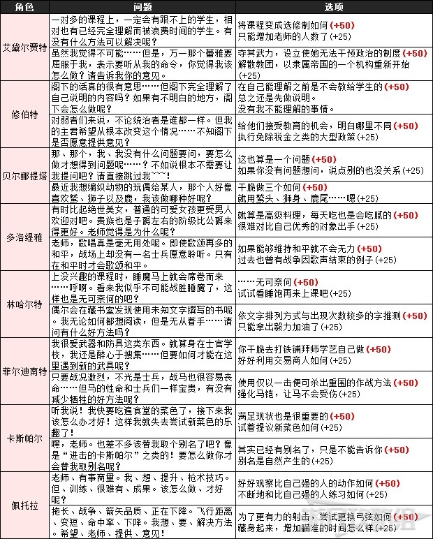
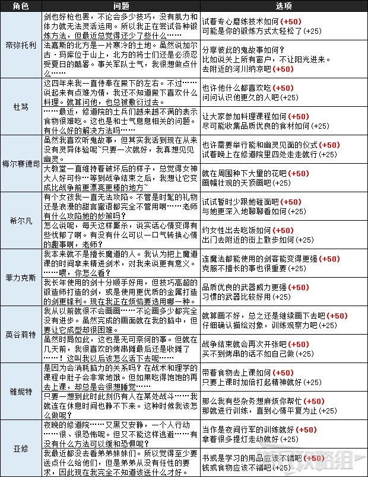
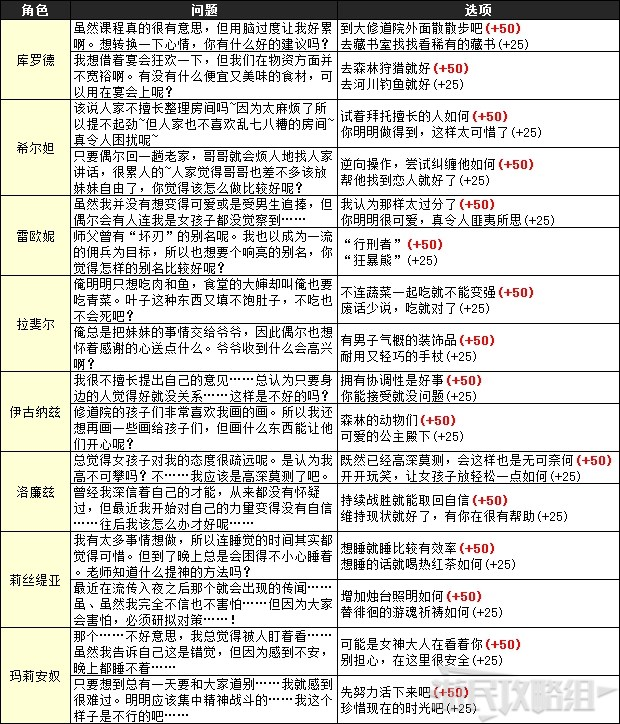
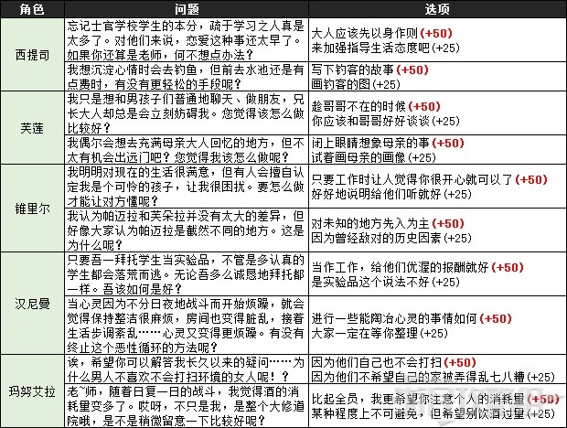
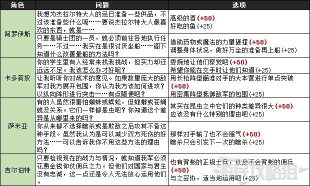

每个月（节）第一次上课会有学生提出问题，选择最让学生满意的答案就能提升该学生的干劲，同时增加主角的指导经验值。

　　PS.偶尔也会出现选择了不满意的答案，干劲也提升的情况。

　　授课提问由随机学生提出问题，并列出三个选项答案，三个答案对应提升的干劲不同，分别为+0（不增加）、+25（增加1格）、+50（增加2格）。

**具体增加干劲及指导经验值：**

　　满意：干劲+50，经验值最大+1200

　　普通：干劲+25，经验值最大+1000

　　不满意：干劲+0，经验值最大+1000

　　※目前表格中列出的没有显示具体增加干劲数值的选项，均为可能增长25或50的选项，不增加的选项没有列出。

　　※通常每个角色会有2-3个问题，第一部分和第二部分（五年后）的提问是不一样的，本攻略中大多数角色的第二个问题为第二部分时触发。

**黑鹫学级**

**青狮子学级**

**金鹿学级**

**赛罗司教会**

**赛罗司骑士团**

