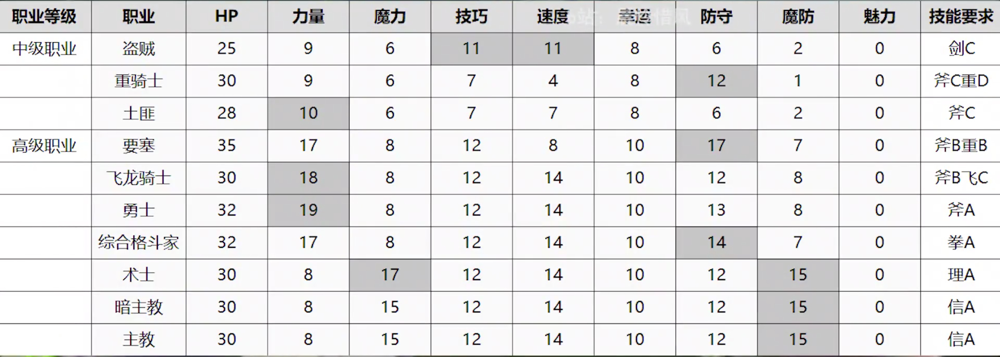

## 初级职业

| 职业名 | 考试准考证     | 性别 | 转职条件       | 职业精通技能 |
| ------ | -------------- | ---- | -------------- | ------------ |
| 贵族   | 初级考试准考证 | 任意 | 无条件         | HP+5         |
| 平民   | 初级考试准考证 | 任意 | 无条件         | HP+5         |
| 剑客   | 初级考试准考证 | 任意 | 剑D            | 速度+2       |
| 士兵   | 初级考试准考证 | 任意 | 枪D            | 防御+2       |
| 战士   | 初级考试准考证 | 任意 | 斧D            | 力量+2       |
| 修道士 | 初级考试准考证 | 任意 | 理性D或者信仰D | 魔力+2       |

## 中级职业

| 职业名   | 考试准考证     | 性别     | 转职条件    | 职业精通技能 |                                                              |
| -------- | -------------- | -------- | ----------- | ------------ | ------------------------------------------------------------ |
| 领主     | 中级考试准考证 | 级长限定 | 剑D+、指挥C | E            |                                                              |
| 佣兵     | 中级考试准考证 | 任意     | 剑C         | 埋伏         | 若HP低于50%，受到敌人攻击时可抢先攻击                        |
| 盗贼     | 中级考试准考证 | 任意     | 剑C         | 开锁         |                                                              |
| 重骑士   | 中级考试准考证 | 任意     | 斧C、种装D  | 金刚一击     | 由自己发动攻击时，防守+6                                     |
| 战马骑士 | 中级考试准考证 | 任意     | 枪C、马术D  | 强攻         | 若HP低于50%，攻击时会在敌方反击前进行追击(仅限触发追击时)    |
| 飞马骑士 | 中级考试准考证 | 女性     | 枪C、飞行D  | 飞燕一击     | 由自己发动攻击时，攻速+6                                     |
| 土匪     | 中级考试准考证 | 任意     | 斧C         | 鬼神一击     | 由自己发动攻击时，力+6                                       |
| 弓箭手   | 中级考试准考证 | 任意     | 箭C         | 命中+20      |                                                              |
| 拳斗士   | 中级考试准考证 | 男性     | 拳C         | 空手格斗     |                                                              |
| 术师     | 中级考试准考证 | 任意     | 理术C       | 魔神一击     | 由自己发动攻击时，魔力+6                                     |
| 暗术师   | 暗术师的资格   | 男性     | 理术C       | 蛇毒         | 当由自己发动的攻击命中时，战斗后敌人的HP减少HP上限的20%      |
| 牧师     | 中级考试准考证 | 任意     | 信仰C       | 祈祷         | HP≥2时，即使受到会使HP归0的伤害，也会根据幸运%的几率不死并剩余1HP |

## 上级职业

| 职业名     | 考试准考证     | 性别 | 转职条件     | 职业精通技能 |                                                           |
| ---------- | -------------- | ---- | ------------ | ------------ | --------------------------------------------------------- |
| 勇者       | 上级考试准考证 | 男性 | 剑B、斧C     | 力量觉醒     | 当HP低于25%时，力量+8                                     |
| 刀剑将领   | 上级考试准考证 | 任意 | 剑A          |              |                                                           |
| 暗杀者     | 上级考试准考证 | 任意 | 剑B、箭C     | 灭杀         | 根据技巧值×0.25%的几率一击必杀                            |
| 要塞       | 上级考试准考证 | 任意 | 斧B、重装B   | 大盾         | 根据技巧%的几率使剑、枪、斧和格斗的伤害减半               |
| 圣骑士     | 上级考试准考证 | 任意 | 枪B、马术B   | 圣盾         | 根据技巧%的几率使弓和魔法的伤害减半                       |
| 飞龙骑士   | 上级考试准考证 | 任意 | 斧头B、飞行C | 防守封锁     | 受到伤害的敌人在战斗后，防守-6(1回合)                     |
| 勇士       | 上级考试准考证 | 任意 | 斧C          | 愤怒         | 若HP低于50%，受到敌人攻击时，必杀+50                      |
| 狙击手     | 上级考试准考证 | 任意 | 箭A          |              |                                                           |
| 综合格斗家 | 上级考试准考证 | 男性 | 拳A          | 破魔者       | 自己使用格斗与使用魔法的敌人战斗时，命中+20、回避+20      |
| 术士       | 上级考试准考证 | 任意 | 理学A        | 破弓者       | 自己装备魔法与持弓箭的敌人战斗时，命中+20、回避+20        |
| 黑暗主教   | 暗术师的资格   | 男性 | 理学A        | 生命吸收     | 自己发动攻击并将敌人击败时，以给予敌人伤害的50%回复自身HP |
| 主教       | 上级考试准考证 | 任意 | 信仰A        | 回复         | 每回合开始时，回复HP上限的20%                             |

## 顶级职业

| 职业名     | 考试准考证       | 性别 | 转职条件            | 职业精通技能 |                                         |
| ---------- | ---------------- | ---- | ------------------- | ------------ | --------------------------------------- |
| 飞龙将领   | 最上级考试准考证 | 任意 | 斧C、飞行A          | 必杀觉醒     | 当HP低于25%时，必杀+50                  |
| 圣飞马骑士 | 最上级考试准考证 | 女性 | 剑C、枪A、飞行B+    | 回避觉醒     | 当HP低于25%时，回避+30                  |
| 英勇骑士   | 最上级考试准考证 | 任意 | 斧B+、重装A、马术B+ | 防守觉醒     | 当HP低于25%时，防御+8                   |
| 神圣骑士   | 最上级考试准考证 | 任意 | 枪C、信仰B+、马术A  | 魔防觉醒     | 当HP低于25%时，魔防+8                   |
| 弓骑士     | 最上级考试准考证 | 任意 | 枪C、箭A、马术A     | 速度觉醒     | 当HP低于25%时，速度+8                   |
| 墓志铭     | 最上级考试准考证 | 任意 | 剑A、理学B+         | 明镜一击     | 由自己发动攻击时，魔防+6                |
| 战争将领   | 最上级考试准考证 | 男性 | 斧A、拳A            | 回击         | 若HP高于50%，受到敌人攻击时必然触发追击 |
| 暗骑士     | 最上级考试准考证 | 任意 | 枪C、理学B+、马术A  | 魔防封锁     | 受到伤害的敌人在战斗后，魔防-6(1回合)   |
| 格莫瑞     | 最上级考试准考证 | 女性 | 理学A、信仰A        | 魔力觉醒     | 当HP低于25%时，魔力+8                   |

## 职业成长修正

深颜色属性值表示转职到当前职业时，人物属性的最低值，一般用来混低保，例如某些人物当前某些属性值过低时，可以进行转职将其属性提升。

主角(斧头A、拳A、指挥C、)：土匪-拳斗士-综合格斗士-战争将领(格斗术lv5(愤怒之阵)、格斗专家、回击、鬼神一击(破魔者)、必杀+20)

库洛德(斧头C、弓箭S、飞行A)：贵族-战士-弓箭手(土匪)-狙击手-巴巴罗萨(箭术5/箭术专家/鬼神一击/弓必杀+10/命中+20)

英谷莉特(斧头C、枪A、飞行B+、剑A)：土匪-舞娘-圣飞马骑士(剑术Lv.5/剑回避+20/鬼神一击(埋伏)/回避+10/警戒态势+)

莉丝缇亚(枪C、理学 B+、骑术 A)：术师-术士-暗骑士(理学Lv.5/黑魔法专家)

希尔妲(剑C、斧A、重甲A、骑术B+、指挥C)：土匪-佣兵-重骑士-要塞-英勇骑士(鬼神一击/大盾(愤怒之阵)/斧头专家/斧头5/埋伏)

雷欧妮(斧头C、箭A、枪C、骑术A)：土匪-弓箭手-狙击手-弓骑士(箭术Lv.5/鬼神一击/弓必杀+10/箭术专家/命中+20)

贝尔(斧头C、箭A、枪C、骑术A)：土匪-弓箭手-狙击手-弓骑士(箭术Lv.5/鬼神一击/弓必杀+10/箭术专家/命中+20)

玛莉安奴(枪C、信仰B+、骑术A、理性随性):  牧师-主教-神圣骑士

梅尔赛德司(枪C、信仰B+、骑术A、理性随性)：牧师-主教-神圣骑士

输出手：

库洛德：斧头到B、飞行，空余练习弓箭

雷欧妮：弓箭、骑术、有空练习指挥

贝尔：弓箭、骑术、有空练习指挥

莉丝缇亚：练习理学、枪术、有空练习马术和指挥

肉盾：

希尔妲：斧头、重甲，有空练习马术和指挥

主角(半肉半输出)：练习斧头和拳头，有空余练习指挥

辅助手：

英谷莉特(诱敌，当前以暗杀者为目标 )：无需攻击、主要练习飞行和枪，尽快到达A+和A，有空练习指挥和剑术。

玛莉安奴(奶妈)：练习信仰和马术，枪练习到C、有空练习指挥

