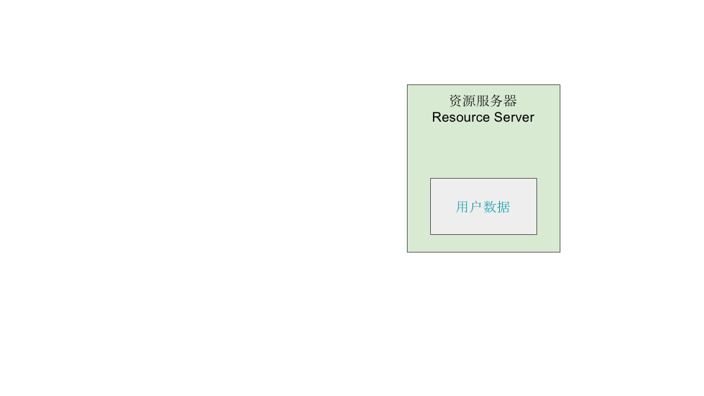
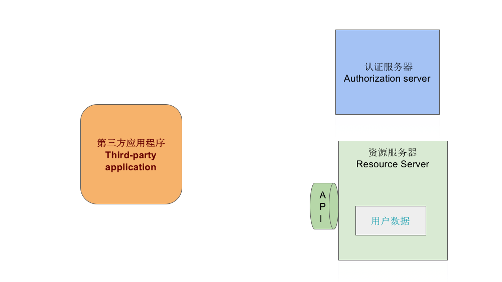

# [简易图解]『 OAuth2.0』 猴子都能懂的图解 

293156[57](https://learnku.com/articles/20031#replies)

[ Laravel ](https://learnku.com/laravel)/ 9949 / 57 / 发布于 2年前 / 更新于 1个月前 / [ 2 个改进](https://learnku.com/laravel/t/20031/patches)

## 一，写在前面的

> 这两天在看论坛的 L03API 教程上面的 oAuth，对于 oAuth 这个概念，一直还很模糊，找了很多国内的一些东西看的，当然还有论坛推荐的阮一峰的说明，但是总是感觉有种理不清楚的感觉。 加之国内很多教程对于非计算机专业的人理解不友好。 恰好在日本网站上看到了一些说明特别容易理解。就按照他们的思路自己写了这一段图。 顺便说下，没别的意思，对于 IT 一些术语的解释，国内还是偏向于专业化了，甚至很多也只是翻译国外的文章，没有自己的理解，还有可能是我。。看的太少了吧。也有可能是我的实力不够。 国外有很多感觉真的是写给猴子看的，还有面向儿童的一些书，很适合我这种刚开始接触某个概念的人来看。废话不多说了，上图了。这是根据 PPT 做出来的简图。如果想一次性看完的，可以去下面这里直接看。新手理解，不吝赐教。[PPT 幻灯片](https://docs.google.com/presentation/d/1jP2fcPjpjULOzfEI0ZQXyAmJ2L9KcA_76HFx-vyA_tA/edit?usp=sharing)为了不引起歧义补充说明一下，这篇只是很概括的说明了一下什么是 OAuth。 真正的授权肯定不是这么简单，到具体的 OAuth 授权模式上会更加复杂，看完这篇可以看看这篇我总结的授权模式，[授权模式总结](https://learnku.com/articles/20082)，比这个稍微没这么好懂一点，但我非计算机专业的我都能懂的话，应该认真看问题不大。本篇文章就不做赘述啦。

## 二，步骤图

#### 1. 我们这里有一份用户的数据

#### 2. 用户的数据我们保存在**资源服务器 (Resource server)** 里

#### 3. 这时候有个 **第三方应用程序（Third-party application）**想要请求资源服务器要用户数据

#### 4. 为了让用户数据和第三方程序程序良好的交互，资源服务器准备了一个 API 接口

#### 5. 第三方应用程序向资源服务器请求用户的数据

#### 6. 资源服务器表示好的给你了

#### 7. 但如果这个第三方应用程序是恶意的第三方呢？那么就会有以下的场景出现

#### 8. 所以我们需要一个机制来保护 API 接口，不能随随便便毫无安全可言的把用户的数据送出去

#### 9. 这个最佳实践就事先在第三方程序里保存一个**令牌 access_token**

#### 10. 第三方应用程序在向资源服务器请求用户数据的时候会出示这个 access_token

#### 11. 然后资源服务器取出授权码并且验证是否有授权

#### 12. 授权通过，资源服务器才会把用户数据传递给第三方应用程序

#### 13. 但这种方案需要事先给第三方 access_token

#### 14. 所以我们需要一个东西用来发行这个 access_token，这时候认证服务器 **（Authorization server）**登场了

#### 15. 认证服务器负责生成并且发行 access_token 给第三方应用程序

#### 16. 接下来我们看一下目前的登场的人物有第三方应用程序 资源服务器 认证服务器 access_token 用户数据资源服务器和认证服务器有时候是同一台服务器

#### 17. 接下来我们来走一下流程 认证服务器生成 access_token

#### 18. 认证服务器发行 access_token 授权给第三方应用程序

#### 19. 第三方应用程序拿着 access_token 去找资源服务器要用户数据

#### 20. 资源服务器取出来 access_token 并验证

#### 21. 验证通过 用户数据送出

#### 22. 问题点来了到上面为止有个很大的问题就是，认证服务器生成 access_token 竟然没人管！那岂不是随便发行了，这不行，于是我们的**用户** （***Resource Owner：资源所有者\***）出现了！

#### 23. 解决认证服务器在发行 access_token 之前要先通过用户的同意

#### 24. 于是接下来就是第三方应用程序向认证服务器要 access_token认证服务器生成之前先问问用户能不能授权啊用户说好的可以给认证服务器生成 access_token 并且发行给第三方应用程序25. oAuth2.0第三方应用程序和这个认证服务器之间围绕着 access_token 进行请求和响应的等等就是 oAuth2.0  [oauth](https://learnku.com/blog/chihokyo/tags/oauth_4) [Oauth2.0](https://learnku.com/blog/chihokyo/tags/oauth20_A7_49017)本作品采用[《CC 协议》](https://learnku.com/docs/guide/cc4.0/6589)，转载必须注明作者和本文链接⬇︎第一次零基础搭建的个人博客。欢迎批评指正，大力鞭策！❤︎ [**旺财的个人博客** (⌯¤̴̶̷̀ω¤̴̶̷́)✧](https://chihokyo.com/) *January 17th, 2020*

本帖由系统于 2年前 自动加精

 举报

[chihokyo](https://learnku.com/users/29862)

[课程读者](https://learnku.com/roles/CourseAttendees) [268 声望](https://learnku.com/users/29862/reputation_logs) 

[@Kiddyu](https://learnku.com/users/5575) 所以你看见没有，市面上百分之九十以上的第三方应用都是采用授权码的模式，就是在培养用户进行授权的时候不用输入账号密码进行授权，常见的第三方登录 `QQ` , `微信` , `微博`等，用户用快捷登录也无非是这几个。你可以尝试用在知乎里面查看`微信` ,`QQ`, `微博`等服务商的授权页面都是用户在它们里面注册的头像以及昵称等信息展示的，这个你钓鱼网站怎么做到，授权页面拿到用户的在`微信`,`QQ`, `微博`等服务商的授权页面里面注册的头像以及昵称等信息展示的？
上面的这是其一.
其二，`微信` ,`QQ`, `微博`等用户登录目前都是培养用户进行登录的时候使用`声音` , `手机验证码` , `扫码`等进行登录，这样就没有使用密码登录的说法。登录跳转到授权页面的时候，你在，`微信`,`QQ`, `微博`注册的用户信息例如`头像` , `昵称`等都展示在授权页面的.
以上总结的就是授权页面这步很关键，你说的隐患就是当用户本地的`微信` ,`QQ`, `微博`等没有登录的情况下会尝试叫用户输入账号密码进行授权，但是对于这种第三方网站进行授权登录，用户在输入`微信`,`QQ`, `微博`等账号后，一定要有一个授权页面，并且这个页面至少要有用户在`微信` ,`QQ`, `微博`上的`图像`以及`昵称`展示，要是少了这一步，正常用户都会觉得有问题，都会很谨慎。因为，输入账号密码，一般用户下意识还是有些警觉的。还有`微信` ,`QQ`, `微博`也会自动登陆上并且也会提示你用它们的账号登录了某某应用.
还有一个细节就是，在做授权登录的时候，无论是安卓还是苹果，都会有一个明显的两个应用间来回跳转的应用间的切换交互流程。这个你根本不好模仿.

##### 授权最关键的一步就是你在授权页展示了用户的`微信` ,`QQ`, `微博`上的头像以及昵称，就是这两个才赢得了用户的信任